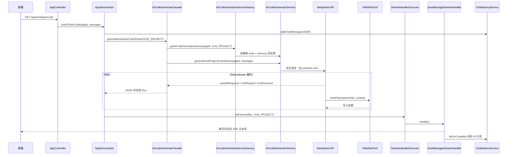

### 版本概述

本次 `1.3` 分支聚焦于 **Vue 工程模式与流式工具调用后端实现**。在 `1.2` 已经打通「应用级对话记忆 + SSE 流式输出 + 历史持久化」的基础上，本版将 AI 代码生成能力从「单页 HTML / 多文件静态页」进一步升级为 **完整 Vue3 工程项目生成**，并引入 **LangChain4j Tool Calling（工具调用）** 机制，让模型通过 `FileWriteTool` 逐文件写入工程代码，而不是一次性输出大段文本再解析落盘。

这一版后端实现，核心上完成了五件事：

1. 新增 `VUE_PROJECT` 代码生成类型，并将新建应用的默认生成模式切换为 Vue 工程模式。
2. 引入 `TokenStream` 流式 API，支持 AI 文本响应、工具调用请求、工具执行结果三类事件的实时推送。
3. 实现 `FileWriteTool`，在 AI 推理过程中直接将 Vue 工程文件写入磁盘。
4. 设计 JSON 结构化流消息模型与 `StreamHandlerExecutor` 执行器，按生成类型分流处理 SSE 输出与对话历史落库。
5. 在项目中覆盖/扩展 LangChain4j 部分类（`dev.langchain4j.*`），补齐流式工具调用（`onPartialToolExecutionRequest`）能力。

---

### 核心目标

#### 为什么需要 Vue 工程模式

`HTML` 和 `MULTI_FILE` 模式适合生成静态页面，但无法直接产出 **可 `npm install` / `npm run dev` / `npm run build` 的完整前端工程**。对于「零代码生成应用」产品而言，用户期望的是：

- 多页面、多组件、路由配置齐全
- 工程结构规范（`package.json`、`vite.config.js`、`src/` 目录等）
- 支持后续迭代修改（依赖 `1.2` 的对话记忆）

因此需要一种新的生成范式：**AI 作为架构师规划工程，作为开发者通过工具逐文件创建**。

#### 为什么需要 TokenStream + 工具调用

传统 `Flux<String>` 流只能传输纯文本 token。Vue 工程生成过程中，模型会：

1. 输出规划说明（自然语言）
2. 多次调用 `writeFile` 工具写入不同文件
3. 在工具调用间隙继续输出文本

如果只使用 `Flux<String>`，前端无法区分「AI 正在说话」还是「AI 正在写文件」，也无法在流式过程中展示工具调用进度。`TokenStream` 提供了：

- `onPartialResponse` — AI 文本片段
- `onPartialToolExecutionRequest` — 工具调用请求（流式）
- `onToolExecuted` — 工具执行完成结果

本版将这些事件统一封装为 JSON 消息，经 SSE 推送给前端。

#### 本版采用的总体方案

```
用户 prompt
    → AiCodeGeneratorService（Vue 专用实例 + 对话记忆 + FileWriteTool）
    → reasoningStreamingChatModel（DeepSeek 流式 + tools）
    → TokenStream 事件流
    → processTokenStream 转为 JSON Flux
    → JsonMessageStreamHandler 解析并格式化前端展示 + 持久化 AI 历史
    → FileWriteTool 实时写入 tmp/code_output/vue_project{appId}/
```

---

### 技术栈

| 层次 | 技术 / 组件 | 用途 |
|------|-------------|------|
| AI 框架 | LangChain4j 1.1.0 | AiServices、Tool、TokenStream、ChatMemory |
| 大模型 | DeepSeek API (`deepseek-chat`) | 流式对话 + Function Calling |
| 流式编程 | Project Reactor (`Flux`) | SSE 后端数据流 |
| 工具写入 | `FileWriteTool` + NIO `Files.write` | 逐文件落盘 Vue 工程 |
| 本地缓存 | Caffeine | 按 `appId + codeGenType` 缓存 AI Service |
| 对话记忆 | Redis + MySQL（继承 1.2） | 多轮对话上下文 |
| JSON 序列化 | Hutool `JSONUtil` | 流消息序列化 / 反序列化 |

---

### 架构与完整调用链

#### 整体流程图



#### 后端调用链路（文字版）

```text
前端发起对话生成请求
    ->
AppServiceImpl.chatToGenCode(appId, message, loginUser)
    ->
1. 校验 appId / 权限 / codeGenType
    ->
2. 保存用户消息到 chat_history
    ->
3. AiCodeGeneratorFacade.generateAndSaveCodeStream(message, VUE_PROJECT, appId)
    ->
4. AiCodeGeneratorServiceFactory.getAiCodeGeneratorService(appId, VUE_PROJECT)
    ->
5. 创建/复用 Vue 专用 AI Service（reasoningStreamingChatModel + FileWriteTool + chatMemory）
    ->
6. aiCodeGeneratorService.generateVueProjectCodeStream(appId, message) → TokenStream
    ->
7. processTokenStream：监听四类回调，封装为 JSON Flux<String>
    ->
8. StreamHandlerExecutor.doExecute → JsonMessageStreamHandler
    ->
9. 解析 JSON → 前端展示文本 + 工具调用提示 + 文件内容预览
    ->
10. 流结束 → 拼接完整 AI 回复落库 chat_history
    ->
11. FileWriteTool 已在步骤 6~7 间将文件写入磁盘
```

---

### 功能拆解

#### 1. 新增 VUE_PROJECT 代码生成类型

在 `CodeGenTypeEnum` 中新增第三种模式：

```java
// YuCodeMother-Backend/src/main/java/com/yupi/yucodemotherbackend/model/enums/CodeGenTypeEnum.java
HTML("原生 HTML 模式", "html"),
MULTI_FILE("原生多文件模式", "multi_file"),
VUE_PROJECT("vue 工程模式", "vue_project");  // 1.3 新增
```

`AppController.addApp` 中将新建应用的默认类型设为 Vue 工程：

```java
// YuCodeMother-Backend/src/main/java/com/yupi/yucodemotherbackend/controller/AppController.java
// 暂时设置为 Vue工程项目 生成
app.setCodeGenType(CodeGenTypeEnum.VUE_PROJECT.getValue());
```

#### 2. AI 接口层：TokenStream 替代 Flux

`AiCodeGeneratorService` 为 Vue 模式新增专用方法，返回 `TokenStream` 而非 `Flux<String>`：

```java
// YuCodeMother-Backend/src/main/java/com/yupi/yucodemotherbackend/ai/AiCodeGeneratorService.java

/**
 * 流式生成 Vue 项目代码 -> 使用TokenStream
 * 注意：使用了 @MemoryId 注解时，第二个参数必须打 @UserMessage 注解
 */
@SystemMessage(fromResource = "prompt/codegen-vue-project-system-prompt.txt")
TokenStream generateVueProjectCodeStream(@MemoryId long appId, @UserMessage String userMessage);
```

**关键约束**：LangChain4j 规定，方法参数使用 `@MemoryId` 时，用户消息参数必须显式标注 `@UserMessage`，否则框架无法正确绑定会话记忆。

#### 3. AI 工厂：按 codeGenType 分流构建服务实例

`1.2` 中缓存键仅为 `appId`（`Long`），`1.3` 升级为 **`appId + codeGenType` 复合键**（`String`），因为同一应用在不同生成模式下需要不同的 AI Service 配置（是否挂载 tools、使用哪个 StreamingChatModel）。

```java
// YuCodeMother-Backend/src/main/java/com/yupi/yucodemotherbackend/ai/AiCodeGeneratorServiceFactory.java

// 缓存键：419969556010991616_vue_project
public String buildCacheKey(long appId, CodeGenTypeEnum codeGenType) {
    return appId + "_" + codeGenType.getValue();
}

// Vue 工程专用分支
case VUE_PROJECT -> AiServices.builder(AiCodeGeneratorService.class)
        .chatModel(chatModel)
        .streamingChatModel(reasoningStreamingChatModel)  // 推理/工具调用专用模型
        .chatMemory(chatMemory)
        .chatMemoryProvider(memoryId -> chatMemory)       // @MemoryId 必须配合 provider
        .tools(new FileWriteTool())                       // 注册文件写入工具
        .hallucinatedToolNameStrategy(toolExecutionRequest ->
                ToolExecutionResultMessage.from(toolExecutionRequest,
                        "Error: there is no tool called " + toolExecutionRequest.name()))
        .build();

// HTML / MULTI_FILE 保持原有配置
case HTML, MULTI_FILE -> AiServices.builder(AiCodeGeneratorService.class)
        .chatModel(chatModel)
        .streamingChatModel(openAiStreamingChatModel)
        .chatMemory(chatMemory)
        .build();
```

**设计要点**：

- `reasoningStreamingChatModel`：专供 Vue + 工具调用，与普通 HTML 流式模型分离。
- `chatMemoryProvider`：使用 `@MemoryId` + `@ToolMemoryId` 时必须配置，否则工具无法获取 `appId`。
- `hallucinatedToolNameStrategy`：当 AI 幻觉调用不存在的工具名时，返回明确错误信息而非抛异常，让模型自我纠正。

#### 4. FileWriteTool：AI 写文件的执行器

```java
// YuCodeMother-Backend/src/main/java/com/yupi/yucodemotherbackend/ai/tools/FileWriteTool.java

@Tool("写入文件到指定路径")
public String writeFile(
        @P("文件的相对路径") String relativeFilePath,
        @P("要写入文件的内容") String content,
        @ToolMemoryId Long appId) {          // 从 @MemoryId 自动注入 appId

    String projectDirName = "vue_project" + appId;   // 注意：无下划线
    Path projectRoot = Paths.get(AppConstant.CODE_OUTPUT_ROOT_DIR, projectDirName);
    path = projectRoot.resolve(relativeFilePath);

    Files.createDirectories(parentDir);
    Files.write(path, content.getBytes(), CREATE, TRUNCATE_EXISTING);

    return "文件写入成功：" + relativeFilePath;  // 返回相对路径，避免泄露绝对路径
}
```

与 `HTML` / `MULTI_FILE` 的 **`processCodeStream` 流结束后统一解析落盘** 不同，Vue 模式在 **AI 推理过程中** 通过工具调用实时写文件，不再走 `CodeParserExecutor` + `CodeFileSaverExecutor` 链路。

#### 5. processTokenStream：TokenStream → JSON Flux

门面类 `AiCodeGeneratorFacade` 新增核心转换逻辑：

```java
// YuCodeMother-Backend/src/main/java/com/yupi/yucodemotherbackend/core/AiCodeGeneratorFacade.java

case VUE_PROJECT -> {
    TokenStream tokenStream = aiCodeGeneratorService.generateVueProjectCodeStream(appId, userMessage);
    yield processTokenStream(tokenStream);   // 不走 processCodeStream
}

private Flux<String> processTokenStream(TokenStream tokenStream) {
    return Flux.create(sink -> {
        tokenStream
            // 1. AI 文本片段 → AiResponseMessage JSON
            .onPartialResponse(partialResponse -> {
                sink.next(JSONUtil.toJsonStr(new AiResponseMessage(partialResponse)));
            })
            // 2. 工具调用请求（流式） → ToolRequestMessage JSON
            .onPartialToolExecutionRequest((index, request) -> {
                sink.next(JSONUtil.toJsonStr(new ToolRequestMessage(request)));
            })
            // 3. 工具执行完成 → ToolExecutedMessage JSON
            .onToolExecuted(toolExecution -> {
                sink.next(JSONUtil.toJsonStr(new ToolExecutedMessage(toolExecution)));
            })
            .onCompleteResponse(response -> sink.complete())
            .onError(sink::error)
            .start();
    });
}
```

#### 6. 流消息模型体系

| 类 | type 值 | 含义 |
|----|---------|------|
| `StreamMessage` | — | 基类，仅含 `type` 字段 |
| `AiResponseMessage` | `ai_response` | AI 文本 token 片段 |
| `ToolRequestMessage` | `tool_request` | 工具调用请求（含 id/name/arguments） |
| `ToolExecutedMessage` | `tool_executed` | 工具执行结果（含 result） |
| `StreamMessageTypeEnum` | — | 类型枚举与解析 |

JSON 消息示例：

```json
{"type":"ai_response","data":"我将为你创建一个任务记录网站..."}
{"type":"tool_request","id":"call_xxx","name":"writeFile","arguments":"{\"relativeFilePath\":\"package.json\""}
{"type":"tool_executed","id":"call_xxx","name":"writeFile","arguments":"{...}","result":"文件写入成功：package.json"}
```

#### 7. 流处理器执行器：策略分流

```java
// YuCodeMother-Backend/src/main/java/com/yupi/yucodemotherbackend/core/handler/StreamHandlerExecutor.java

public Flux<String> doExecute(Flux<String> originFlux, ..., CodeGenTypeEnum codeGenType) {
    return switch(codeGenType) {
        case VUE_PROJECT ->
            jsonMessageStreamHandler.handle(originFlux, chatHistoryService, appId, loginUser);
        case HTML, MULTI_FILE ->
            new SimpleTextStreamHandler().handle(originFlux, chatHistoryService, appId, loginUser);
    };
}
```

**SimpleTextStreamHandler**（继承 1.2 逻辑）：直接拼接文本块，流结束后落库。

**JsonMessageStreamHandler**（1.3 新增）：解析 JSON 消息，转换为前端可读的 Markdown 风格文本：

- `AI_RESPONSE` → 直接透传文本
- `TOOL_REQUEST` → 同一 `toolId` 首次出现时输出 `[选择工具] 写入文件`
- `TOOL_EXECUTED` → 格式化为带代码块的文件写入摘要，同时写入对话历史

```java
// JsonMessageStreamHandler.handleJsonMessageChunk 核心逻辑
case TOOL_EXECUTED -> {
    JSONObject jsonObject = JSONUtil.parseObj(toolExecutedMessage.getArguments());
    String relativeFilePath = jsonObject.getStr("relativeFilePath");
    String content = jsonObject.getStr("content");
    String result = String.format("""
            【工具调用】写入文件 %s
            ```%s
            %s
            ```
            """, relativeFilePath, suffix, content);
    chatHistoryStringBuilder.append(result);  // 持久化到 chat_history
    return output;                             // SSE 推送给前端
}
```

#### 8. AppServiceImpl 重构：历史落库职责下沉

`1.2` 中 `chatToGenCode` 直接在方法内用 `StringBuilder` 收集 AI 回复并 `doOnComplete` 落库。`1.3` 将这一职责 **下沉到 StreamHandlerExecutor**，使 `AppServiceImpl` 更简洁：

```java
// YuCodeMother-Backend/src/main/java/com/yupi/yucodemotherbackend/service/impl/AppServiceImpl.java

Flux<String> codeStream = aiCodeGeneratorFacade.generateAndSaveCodeStream(message, codeGenTypeEnum, appId);
// 委托流处理器执行器，按 codeGenType 选择 SimpleText 或 JsonMessage 处理器
return streamHandlerExecutor.doExecute(codeStream, chatHistoryService, appId, loginUser, codeGenTypeEnum);
```

#### 9. LangChain4j 源码覆盖：补齐流式工具调用

当前 LangChain4j 1.1.0 官方版本对流式工具调用的 `onPartialToolExecutionRequest` 支持不完整。项目在 `dev.langchain4j` 包下 **复制并修改** 了以下关键类：

| 文件 | 作用 |
|------|------|
| `TokenStream.java` | 定义 `onPartialToolExecutionRequest` / `onCompleteToolExecutionRequest` 接口 |
| `AiServiceTokenStream.java` | TokenStream 实现，注册各类回调 |
| `AiServiceStreamingResponseHandler.java` | 流式响应处理，工具执行后递归调用模型 |
| `OpenAiStreamingChatModel.java` | OpenAI 兼容 API 流式请求 |
| `OpenAiStreamingResponseBuilder.java` | 解析 SSE delta 中的 `toolCalls`，按 index 拼接参数 |
| `ToolExecutionRequestBuilder.java` | 流式拼接 tool id / name / arguments |

**为什么需要覆盖**：DeepSeek 的 Function Calling 在流式模式下，`toolCalls` 的参数是 **分片到达** 的。官方 `OpenAiStreamingResponseBuilder` 未完整暴露 partial tool request 回调，导致前端无法实时感知「AI 正在调用 writeFile 写 package.json」。覆盖后可在参数尚未完整时就推送 `ToolRequestMessage`，提升交互体验。

`OpenAiStreamingResponseBuilder` 中对 `delta.toolCalls()` 的处理：

```java
// dev/langchain4j/model/openai/OpenAiStreamingResponseBuilder.java
if (delta.toolCalls() != null) {
    for (ToolCall toolCall : delta.toolCalls()) {
        ToolExecutionRequestBuilder builder = indexToToolExecutionRequestBuilder
                .computeIfAbsent(toolCall.index(), idx -> new ToolExecutionRequestBuilder());
        if (toolCall.id() != null) builder.idBuilder.append(toolCall.id());
        if (functionCall.name() != null) builder.nameBuilder.append(functionCall.name());
        if (functionCall.arguments() != null) builder.argumentsBuilder.append(functionCall.arguments());
    }
}
```

#### 10. Vue 工程 System Prompt

`codegen-vue-project-system-prompt.txt` 定义了 AI 的角色、技术栈约束、工程结构、输出规范：

**核心约束**：

1. 必须通过 **文件写入工具** 依次创建每个文件，禁止直接输出文件代码。
2. 使用 Vue3 Composition API + Vite + Vue Router（hash 模式）。
3. 禁止 Pinia、TypeScript、状态管理库等复杂依赖。
4. 文件总数 < 30，总 token < 20000。
5. 开头输出简要计划，结尾输出完成提示，禁止输出安装步骤/技术栈说明。

#### 11. AppConstant 路径修正

```java
// 1.2：System.getProperty("user.dir") + "/YuCodeMother-Backend/tmp/code_output"
// 1.3：System.getProperty("user.dir") + "/tmp/code_output"

String CODE_OUTPUT_ROOT_DIR = System.getProperty("user.dir") + "/tmp/code_output";
String CODE_DEPLOY_ROOT_DIR = System.getProperty("user.dir") + "/tmp/code_deploy";
```

**原因**：`user.dir` 在 IDEA 中运行时通常指向 `YuCodeMother-Backend` 模块根目录，再拼接 `/YuCodeMother-Backend/tmp/...` 会导致路径重复嵌套。修正后文件落在 `{模块根}/tmp/code_output/` 下。

#### 12. ReasoningStreamingChatModelConfig

```java
// YuCodeMother-Backend/src/main/java/com/yupi/yucodemotherbackend/config/ReasoningStreamingChatModelConfig.java

@Bean
public StreamingChatModel reasoningStreamingChatModel() {
    final String modelName = "deepseek-chat";   // 当前使用快速对话模式
    final int maxTokens = 8192;
    // 注释中预留了 deepseek-reasoner + 32768 tokens 的推理模型配置

    return OpenAiStreamingChatModel.builder()
            .apiKey(apiKey)
            .baseUrl(baseUrl)
            .modelName(modelName)
            .maxTokens(maxTokens)
            .logRequests(true)
            .logResponses(true)
            .build();
}
```

配置前缀 `langchain4j.open-ai.chat-model`，与普通 `chat-model` / `streaming-chat-model` 共用 `base-url` 和 `api-key`。

---

### 配置说明

`application.yml` 中与 1.3 相关的 LangChain4j 配置：

```yaml
langchain4j:
  open-ai:
    chat-model:                          # 普通同步模型（HTML 结构化输出）
      base-url: https://api.deepseek.com
      api-key: <Your API Key>
      model-name: deepseek-chat
      max-tokens: 8192
    streaming-chat-model:                # HTML/MULTI_FILE 流式模型
      base-url: https://api.deepseek.com
      api-key: <Your API Key>
      model-name: deepseek-chat
      max-tokens: 8192
```

`reasoningStreamingChatModel` 读取 `chat-model` 前缀下的 `base-url` / `api-key`，模型名在 Java 代码中硬编码为 `deepseek-chat`。

---

### 三种生成模式对比

| 维度 | HTML | MULTI_FILE | VUE_PROJECT |
|------|------|------------|-------------|
| 返回类型 | `Flux<String>` | `Flux<String>` | `TokenStream` |
| 流式模型 | `openAiStreamingChatModel` | `openAiStreamingChatModel` | `reasoningStreamingChatModel` |
| 落盘方式 | 流结束后 `processCodeStream` 解析保存 | 同左 | `FileWriteTool` 实时写入 |
| 流处理器 | `SimpleTextStreamHandler` | `SimpleTextStreamHandler` | `JsonMessageStreamHandler` |
| 目录命名 | `html_{appId}` | `multi_file_{appId}` | `vue_project{appId}`（⚠️ 见注意事项） |
| 工具调用 | 无 | 无 | `writeFile` |
| 对话记忆 | 有 | 有 | 有 |

---

### 数据流视角

```text
用户消息
    → chat_history 落库（USER）
    → TokenStream 启动
    → [ai_response] AI 输出规划文本 → SSE → 前端实时展示
    → [tool_request] AI 请求 writeFile → SSE → 前端显示「选择工具：写入文件」
    → FileWriteTool 写入磁盘 → [tool_executed] → SSE → 前端显示文件内容预览
    → （可能多轮 tool call 循环）
    → 流结束 → JsonMessageStreamHandler 拼接完整 AI 回复 → chat_history 落库（AI）
    → Redis 记忆窗口同步更新（LangChain4j 自动）
```

---

### 测试与验证

#### 测试用例

`AiCodeGeneratorFacadeTest` 新增 Vue 工程流式测试：

```java
@Test
void generateVueProjectCodeStream() {
    Flux<String> codeStream = aiCodeGeneratorFacade.generateAndSaveCodeStream(
            "简单的任务记录网站，总代码不超过250行",
            CodeGenTypeEnum.VUE_PROJECT, 1L);
    List<String> result = codeStream.collectList().block();
    Assertions.assertNotNull(result);
}
```

#### 验证清单

1. 调用 `/app/add` 创建应用，确认 `codeGenType = vue_project`。
2. 调用 `/app/chat/gen/code?appId=xxx&message=...`，观察 SSE 流中是否出现 AI 文本、工具调用提示、文件写入摘要。
3. 检查 `{user.dir}/tmp/code_output/vue_project{appId}/` 下是否生成完整 Vue 工程（`package.json`、`src/` 等）。
4. 再次对话，确认 AI 能基于 1.2 的对话记忆继续修改工程。
5. 查看 `chat_history` 表，AI 消息应包含格式化的工具调用记录。

---

### 与前后分支关系

#### 与 1.2 对话记忆后端的关系

| 1.2 能力 | 1.3 中的延续 |
|----------|-------------|
| `appId` 级 AI Service 隔离 | 延续，缓存键扩展为 `appId_codeGenType` |
| Redis + MySQL 双层记忆 | Vue 模式完全继承 |
| 用户消息先落库 | 不变 |
| AI 回复流结束后落库 | 职责迁移至 `StreamHandlerExecutor`，逻辑等价 |
| Caffeine 实例缓存 | 不变，键类型从 `Long` 改为 `String` |

#### 与 1.1 前端对话历史的关系

1.3 **纯后端分支**，未修改前端代码。前端仍接收 SSE `{ "d": "..." }` 格式，但 Vue 模式下 `d` 字段的内容从纯文本变为 **经 JsonMessageStreamHandler 格式化后的 Markdown 文本**（含工具调用摘要和代码块）。

#### 为后续分支铺垫

- 前端解析 JSON 流消息、展示工具调用进度条/文件树（预计 1.4 前端分支）
- Vue 工程预览与部署路径统一
- 支持 `npm run dev` 一键启动预览

---

### 常见问题与注意事项

#### 1. ⚠️ 目录命名不一致：预览/部署 vs 实际写入

这是本版 **最需关注的坑**：

| 场景 | 目录规则 | 示例（appId=123） |
|------|----------|-------------------|
| `FileWriteTool` 写入 | `vue_project` + appId（**无下划线**） | `vue_project123` |
| `CodeFileSaverTemplate.buildUniqueDir` | `{codeType}_{appId}` | `vue_project_123` |
| `AppServiceImpl.deployApp` | `{codeGenType}_{appId}` | `vue_project_123` |

**后果**：

- AI 通过工具写入的文件在 `tmp/code_output/vue_project123/`
- 部署逻辑查找的是 `tmp/code_output/vue_project_123/`
- 调用 `/app/deploy` 会报 **「应用代码路径不存在，请先生成应用」**

**建议修复方向**（后续分支）：统一 `FileWriteTool` 的 `projectDirName` 为 `codeGenType + "_" + appId`，与 `CodeFileSaverTemplate` 保持一致。

#### 2. processCodeStream vs Vue 模式

- `HTML` / `MULTI_FILE`：走 `processCodeStream`，在 `doOnComplete` 中调用 `CodeParserExecutor` + `CodeFileSaverExecutor` 统一落盘。
- `VUE_PROJECT`：走 `processTokenStream`，**不经过** `processCodeStream`，文件由 `FileWriteTool` 在流式过程中写入。

如果在 Vue 分支误调 `processCodeStream`，会导致流结束后尝试解析 JSON 字符串为 HTML/多文件代码，必然失败。

#### 3. generateAndSaveCode 不支持 VUE_PROJECT

非流式入口 `generateAndSaveCode` 的 switch 仅处理 `HTML` 和 `MULTI_FILE`，`VUE_PROJECT` 会落入 `default` 抛异常。Vue 工程 **必须走流式接口**。

#### 4. @MemoryId 与 @UserMessage 必须成对出现

```java
// ✅ 正确
TokenStream generateVueProjectCodeStream(@MemoryId long appId, @UserMessage String userMessage);

// ❌ 错误 — 缺少 @UserMessage，运行时可能无法绑定用户消息
TokenStream generateVueProjectCodeStream(@MemoryId long appId, String userMessage);
```

#### 5. chatMemoryProvider 不能省略

Vue 模式使用了 `@MemoryId` 和 `@ToolMemoryId`，工厂中必须配置：

```java
.chatMemory(chatMemory)
.chatMemoryProvider(memoryId -> chatMemory)
```

否则 LangChain4j 无法将 `appId` 传递给 `FileWriteTool.writeFile` 的 `@ToolMemoryId` 参数。

#### 6. LangChain4j 源码覆盖的维护成本

`dev.langchain4j` 下的类是从官方源码复制修改的。升级 LangChain4j 版本时需 **手动合并** 官方变更，否则可能出现编译冲突或流式工具调用回退。

#### 7. user.dir 与工作目录

`AppConstant.CODE_OUTPUT_ROOT_DIR` 依赖 `System.getProperty("user.dir")`。在不同 IDE 配置、Docker 容器、命令行启动方式下，`user.dir` 可能不同。建议后续改为配置项或 `@Value` 注入固定路径。

#### 8. HTML 流式分支的潜在问题

`generateAndSaveCodeStream` 中 `case HTML` 调用的是 `generateMultiFileCodeStream` 而非 `generateHtmlCodeStream`，这可能是历史遗留问题，与 1.3 无关，但调试 HTML 模式时需注意。

---

### 技术亮点

#### 1. TokenStream 结构化流式协议

将 AI 文本、工具请求、工具结果三类事件统一为 JSON 消息，在保持 SSE 传输通道不变的前提下，实现了 **语义化的流式协议**，为前端精细化展示奠定基础。

#### 2. 工具调用 + 对话记忆协同

Vue 模式同时启用 `FileWriteTool` 和 `MessageWindowChatMemory`，用户可以在首轮生成后继续说「把导航栏改成深色」，AI 基于历史上下文调用工具修改对应文件。

#### 3. 执行器模式扩展流处理

`StreamHandlerExecutor` 遵循 0.6~0.7 版本已有的执行器模式，以最小改动将 Vue 的复杂流处理 **插拔式** 接入现有 SSE 链路，HTML/MULTI_FILE 逻辑零影响。

#### 4. 幻觉工具名容错

`hallucinatedToolNameStrategy` 将 AI 调用不存在工具的行为转化为可恢复的错误消息，避免整个生成流程因一次幻觉调用而中断。

---

### 核心收益总结

#### 从「静态页生成」升级到「完整工程生成」

1.3 使系统具备了生成 **可运行 Vue3 工程** 的能力，文件结构、依赖配置、路由模式均受 System Prompt 约束，质量显著高于多文件 HTML 拼接。

#### 从「纯文本流」升级到「工具事件流」

通过 TokenStream + JSON 消息模型，后端能够区分并推送 AI 推理过程中的不同事件类型，为前端展示「AI 正在写 package.json」等交互提供数据基础。

#### 架构层面保持开闭原则

新增 `VUE_PROJECT` 类型时，HTML/MULTI_FILE 的生成、解析、保存链路完全未改动，流式历史落库逻辑通过执行器模式平滑迁移。

---

### 后续可优化方向

1. **统一目录命名规范**：修复 `vue_project{appId}` vs `vue_project_{appId}` 不一致问题。
2. **前端 JSON 流消息解析**：直接消费 JSON 消息渲染文件树、工具调用时间线，而非依赖后端格式化的 Markdown 文本。
3. **Vue 工程预览**：集成 `npm run dev` 或静态 build 预览，替代当前 StaticResourceController 的简单文件服务。
4. **推理模型切换**：启用 `deepseek-reasoner` 提升复杂工程的规划质量。
5. **LangChain4j 版本升级**：评估官方是否已支持 partial tool execution，减少源码覆盖维护成本。
6. **工具扩展**：新增 `readFile`、`listFiles` 等工具，支持 AI 读取已有工程文件后再修改。

---

### 发布信息

**发布日期**: 2026-06-04  
**版本号**: v1.3  
**分支**: 1.3 - Vue工程模式与流式工具调用后端实现  
**核心能力**: VUE_PROJECT 工程生成 + TokenStream 流式工具调用 + FileWriteTool 实时落盘 + JSON 流消息协议 + StreamHandlerExecutor 分流处理  
**变更规模**: 相对 1.2 共 29 个文件，+2202 / -31 行（含 LangChain4j 源码覆盖）
