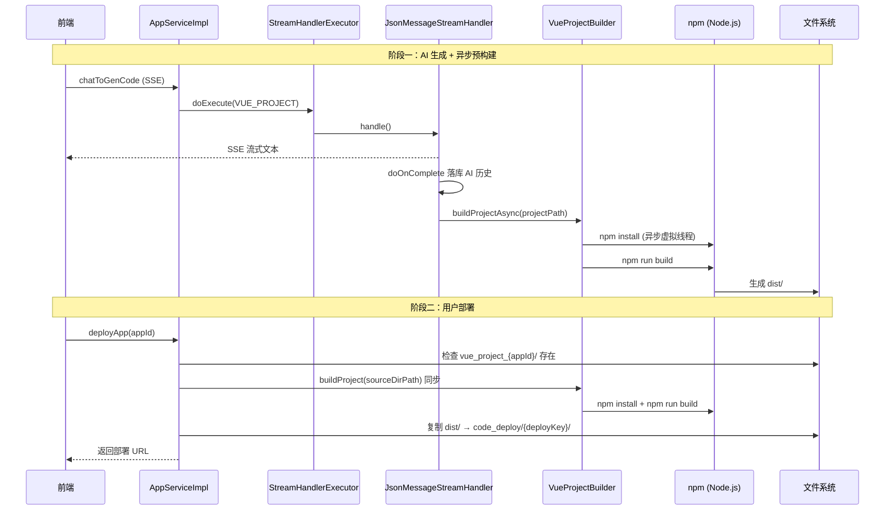

### 版本概述

本次 `1.4` 分支聚焦于 **Vue 工程自动构建与部署后端实现**。在 `1.3` 已经打通「Vue 工程生成 + TokenStream 工具调用 + FileWriteTool 实时落盘」的基础上，本版进一步补齐了 **Vue 工程从源码到可访问静态站** 的关键一环：通过 `npm install` + `npm run build` 将 AI 生成的 Vue 源码编译为 `dist` 目录，并在部署时发布构建产物而非原始工程文件。

这一版后端实现，核心上完成了三件事：

1. 新增 `VueProjectBuilder` 组件，封装 Vue 工程的 `npm install` / `npm run build` 构建流程，支持跨平台命令执行与超时控制。
2. 在 `JsonMessageStreamHandler` 流式响应结束后，**异步触发** Vue 工程预构建，为后续预览/部署提前生成 `dist`。
3. 在 `AppServiceImpl.deployApp` 中，对 `VUE_PROJECT` 类型增加 **同步构建** 逻辑，构建成功后将 `dist` 目录（而非源码目录）复制到部署目录。

---

### 核心目标

#### 为什么需要 Vue 自动构建

`1.3` 中 AI 通过 `FileWriteTool` 写入的是 **Vue 源码工程**（`package.json`、`src/`、`vite.config.js` 等），浏览器无法直接访问这些文件作为线上页面：

- 源码中包含 `.vue` 单文件组件，需要 Vite 编译
- 依赖 `node_modules`，不能直接作为静态资源部署
- 用户期望点击「部署」后得到的是 **可访问的 HTML/JS/CSS 成品站**，而非开发目录

因此必须在后端引入 **npm 构建能力**，将 Vue 工程编译为 `dist` 静态资源后再部署。

#### 为什么区分「异步预构建」与「同步部署构建」

本版在两个时机触发构建，职责不同：

| 时机 | 触发位置 | 执行方式 | 目的 |
|------|----------|----------|------|
| AI 生成流结束 | `JsonMessageStreamHandler.doOnComplete` | **异步**（虚拟线程） | 提前编译，缩短用户后续部署等待时间 |
| 用户点击部署 | `AppServiceImpl.deployApp` | **同步**（阻塞等待） | 确保部署时 `dist` 一定存在且为最新版本 |

异步构建失败不会阻塞 SSE 流式响应；同步构建失败则直接抛业务异常，阻止错误产物上线。

#### 本版采用的总体方案

```
AI 流式生成 Vue 源码（FileWriteTool 写入 vue_project_{appId}/）
    → JsonMessageStreamHandler 流结束
    → vueProjectBuilder.buildProjectAsync()  【异步 npm install + build】
    → 用户点击部署
    → AppServiceImpl.deployApp()
    → vueProjectBuilder.buildProject()        【同步 npm install + build】
    → 复制 dist/ → tmp/code_deploy/{deployKey}/
    → 返回可访问 URL
```

---

### 技术栈

| 层次 | 技术 / 组件 | 用途 |
|------|-------------|------|
| 构建执行 | Node.js + npm | Vue 工程依赖安装与 Vite 编译 |
| 进程调用 | Hutool `RuntimeUtil.exec` | 在指定工作目录执行 shell 命令 |
| 并发模型 | Java 21 虚拟线程 `Thread.ofVirtual()` | 异步构建不阻塞主线程 |
| 超时控制 | `Process.waitFor(timeout, TimeUnit.SECONDS)` | 防止 npm 命令无限挂起 |
| 跨平台适配 | `npm` / `npm.cmd` 自动切换 | Windows 与 Linux/macOS 兼容 |
| 部署复制 | Hutool `FileUtil.copyContent` | 将 `dist` 目录复制到部署目录 |
| 继承 1.3 | TokenStream + FileWriteTool + JsonMessageStreamHandler | Vue 工程生成与流式处理 |

---

### 架构与完整调用链

#### 整体流程图



#### 部署调用链路（文字版）

```text
用户点击部署
    ->
AppServiceImpl.deployApp(appId, loginUser)
    ->
1. 校验权限 / 应用存在
    ->
2. 生成或复用 deployKey
    ->
3. 拼接源码目录：tmp/code_output/{codeGenType}_{appId}
    ->
4. 检查源码目录存在
    ->
5. 【VUE_PROJECT 专属】vueProjectBuilder.buildProject(sourceDirPath)
    -> npm install（最长 5 分钟）
    -> npm run build（最长 3 分钟）
    -> 验证 dist/ 目录生成
    -> sourceDir 切换为 dist/
    ->
6. FileUtil.copyContent(sourceDir, deployDir, true)
    ->
7. 更新数据库 deployKey / deployedTime
    ->
8. 返回 http://localhost/{deployKey}/
```

---

### 功能拆解

#### 1. 新增 VueProjectBuilder 构建组件

`VueProjectBuilder` 是 1.4 的核心新增类，负责在指定目录执行 npm 构建：

```java
// YuCodeMother-Backend/src/main/java/com/yupi/yucodemotherbackend/core/builder/VueProjectBuilder.java

@Slf4j
@Component
public class VueProjectBuilder {

    // 异步构建：虚拟线程，不阻塞调用方
    public void buildProjectAsync(String projectPath) {
        Thread.ofVirtual().name("vue-builder-" + System.currentTimeMillis())
                .start(() -> {
                    try {
                        buildProject(projectPath);
                    } catch (Exception e) {
                        log.error("异步构建 vue 项目时发生异常：{}", e.getMessage(), e);
                    }
                });
    }

    // 同步构建：返回是否成功
    public boolean buildProject(String projectPath) { ... }
}
```

**构建流程**：

1. 校验项目目录存在
2. 校验 `package.json` 存在
3. 执行 `npm install`（超时 300 秒）
4. 执行 `npm run build`（超时 180 秒）
5. 验证 `dist/` 目录已生成

#### 2. 跨平台命令执行与超时控制

```java
// Windows 下使用 npm.cmd，其他系统使用 npm
private String buildCommand(String baseCommand) {
    if (isWindows()) {
        return baseCommand + ".cmd";
    }
    return baseCommand;
}

// 通用命令执行，支持超时强制终止
private boolean executeCommand(File workingDir, String command, int timeoutSeconds) {
    Process process = RuntimeUtil.exec(null, workingDir, command.split("\\s+"));
    boolean finished = process.waitFor(timeoutSeconds, TimeUnit.SECONDS);
    if (!finished) {
        process.destroyForcibly();
        return false;
    }
    return process.exitValue() == 0;
}
```

**设计要点**：

- 使用 `RuntimeUtil.exec` 在项目根目录执行命令，环境变量继承当前 JVM 进程
- `npm install` 和 `npm run build` 分别设置 5 分钟 / 3 分钟超时，避免构建卡死
- 退出码非 0 或超时时返回 `false`，由调用方决定抛异常或仅记日志

#### 3. JsonMessageStreamHandler：流结束后异步预构建

在 `1.3` 的 `doOnComplete` 落库逻辑之后，新增异步构建触发：

```java
// YuCodeMother-Backend/src/main/java/com/yupi/yucodemotherbackend/core/handler/JsonMessageStreamHandler.java

@Resource
private VueProjectBuilder vueProjectBuilder;

.doOnComplete(() -> {
    String aiResponse = chatHistoryStringBuilder.toString();
    chatHistoryService.addChatMessage(appId, aiResponse, ...);
    // 流式响应完成后，异步构建 Vue 工程
    String projectPath = AppConstant.CODE_OUTPUT_ROOT_DIR + "/vue-project/" + appId;
    vueProjectBuilder.buildProjectAsync(projectPath);
})
```

**意图**：AI 生成完所有文件后，后台自动跑一遍 `npm install + build`，用户后续部署时可能直接命中已生成的 `dist`，减少等待。

#### 4. AppServiceImpl.deployApp：Vue 部署前同步构建

`deployApp` 在复制文件前，对 Vue 工程做同步构建，并切换复制源为 `dist`：

```java
// YuCodeMother-Backend/src/main/java/com/yupi/yucodemotherbackend/service/impl/AppServiceImpl.java

@Resource
private VueProjectBuilder vueProjectBuilder;

// 源码目录：{codeGenType}_{appId}，如 vue_project_123
String sourceDirPath = AppConstant.CODE_OUTPUT_ROOT_DIR + File.separator + sourceDirName;

if (codeGenTypeEnum == CodeGenTypeEnum.VUE_PROJECT) {
    boolean buildSuccess = vueProjectBuilder.buildProject(sourceDirPath);
    ThrowUtils.throwIf(!buildSuccess, ErrorCode.SYSTEM_ERROR, "Vue 项目构建失败，请重试");
    File distDir = new File(sourceDirPath, "dist");
    ThrowUtils.throwIf(!distDir.exists(), ErrorCode.SYSTEM_ERROR, "Vue 项目构建完成但未生成 dist 目录");
    sourceDir = distDir;  // 第 8 步复制 dist 而非源码
}
FileUtil.copyContent(sourceDir, new File(deployDirPath), true);
```

**与 0.8 / 1.3 的变化**：

| 版本 | 部署复制的内容 |
|------|----------------|
| 0.8 ~ 1.3（HTML/MULTI_FILE） | 直接复制源码目录 |
| 1.4（VUE_PROJECT） | 先 `npm run build`，再复制 `dist/` 目录 |

---

### 环境依赖说明

1.4 构建能力依赖 **本机已安装 Node.js 和 npm**，且能在命令行中直接调用：

```bash
# 验证环境
node -v
npm -v
```

| 检查项 | 要求 |
|--------|------|
| Node.js | 建议 v18+（与 AI 生成的 Vite 工程兼容） |
| npm | 随 Node.js 安装，需加入系统 PATH |
| 网络 | `npm install` 需能访问 npm  registry（国内建议配置镜像） |
| 磁盘空间 | `node_modules` + `dist` 会占用额外空间 |

若 Node.js 未安装或未加入 PATH，`VueProjectBuilder` 执行命令时会失败，部署接口返回「Vue 项目构建失败，请重试」。

---

### 三种模式部署流程对比

| 维度 | HTML | MULTI_FILE | VUE_PROJECT（1.4） |
|------|------|------------|---------------------|
| 生成落盘 | 流结束后解析保存 | 同左 | FileWriteTool 实时写入 |
| 部署前处理 | 无，直接复制 | 无，直接复制 | `npm install` + `npm run build` |
| 部署内容 | 源码 HTML/CSS/JS | 源码多文件 | **编译后的 `dist/`** |
| 生成后预构建 | 无 | 无 | 流结束异步构建（1.4 新增） |
| 构建耗时 | 0 | 0 | 数十秒 ~ 数分钟（取决于工程大小与网络） |
| 外部依赖 | 无 | 无 | Node.js + npm |

---

### 数据流视角

```text
【生成阶段】
用户消息 → TokenStream → FileWriteTool 写入 vue_project_{appId}/
    → SSE 流结束 → chat_history 落库
    → buildProjectAsync() 后台启动 npm 构建

【部署阶段】
用户点击部署 → 检查 vue_project_{appId}/ 存在
    → buildProject() 同步 npm install + build
    → 复制 dist/ → code_deploy/{deployKey}/
    → 更新 deployKey → 返回 http://localhost/{deployKey}/
```

---

### 测试与验证

#### 验证清单

1. 确认本机 `node -v` 和 `npm -v` 可正常输出。
2. 调用 `/app/chat/gen/code` 生成 Vue 工程，检查 `tmp/code_output/vue_project_{appId}/` 下有完整工程文件。
3. 观察后端日志，流结束后应出现 `vue-builder-*` 虚拟线程的构建日志（异步预构建）。
4. 调用 `/app/deploy?appId=xxx`，观察日志中 `npm install` / `npm run build` 执行过程。
5. 确认 `tmp/code_output/vue_project_{appId}/dist/` 目录生成且非空。
6. 确认 `tmp/code_deploy/{deployKey}/` 下为编译后的静态文件（`index.html` + `assets/`）。
7. 浏览器访问返回的部署 URL，确认页面可正常渲染。

#### 日志关键字

```
开始构建 Vue 项目
执行 npm install...
执行 npm run build...
Vue 项目构建成功，dist 目录
命令执行超时
Vue 项目构建失败
```

---

### 与前后分支关系

#### 与 1.3 Vue 工程生成的关系

| 1.3 能力 | 1.4 中的延续与扩展 |
|----------|-------------------|
| `VUE_PROJECT` 代码生成类型 | 完全继承 |
| TokenStream + FileWriteTool | 完全继承，写入目录为 `vue_project_{appId}` |
| JsonMessageStreamHandler 流处理 | 扩展：流结束后新增异步构建 |
| 部署直接复制源码 | **Vue 模式改为复制 dist** |
| 目录命名 `vue_project_{appId}` | FileWriteTool 与 deployApp 已统一（1.3 文档中的命名不一致问题在代码层已修复） |

#### 与 0.8 应用部署功能的关系

0.8 建立了「生成目录 → 部署目录 → deployKey 访问」的基础部署链路。1.4 在链路中间插入了 **Vue 构建** 步骤，使 Vue 工程也能复用同一套部署基础设施，无需单独的部署通道。

#### 为后续分支铺垫

- 构建状态推送：通过 SSE 或 WebSocket 向前端实时反馈 `npm install` / `build` 进度
- 构建结果缓存：若 `dist` 已存在且源码未变，跳过重复构建
- Docker 化构建：将 npm 构建放入容器，消除本机 Node.js 环境依赖
- `npm run dev` 热更新预览：支持开发态实时预览，而非仅 build 后静态部署

---

### 常见问题与注意事项

#### 1. ⚠️ 异步构建路径与写入路径不一致

当前代码中存在路径拼接差异，需重点关注：

| 场景 | 路径规则 | 示例（appId=123） |
|------|----------|-------------------|
| `FileWriteTool` 写入 | `vue_project_{appId}` | `tmp/code_output/vue_project_123/` |
| `deployApp` 查找 | `{codeGenType}_{appId}` | `tmp/code_output/vue_project_123/` |
| `JsonMessageStreamHandler` 异步构建 | `vue-project/{appId}` | `tmp/code_output/vue-project/123/` ❌ |

**后果**：异步预构建可能因路径错误找不到项目目录而静默失败（仅记 error 日志），不影响 SSE 流和同步部署，但 **失去了「提前编译」的优化效果**。

**建议修复方向**：将 `JsonMessageStreamHandler` 中的路径改为与 `FileWriteTool` / `deployApp` 一致：

```java
String projectPath = AppConstant.CODE_OUTPUT_ROOT_DIR + File.separator + "vue_project_" + appId;
```

#### 2. Node.js 环境依赖

构建依赖本机 Node.js，服务器若未安装则部署必定失败。生产环境建议：

- 在部署文档中明确 Node.js 版本要求
- 启动前增加环境检测接口或健康检查
- 长期方案：Docker 镜像内置 Node.js

#### 3. npm install 网络与超时

国内环境 `npm install` 可能较慢或超时（当前上限 5 分钟）。建议：

- 配置 npm 镜像：`npm config set registry https://registry.npmmirror.com`
- 视情况调大 `executeNpmInstall` 的超时时间

#### 4. 异步构建失败不可见

`buildProjectAsync` 在虚拟线程中执行，失败仅记日志，**不会通知前端**。用户可能在部署时才首次发现构建问题。后续可增加构建状态查询接口。

#### 5. 重复构建的性能开销

当前策略下，一次完整的对话生成可能触发 **两次构建**（流结束异步 + 部署同步）。对于小工程可接受，大工程建议增加「dist 已存在且未过期则跳过」的缓存策略。

#### 6. Windows 命令兼容性

已通过 `npm.cmd` 适配 Windows。若使用 nvm 或自定义 npm 路径，需确保 `npm` 在 JVM 进程的环境变量 `PATH` 中可找到。

#### 7. 部署后访问的是编译产物

Vue 部署后 `code_deploy/{deployKey}/` 下是 `dist` 内容（静态 HTML/JS/CSS），**不是** Vue 源码。如需修改工程，需重新通过 AI 对话生成并再次部署。

---

### 技术亮点

#### 1. 生成与构建解耦

AI 生成（TokenStream + 工具调用）与 npm 构建（VueProjectBuilder）职责分离，构建失败不影响对话流式响应和历史落库。

#### 2. 双时机构建策略

异步预构建 + 同步部署构建，兼顾用户体验（提前编译）与部署可靠性（确保最新 dist）。

#### 3. Java 21 虚拟线程异步执行

使用 `Thread.ofVirtual()` 执行后台构建，相比传统线程池更轻量，适合 IO 密集型的 npm 命令等待场景。

#### 4. 最小侵入式扩展

仅新增 1 个组件、修改 2 个已有类，HTML / MULTI_FILE 的生成与部署链路零影响。

---

### 核心收益总结

#### 从「生成 Vue 源码」升级到「可部署的成品站」

1.4 补齐了 Vue 工程落地的最后一公里，用户部署后得到的是经 Vite 编译的静态站点，而非无法直接访问的源码目录。

#### 构建能力可复用

`VueProjectBuilder` 作为独立 `@Component`，可在预览、定时构建、CI 等场景中复用，不仅限于部署接口。

#### 与既有部署体系无缝融合

复用 0.8 的 `deployKey` + `StaticResourceController` 访问机制，Vue 工程部署后同样通过 `http://localhost/{deployKey}/` 访问。

---

### 后续可优化方向

1. **修复异步构建路径**：统一 `JsonMessageStreamHandler` 与 `FileWriteTool` 的目录命名。
2. **构建状态可视化**：向前端推送构建进度（install / build / success / fail）。
3. **构建缓存**：源码未变时跳过重复 `npm install` 和 `npm run build`。
4. **Docker 构建沙箱**：隔离构建环境，消除本机 Node.js 依赖。
5. **预览模式**：支持 `npm run dev` 热更新预览，无需每次完整 build + deploy。
6. **构建超时与重试策略**：按工程规模动态调整超时，失败自动重试 1~2 次。

---

### 发布信息

**发布日期**: 2026-06-04  
**版本号**: v1.4  
**分支**: 1.4 - Vue工程自动构建与部署后端实现  
**核心能力**: VueProjectBuilder 构建组件 + 流结束异步预构建 + 部署前同步 build + dist 目录部署  
**变更规模**: 相对 1.3 共 3 个 Java 文件，+196 / -16 行（`VueProjectBuilder` 新增 154 行，`JsonMessageStreamHandler` +20 行，`AppServiceImpl` +26 行）
