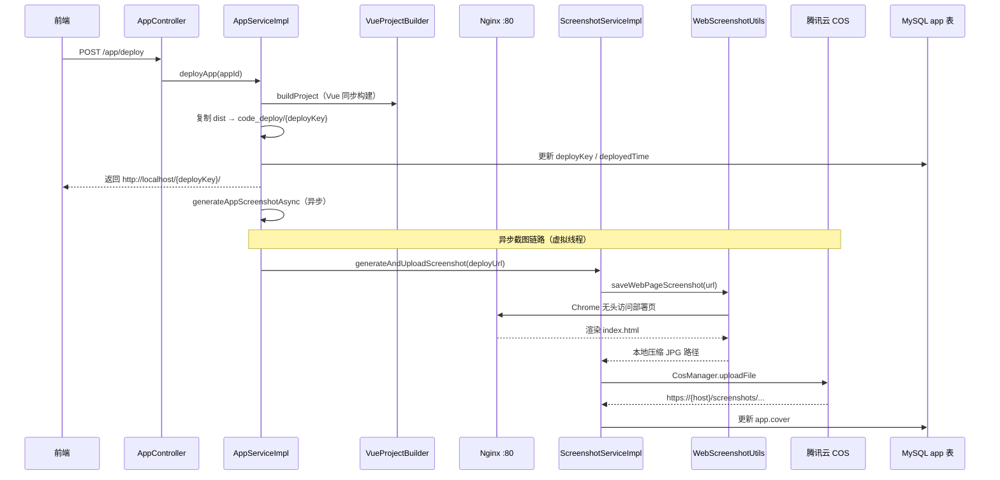

### 版本概述

本次 `1.5` 分支聚焦于 **应用部署截图与 COS 封面上传后端实现**。在 `1.4` 已经打通「Vue 工程构建 + dist 部署 + Nginx 访问」的基础上，本版进一步实现 **部署成功后自动生成应用封面**：通过 Selenium 无头浏览器访问已部署站点截图，压缩后上传至 **腾讯云 COS**，并异步更新 `app.cover` 字段，让应用列表/详情页能展示真实页面预览图。

这一版后端实现，核心上完成了四件事：

1. 新增 `WebScreenshotUtils`，基于 Selenium + Chrome 无头模式实现网页截图与图片压缩。
2. 新增 `CosClientConfig` / `CosManager`，封装腾讯云 COS 客户端与文件上传能力。
3. 新增 `ScreenshotService`，串联「截图 → 上传 COS → 返回访问 URL」完整流程。
4. 在 `AppServiceImpl.deployApp` 部署成功后，**异步触发**截图任务并更新应用封面；同时修复 `1.4` 中 Vue 构建路径与 npm 命令执行相关问题。

---

### 核心目标

#### 为什么需要部署后自动截图

`0.8 ~ 1.4` 部署链路完成后，用户可通过 `deployKey` 访问应用，但 **应用列表中的 `cover` 封面字段仍为空**：

- 用户无法在「我的应用」页面直观看到生成效果
- 手动上传封面成本高，与「零代码自动生成」产品理念不符
- 封面应反映 **部署后的真实页面**，而非静态占位图

因此需要在部署成功时，自动抓取部署 URL 的页面截图作为封面。

#### 为什么截图后上传 COS 而非本地存储

- 本地 `tmp/screenshots/` 不适合作为长期封面资源存储
- 多实例部署时本地文件无法共享
- COS 提供稳定的 HTTP 访问 URL，前端可直接 `` 展示
- 与腾讯云生态集成，便于后续扩展（CDN、权限控制等）

#### 本版采用的总体方案

```
用户点击部署
    → deployApp：构建 + 复制 dist + 返回 http://localhost/{deployKey}/
    → generateAppScreenshotAsync（虚拟线程，不阻塞部署响应）
    → WebScreenshotUtils：Chrome 无头访问部署 URL → 截图 → 压缩 JPG
    → CosManager：上传到 COS /screenshots/yyyy/MM/dd/{uuid}.jpg
    → 更新 app.cover = COS 访问 URL
```

---

### 技术栈

| 层次 | 技术 / 组件 | 用途 |
|------|-------------|------|
| 网页截图 | Selenium 4.33 + ChromeDriver | 无头浏览器渲染并截图 |
| 驱动管理 | WebDriverManager 6.1 | 自动下载匹配版本的 chromedriver |
| 图片处理 | Hutool `ImgUtil.compress` | PNG 截图压缩为 JPG（quality 0.3） |
| 对象存储 | 腾讯云 COS SDK 5.6.227 | 上传截图文件 |
| 配置绑定 | `@ConfigurationProperties("cos.client")` | 读取 host / secretId / region / bucket |
| 异步执行 | Java 21 `Thread.startVirtualThread` | 截图上传不阻塞部署接口 |
| 静态访问 | Nginx（继承 0.8） | 截图目标 URL 需 Nginx 在 80 端口可访问 |
| 继承 1.4 | VueProjectBuilder + deployApp | 部署完成后触发截图 |

---

### 架构与完整调用链

#### 整体流程图



#### 后端调用链路（文字版）

```text
POST /app/deploy { appId }
    ->
AppServiceImpl.deployApp(appId, loginUser)
    ->
1. 校验权限 / 应用存在
2. 生成或复用 deployKey
3. Vue 模式：vueProjectBuilder.buildProject → 复制 dist
4. FileUtil.copyContent → tmp/code_deploy/{deployKey}/
5. 更新数据库 deployKey、deployedTime
6. 拼接 appDeployUrl = http://localhost/{deployKey}/
7. generateAppScreenshotAsync(appId, appDeployUrl)  // 异步，立即 return URL
    ->
【异步虚拟线程】
ScreenshotServiceImpl.generateAndUploadScreenshot(webUrl)
    ->
WebScreenshotUtils.saveWebPageScreenshot(webUrl)
    -> Chrome 无头打开 URL
    -> waitForPageLoad（document.readyState + 2s）
    -> getScreenshotAs(BYTES)
    -> 压缩为 JPG，删除原始 PNG
    ->
CosManager.uploadFile(cosKey, file)
    -> key = /screenshots/2026/06/10/{uuid}_compressed.jpg
    -> 返回 host + key 组成的 COS URL
    ->
AppServiceImpl 更新 app.cover = screenshotUrl
    ->
finally：删除本地 tmp/screenshots/ 临时文件
```

---

### 功能拆解

#### 1. WebScreenshotUtils 网页截图工具

`WebScreenshotUtils` 是截图核心工具类，在 **静态代码块** 中初始化全局单例 `ChromeDriver`，避免重复创建浏览器实例。

```java
// YuCodeMother-Backend/src/main/java/com/yupi/yucodemotherbackend/utils/WebScreenshotUtils.java

static {
    webDriver = initChromeDriver(1600, 900);  // 无头模式
}

public static String saveWebPageScreenshot(String webUrl) {
    webDriver.get(webUrl);
    waitForPageLoad(webDriver);
    byte[] bytes = ((TakesScreenshot) webDriver).getScreenshotAs(OutputType.BYTES);
    // 保存 PNG → ImgUtil.compress 为 JPG（quality=0.3）→ 删除 PNG
    return compressedImagePath;
}
```

**Chrome 无头配置要点**：

- `--headless`、`--disable-gpu`、`--no-sandbox`
- 窗口大小 1600×900
- WebDriverManager 自动匹配本机 Chrome 版本下载 chromedriver

#### 2. ScreenshotService 截图业务编排

```java
// ScreenshotServiceImpl.generateAndUploadScreenshot

log.info("开始生成网页截图，URL：{}", webUrl);
String localPath = WebScreenshotUtils.saveWebPageScreenshot(webUrl);
ThrowUtils.throwIf(StrUtil.isBlank(localPath), ..., "生成网页截图失败");

String cosUrl = uploadScreenshotToCos(localPath);  // 调用 CosManager
cleanupLocalFile(localPath);  // finally 清理临时文件
return cosUrl;
```

COS 对象键格式：

```text
/screenshots/{yyyy}/{MM}/{dd}/{8位uuid}_compressed.jpg
```

#### 3. CosClientConfig + CosManager 对象存储

**配置类**（读取 `application.yml` 中 `cos.client` 前缀）：

```yaml
cos:
  client:
    host: https://your-bucket.cos.ap-chengdu.myqcloud.com
    secretId: AKIDxxxx
    secretKey: xxxxx
    region: ap-chengdu
    bucket: karry-code-mother-1375843739
```

**CosManager 上传逻辑**：

```java
PutObjectRequest request = new PutObjectRequest(bucket, key, file);
cosClient.putObject(request);
// 返回可访问 URL = host + key
return String.format("%s%s", cosClientConfig.getHost(), key);
```

#### 4. deployApp 集成：异步生成封面

`AppServiceImpl` 在部署流程末尾新增两步：

```java
// 10. 得到可访问 URL
String appDeployUrl = String.format("%s/%s/", AppConstant.CODE_DEPLOY_HOST, deployKey);
// 11. 异步生成截图并更新封面
generateAppScreenshotAsync(appId, appDeployUrl);
return appDeployUrl;

@Override
public void generateAppScreenshotAsync(Long appId, String appUrl) {
    Thread.startVirtualThread(() -> {
        String screenshotUrl = screenshotService.generateAndUploadScreenshot(appUrl);
        App updateApp = new App();
        updateApp.setId(appId);
        updateApp.setCover(screenshotUrl);
        this.updateById(updateApp);
    });
}
```

**设计要点**：截图耗时可能 30s~3min（含 chromedriver 下载），必须 **异步** 执行，不能阻塞部署接口返回。

#### 5. 1.4 遗留问题修复（本版一并纳入）

| 问题 | 修复 |
|------|------|
| `JsonMessageStreamHandler` 异步构建路径写错 `vue-project/{appId}` | 改为 `vue_project_{appId}`，与 `FileWriteTool` 一致 |
| `VueProjectBuilder` Windows 下找不到 `npm` | 使用 `npm.cmd` + `cmd /c` 执行，显式传入系统环境变量 |
| 前端 Vue 预览路径 | `getStaticPreviewUrl` 对 `VUE_PROJECT` 追加 `dist/index.html` |

---

### 配置说明

#### pom.xml 新增依赖

```xml
<!-- Selenium 网页截图 -->
<dependency>
    <groupId>org.seleniumhq.selenium</groupId>
    <artifactId>selenium-java</artifactId>
    <version>4.33.0</version>
</dependency>
<dependency>
    <groupId>io.github.bonigarcia</groupId>
    <artifactId>webdrivermanager</artifactId>
    <version>6.1.0</version>
</dependency>

<!-- 腾讯云 COS -->
<dependency>
    <groupId>com.qcloud</groupId>
    <artifactId>cos_api</artifactId>
    <version>5.6.227</version>
</dependency>
```

#### application.yml / application-local.yml

```yaml
cos:
  client:
    host: https://karry-code-mother-1375843739.cos.ap-chengdu.myqcloud.com
    secretId: <Your SecretId>
    secretKey: <Your SecretKey>
    region: ap-chengdu
    bucket: karry-code-mother-1375843739
```

#### 环境依赖清单

| 依赖 | 说明 |
|------|------|
| 本机 Chrome 浏览器 | WebDriverManager 需匹配 Chrome 版本 |
| Nginx 监听 80 端口 | 截图 URL 为 `http://localhost/{deployKey}/`，部署前需 Nginx 已启动 |
| 腾讯云 COS 桶 | 需提前创建 bucket 并配置 CORS（若前端直读） |
| 网络 | 首次运行 WebDriverManager 可能需下载 chromedriver |

---

### 数据流视角

```text
【部署主链路】
用户部署 → build dist → 复制 code_deploy → 返回 deployUrl → 前端立即展示部署地址

【封面异步链路】
deployUrl → Chrome 无头截图 → 本地 JPG → COS 上传 → app.cover 更新 → 前端列表刷新可见封面

【资源清理】
截图临时文件 tmp/screenshots/{uuid}/ → 上传成功后 delete
ChromeDriver → @PreDestroy 时 webDriver.quit()
```

---

### 测试与验证

#### 测试用例

`WebScreenshotUtilsTest` 提供基础截图测试：

```java
@Test
void saveWebPageScreenshot() {
    String testUrl = "https://www.codefather.cn";  // 注意 URL 格式正确
    String path = WebScreenshotUtils.saveWebPageScreenshot(testUrl);
    Assertions.assertNotNull(path);
}
```

#### 验证清单

1. 配置 `cos.client` 四项参数，COS 桶可正常上传。
2. 启动 Nginx，`root` 指向 `tmp/code_deploy`。
3. 完成一次 Vue 应用生成 + 部署。
4. 观察日志：`开始生成网页截图，URL：http://localhost/{deployKey}/`。
5. 等待异步任务完成，日志出现 `文件上传到 COS 成功`。
6. 查询 `app` 表，`cover` 字段为 COS HTTPS URL。
7. 前端应用列表/详情页能加载封面图片。

---

### 与前后分支关系

#### 与 1.4 Vue 自动构建与部署的关系

| 1.4 能力 | 1.5 中的延续与扩展 |
|----------|-------------------|
| `VueProjectBuilder` npm 构建 | 完全继承，并修复 Windows npm 执行 |
| `deployApp` 复制 dist | 部署成功后新增异步截图 |
| `JsonMessageStreamHandler` 异步预构建 | 修复 `vue_project_{appId}` 路径 |
| 返回 `http://localhost/{deployKey}/` | 该 URL 同时作为截图目标地址 |

#### 与 0.8 Nginx 部署的关系

截图 **不是** 读取本地 `dist` 文件截图，而是 **访问部署 URL** 渲染页面后截图。因此 **Nginx 必须在截图任务执行前已运行**，否则会出现 `ERR_CONNECTION_REFUSED`。

#### 与 1.1 前端应用展示的关系

前端 `HomePage` 等页面读取 `app.cover` 展示封面；1.5 后端自动填充该字段，前端无需改动即可展示 COS 图片（需 COS 域名允许跨域或 img 直链访问）。

#### 前端预览 URL 补充（1.5 小改）

```typescript
// YuCodeMother-Frontend/src/config/env.ts
export const getStaticPreviewUrl = (codeGenType: string, appId: string) => {
  const baseUrl = `${STATIC_BASE_URL}/${codeGenType}_${appId}/`
  if (codeGenType == CodeGenTypeEnum.VUE_PROJECT) {
    return `${baseUrl}dist/index.html`  // Vue 工程预览 dist
  }
  return baseUrl
}
```

---

### 常见问题与注意事项

#### 1. ⚠️ 截图失败：ERR_CONNECTION_REFUSED

**原因**：异步截图执行时，Nginx 未在 80 端口运行，或部署 URL 不可访问。

**建议**：部署前确认 `http://localhost/{deployKey}/` 在浏览器可打开；或调整截图时机（部署后延迟重试）。

#### 2. ⚠️ 截图失败：chromedriver 下载慢 / 超时

WebDriverManager 首次运行需从 Google CDN 下载 chromedriver，国内网络可能较慢（日志中可见 1~3 分钟）。

**建议**：提前运行一次测试用例完成驱动缓存；或配置 WebDriverManager 国内镜像。

#### 3. COS 上传失败

检查 `secretId` / `secretKey` / `region` / `bucket` 是否匹配；`host` 需为 bucket 的访问域名（如 `https://{bucket}.cos.{region}.myqcloud.com`）。

#### 4. 封面更新失败不影响部署

截图在独立虚拟线程中执行，失败仅记日志 + 抛 `BusinessException`（线程内），**部署 URL 仍正常返回**。

#### 5. ChromeDriver 与应用生命周期

`WebScreenshotUtils` 使用静态单例 WebDriver，`@PreDestroy destroy()` 在 Bean 销毁时 `quit()`。开发环境热重启可能导致 driver 状态异常，需重启应用。

#### 6. 截图 URL 必须是完整可访问地址

`AppConstant.CODE_DEPLOY_HOST` 默认为 `http://localhost`（无端口），与 Nginx 80 端口设计一致；若改用 `8123/api/static`，需同步修改 `CODE_DEPLOY_HOST` 与 Nginx 配置。

---

### 技术亮点

#### 1. 部署与截图解耦

部署接口立即返回 URL，截图在后台异步完成，用户无需等待 chromedriver 下载和页面渲染。

#### 2. 截图 + 压缩 + 上传一条龙

`WebScreenshotUtils` 输出压缩 JPG，`ScreenshotServiceImpl` 负责上传与清理，职责清晰。

#### 3. COS Manager 可复用

`CosManager.uploadFile` 不仅服务封面截图，后续可扩展用户头像、代码导出等上传场景。

#### 4. 虚拟线程降低异步开销

`Thread.startVirtualThread` 执行截图任务，比传统线程池更轻量，适合 IO 密集型（网络 + 子进程）场景。

---

### 核心收益总结

#### 从「无封面」到「部署页自动截图封面」

1.5 让用户在应用列表中 **直观看到 AI 生成并部署后的真实页面效果**，提升产品完整度与展示体验。

#### 封面资源云端持久化

COS 存储保证封面 URL 稳定可访问，不依赖本地临时目录，支持多实例部署。

#### 与部署链路自然融合

无需额外接口，部署成功即触发封面生成，用户零感知、零操作。

---

### 后续可优化方向

1. **截图前重试 / 等待 Nginx 就绪**：避免 Nginx 未启动导致 `ERR_CONNECTION_REFUSED`。
2. **截图失败告警**：封面生成失败时写入日志或通知，便于排查。
3. **HTML 模式部署也生成封面**：当前逻辑对所有 `codeGenType` 部署后均触发截图，可针对 Vue / HTML 优化等待时间。
4. **COS CDN 加速**：封面 URL 接入 CDN 域名，提升列表页加载速度。
5. **WebDriver 池化**：高并发部署时避免单例 ChromeDriver 成为瓶颈。

---

### 发布信息

**发布日期**: 2026-06-10  
**版本号**: v1.5  
**分支**: 1.5 - 应用部署截图与COS封面上传后端实现  
**核心能力**: WebScreenshotUtils 无头截图 + 腾讯云 COS 上传 + 部署后异步更新 app.cover + Vue 构建路径/npm 修复  
**变更规模**: 相对 1.4 共 14 个文件，+556 / -17 行（含 Selenium/COS 依赖、`ScreenshotService` 体系、`CosManager`、`AppServiceImpl` 异步封面、前端预览 URL 补充）
