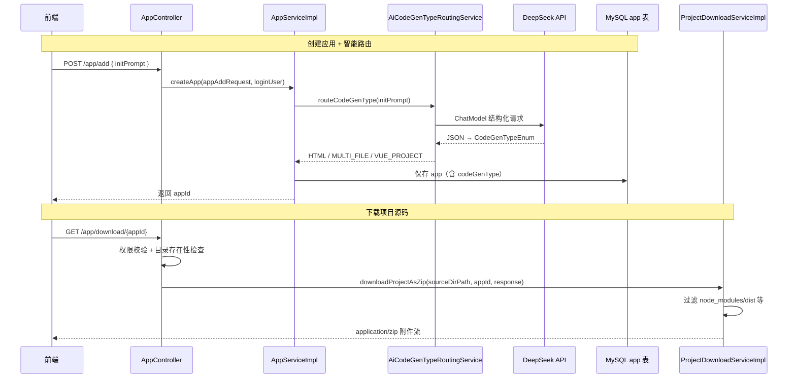

### 版本概述

本次 `1.6` 分支聚焦于 **代码生成智能路由与项目下载实现**。在 `1.5` 已具备「Vue 构建 + 部署 + 自动截图封面」完整链路的基础上，本版解决两个产品痛点：

1. **创建应用时不再硬编码 `VUE_PROJECT`**，而是由 AI 根据用户初始 prompt 自动选择 `HTML` / `MULTI_FILE` / `VUE_PROJECT` 三种生成模式。
2. **支持将 AI 生成的项目源码打包下载为 ZIP**，方便用户本地二次开发或备份。

这一版实现，核心上完成了四件事：

1. 新增 `AiCodeGenTypeRoutingService`，基于 LangChain4j AiServices + 枚举结构化输出实现智能路由。
2. 新增 `AiCodeGenTypeRoutingServiceFactory`（`@Configuration` + `@Bean`）注册路由服务 Bean。
3. 重构 `createApp` 业务到 `AppServiceImpl`，创建应用时调用 AI 路由并写入 `app.codeGenType`。
4. 新增 `ProjectDownloadService`，提供 `GET /app/download/{appId}` 接口，过滤 `node_modules` 等目录后 ZIP 打包下载；前端对话页同步增加「下载代码」按钮与生成类型展示。

---

### 核心目标

#### 为什么需要 AI 智能路由

`1.3 ~ 1.5` 已支持三种代码生成模式，但创建应用时 **长期写死为 `VUE_PROJECT`**：

- 简单「个人介绍页」也被强制走 Vue 工程，生成慢、成本高
- 用户无法根据需求复杂度自动匹配最合适的生成策略
- 与「零代码、智能化」产品定位不符

因此需要在 **创建应用阶段**，让 AI 阅读 `initPrompt` 后自动选择生成类型。

#### 为什么需要项目源码下载

AI 生成代码保存在 `tmp/code_output/{codeGenType}_{appId}/`，用户只能在线预览/部署，无法：

- 将代码拿到本地 IDE 继续开发
- 备份或分享给他人
- 对 Vue 工程进行二次定制

因此需要提供 **权限校验 + 目录过滤 + ZIP 打包** 的下载能力。

#### 本版采用的总体方案

```
【智能路由链路】
用户提交 initPrompt
    → AppServiceImpl.createApp
    → AiCodeGenTypeRoutingService.routeCodeGenType(initPrompt)
    → DeepSeek 返回 CodeGenTypeEnum（HTML / MULTI_FILE / VUE_PROJECT）
    → 写入 app.codeGenType → 后续 chatToGenCode / deployApp 按类型分流

【项目下载链路】
用户点击「下载代码」
    → GET /app/download/{appId}
    → 权限校验（仅创建者）
    → 定位 tmp/code_output/{codeGenType}_{appId}/
    → ProjectDownloadServiceImpl 过滤 node_modules/dist 等 → ZipUtil 压缩
    → 浏览器下载 {appId}.zip
```

---

### 技术栈

| 层次 | 技术 / 组件 | 用途 |
|------|-------------|------|
| AI 路由 | LangChain4j AiServices + ChatModel | 根据 prompt 返回 `CodeGenTypeEnum` |
| 结构化输出 | 枚举返回类型 + system prompt | LangChain4j 自动解析 JSON → 枚举 |
| 提示词 | `codegen-routing-system-prompt.txt` | 定义三种模式判断规则 |
| 业务下沉 | `AppServiceImpl.createApp` | 从 Controller 抽离创建逻辑 |
| ZIP 打包 | Hutool `ZipUtil.zip` | 流式写入 HttpServletResponse |
| 目录过滤 | `FileFilter` + 黑白名单 | 排除 node_modules、dist、.git 等 |
| 前端下载 | `fetch` + Blob + `<a download>` | 带 Cookie 的跨域文件下载 |
| 继承 1.3 | `CodeGenTypeEnum` 三分流 | 路由结果直接对接现有生成/部署链路 |

---

### 架构与完整调用链

#### 整体流程图



#### 后端调用链路（文字版）

```text
【创建应用】
POST /app/add { initPrompt }
    ->
AppController.addApp → appService.createApp(appAddRequest, loginUser)
    ->
AppServiceImpl.createApp
    -> 校验 initPrompt 非空
    -> 构造 App，appName = initPrompt 前 12 位
    -> aiCodeGenTypeRoutingService.routeCodeGenType(initPrompt)
    -> app.setCodeGenType(selectedCodeGenType.getValue())
    -> save(app) → return app.getId()

【AI 路由内部】
AiCodeGenTypeRoutingServiceFactory
    -> AiServices.builder(AiCodeGenTypeRoutingService.class).chatModel(chatModel).build()
    ->
routeCodeGenType(userPrompt)
    -> 加载 codegen-routing-system-prompt.txt 作为 system message
    -> LangChain4j 自动追加 enum 约束 + response_format: json_object
    -> 解析为 CodeGenTypeEnum

【下载代码】
GET /app/download/{appId}
    ->
AppController.downloadAppCode
    -> 校验 appId、应用存在、创建者权限
    -> sourceDirPath = tmp/code_output/{codeGenType}_{appId}/
    -> 目录存在性检查
    ->
ProjectDownloadServiceImpl.downloadProjectAsZip
    -> 设置 Content-Type: application/zip
    -> Content-Disposition: attachment; filename="{appId}.zip"
    -> ZipUtil.zip(response.getOutputStream(), UTF-8, filter, projectDir)
```

---

### 功能拆解

#### 1. AiCodeGenTypeRoutingService 智能路由接口

```java
// YuCodeMother-Backend/.../ai/AiCodeGenTypeRoutingService.java

@SystemMessage(fromResource = "prompt/codegen-routing-system-prompt.txt")
CodeGenTypeEnum routeCodeGenType(String userPrompt);
```

- 返回类型为 **枚举**，LangChain4j 自动启用结构化输出
- 无需手写 JSON 解析，框架将模型响应映射为 `CodeGenTypeEnum`

#### 2. AiCodeGenTypeRoutingServiceFactory 工厂注册

```java
@Configuration
@Slf4j
public class AiCodeGenTypeRoutingServiceFactory {

    @Resource
    private ChatModel chatModel;

    @Bean
    public AiCodeGenTypeRoutingService aiCodeGenTypeRoutingService() {
        return AiServices.builder(AiCodeGenTypeRoutingService.class)
                .chatModel(chatModel)
                .build();
    }
}
```

**注意**：必须加 `@Configuration`，否则 Spring 不会扫描 `@Bean` 方法，容器内找不到 `AiCodeGenTypeRoutingService`，启动即报 `NoSuchBeanDefinitionException`。

#### 3. 路由 System Prompt

`codegen-routing-system-prompt.txt` 定义三种模式及判断规则：

| 用户需求特征 | 路由结果 |
|-------------|---------|
| 简单单页展示 | `HTML` |
| 多页面、低交互 | `MULTI_FILE` |
| 复杂交互、路由、状态管理 | `VUE_PROJECT` |

末尾需包含 **JSON 字样**（DeepSeek 使用 `json_object` 模式时的 API 要求）：

```text
请以 JSON 格式返回结果，value 字段必须是 HTML、MULTI_FILE 或 VUE_PROJECT 之一。
```

#### 4. createApp 业务重构

原先 `AppController.addApp` 内联创建逻辑，现下沉至 `AppServiceImpl.createApp`：

```java
// 【长期选择】AI 智能路由选择生成代码类型
CodeGenTypeEnum selectedCodeGenType = aiCodeGenTypeRoutingService.routeCodeGenType(initPrompt);
app.setCodeGenType(selectedCodeGenType.getValue());

// 对比 1.5 及之前硬编码：
// app.setCodeGenType(CodeGenTypeEnum.VUE_PROJECT.getValue());
```

Controller 简化为：

```java
Long appId = appService.createApp(appAddRequest, loginUser);
return ResultUtils.success(appId);
```

#### 5. ProjectDownloadService 项目打包下载

**接口定义**：

```java
void downloadProjectAsZip(String projectPath, String downloadFileName, HttpServletResponse response);
```

**过滤规则**（不打入 ZIP）：

| 类型 | 示例 |
|------|------|
| 目录名 | `node_modules`、`.git`、`dist`、`build`、`.idea`、`.vscode` |
| 扩展名 | `.log`、`.tmp`、`.cache` |

**核心实现**：

```java
response.setContentType("application/zip");
response.setHeader("Content-Disposition",
        String.format("attachment; filename=\"%s.zip\"", downloadFileName));
ZipUtil.zip(response.getOutputStream(), StandardCharsets.UTF_8, false, filter, projectDir);
```

#### 6. AppController 下载接口

```java
@GetMapping("/download/{appId}")
public void downloadAppCode(@PathVariable Long appId, ...) {
    // 权限：仅应用创建者可下载
    String sourceDirName = codeGenType + "_" + appId;
    String sourceDirPath = AppConstant.CODE_OUTPUT_ROOT_DIR + File.separator + sourceDirName;
    projectDownloadService.downloadProjectAsZip(sourceDirPath, String.valueOf(appId), response);
}
```

目录命名与 `FileWriteTool`、`deployApp` 保持一致：`vue_project_1`、`html_2`、`multi_file_3` 等。

#### 7. 前端改动

**AppChatPage.vue**：

- 顶栏展示 `codeGenType` 标签（HTML / 多文件 / Vue 工程）
- 新增「下载代码」按钮，通过 `fetch` + Blob 触发浏览器下载
- 仅应用创建者（`isOwner`）可点击下载

**AppDetailModal.vue**：

- 应用详情弹窗增加「生成类型」字段展示

---

### 配置说明

#### application.yml 调整

相对 1.5，注释掉 ChatModel 全局 JSON Schema 配置（避免与路由服务的 enum 结构化输出机制混淆；路由依赖 LangChain4j 框架层自动加 `json_object`，而非 yml 全局开关）：

```yaml
langchain4j:
  open-ai:
    chat-model:
      max-tokens: 8192
      # strict-json-schema: true
      # response-format: json_object
      log-requests: true
      log-responses: true
```

#### 新增 Prompt 文件

```text
src/main/resources/prompt/
└── codegen-routing-system-prompt.txt   # AI 路由系统提示词
```

#### 下载接口说明

| 项目 | 值 |
|------|-----|
| 路径 | `GET /api/app/download/{appId}` |
| 权限 | Session 登录 + 应用创建者 |
| 响应类型 | `application/zip` |
| 默认文件名 | `{appId}.zip` |

---

### 三种生成模式路由对照

| 模式 | enum value | 典型场景 | 路由后链路 |
|------|-----------|---------|-----------|
| HTML | `html` | 个人介绍、简单落地页 | SimpleTextStreamHandler + HtmlCodeParser |
| MULTI_FILE | `multi_file` | 多页静态站（首页/关于/联系） | SimpleTextStreamHandler + MultiFileCodeParser |
| VUE_PROJECT | `vue_project` | 电商后台、复杂 SPA | JsonMessageStreamHandler + FileWriteTool |

路由发生在 **创建应用时一次性确定**，后续对话生成、部署、下载均读取 `app.codeGenType` 字段。

---

### 数据流视角

```text
【创建阶段】
initPrompt → AI 路由 → app.codeGenType 持久化 → 前端展示类型标签

【生成阶段（继承 1.3）】
codeGenType → AiCodeGeneratorServiceFactory 分流 → 对应 StreamHandler 处理

【下载阶段】
codeGenType + appId → tmp/code_output/{codeGenType}_{appId}/ → 过滤 → ZIP → 浏览器

【部署阶段（继承 1.4/1.5）】
同目录源码 → Vue 构建 dist → 部署 → 截图封面（1.5）
```

---

### 测试与验证

#### 测试用例

`AiCodeGenTypeRoutingServiceTest` 覆盖三种典型 prompt：

```java
@SpringBootTest
class AiCodeGenTypeRoutingServiceTest {

    @Resource
    private AiCodeGenTypeRoutingService aiCodeGenTypeRoutingService;

    @Test
    void routeCodeGenType() {
        // 简单页面 → 期望 HTML
        routeCodeGenType("做一个简单的个人介绍页面");

        // 多页静态站 → 期望 MULTI_FILE
        routeCodeGenType("做一个公司官网，需要首页、关于我们、联系我们三个页面");

        // 复杂管理系统 → 期望 VUE_PROJECT
        routeCodeGenType("做一个电商管理系统，包含用户管理、商品管理、订单管理，需要路由和状态管理");
    }
}
```

#### 验证清单

1. `AiCodeGenTypeRoutingServiceFactory` 已加 `@Configuration`，应用可正常启动。
2. `codegen-routing-system-prompt.txt` 末尾含 `JSON` 字样，DeepSeek 路由请求不报 400。
3. 创建应用后，数据库 `app.codeGenType` 与 prompt 复杂度匹配。
4. 对话页顶栏显示正确的生成类型标签。
5. 生成代码后，创建者点击「下载代码」可得到 `{appId}.zip`。
6. ZIP 内 **不含** `node_modules`、`dist` 等被过滤目录。
7. 非创建者访问下载接口返回无权限错误。

---

### 与前后分支关系

#### 与 1.5 应用截图封面的关系

| 1.5 能力 | 1.6 中的延续 |
|----------|-------------|
| `deployApp` + 异步截图 | 完全继承，路由结果不影响部署逻辑 |
| COS 封面上传 | 完全继承 |
| `app.cover` 展示 | 完全继承 |

#### 与 1.3 三种生成模式的关系

| 1.3 能力 | 1.6 中的扩展 |
|----------|-------------|
| `CodeGenTypeEnum` 三分流 | 创建时由 AI 自动选择，不再硬编码 |
| `StreamHandlerExecutor` | 读取 `app.codeGenType` 分流，无改动 |
| `FileWriteTool` 写 `vue_project_{appId}` | 与下载/部署目录命名一致 |

#### 与 1.4 Vue 构建部署的关系

下载的是 **源码目录**（含 `package.json`、`src/` 等），不是 `dist` 部署产物；部署仍走 `deployApp` 构建 + 复制 dist 链路。

#### 前端联动

- `AppChatPage`：类型标签 + 下载按钮
- `AppDetailModal`：详情中展示生成类型

---

### 常见问题与注意事项

#### 1. ⚠️ 启动失败：NoSuchBeanDefinitionException

**原因**：`AiCodeGenTypeRoutingServiceFactory` 缺少 `@Configuration`。

**解决**：工厂类必须标注 `@Configuration`，与 `AiCodeGeneratorServiceFactory` 保持一致。

#### 2. ⚠️ 路由 400：Prompt must contain the word 'json'

**原因**：LangChain4j 对 enum 返回类型自动设置 `response_format: json_object`；DeepSeek 要求 prompt 中含 `json` 字样。这与 yml 里是否注释 `response-format` **无关**。

**解决**：在 `codegen-routing-system-prompt.txt` 末尾添加 JSON 格式说明（本版已加）。

#### 3. ⚠️ 注释 yml 的 response-format 后仍看到 json_object

这是 **LangChain4j AiServices + enum 结构化输出** 的框架行为，不是 yml 配置残留。HTML/MultiFile 的 POJO 结构化输出同理。

#### 4. 下载目录不存在

需先通过对话 **生成代码**，`tmp/code_output/{codeGenType}_{appId}/` 目录才会存在；未生成就下载会报「应用代码不存在」。

#### 5. Vue 项目下载不含 node_modules

ZIP 过滤了 `node_modules`，用户本地需自行 `npm install`。这是有意设计，避免压缩包体积过大。

#### 6. 路由仅在创建时执行一次

后续多轮对话 **不会重新路由**；若需变更生成类型，需新建应用或扩展「修改 codeGenType」能力。

#### 7. createApp 增加一次 AI 调用

创建应用会多一次 DeepSeek 请求（路由），响应时间略增；可考虑后续加缓存或规则预筛简单 prompt。

---

### 技术亮点

#### 1. AI 驱动的模式选择

从「一律 Vue 工程」升级为「按需求复杂度自动匹配」，降低简单场景的生成成本与等待时间。

#### 2. 枚举结构化输出复用 LangChain4j

路由服务与 `HtmlCodeResult` 等同属 AiServices 结构化输出体系，代码简洁、类型安全。

#### 3. createApp 职责下沉

Controller 只做参数校验与转发，创建逻辑集中在 Service，便于测试与扩展。

#### 4. 通用 ZIP 下载服务

`ProjectDownloadService` 通过黑白名单过滤，可复用于其他项目导出场景。

#### 5. 前后端类型展示闭环

后端路由写入 `codeGenType` → 前端标签展示 → 用户可感知当前应用使用的生成策略。

---

### 核心收益总结

#### 从「硬编码 Vue」到「智能路由三分流」

1.6 让简单需求走 HTML/多文件快速通道，复杂需求才启用 Vue 工程， **更省 token、更快出结果**。

#### 从「只能在线预览」到「源码可下载」

用户可将 AI 生成项目 ZIP 下载到本地，支持二次开发与备份，产品闭环更完整。

#### 架构保持开闭原则

路由与下载均为增量模块，不破坏 1.3 ~ 1.5 已有生成、部署、截图链路。

---

### 后续可优化方向

1. **路由结果缓存**：相同/相似 initPrompt 复用路由结论，减少 API 调用。
2. **路由失败降级**：AI 路由超时或异常时，默认回退 `HTML` 或 `MULTI_FILE`。
3. **下载进度反馈**：大项目 ZIP 打包时前端展示进度条。
4. **支持管理员下载**：扩展权限模型，允许管理员下载任意应用源码。
5. **路由可解释性**：返回 AI 选择该模式的理由，在前端展示给用户。

---

### 发布信息

**发布日期**: 2026-06-11  
**版本号**: v1.6  
**分支**: 1.6 - 代码生成智能路由与项目下载实现  
**核心能力**: AiCodeGenTypeRoutingService 智能路由 + createApp 重构 + ProjectDownloadService ZIP 下载 + 前端下载按钮与类型展示  
**变更规模**: 相对 1.5 共 12 个文件，+407 / -23 行（含路由服务/工厂/Prompt、createApp 下沉、下载服务、AppController 下载接口、前端 AppChatPage/AppDetailModal 改动、application.yml 配置调整）
