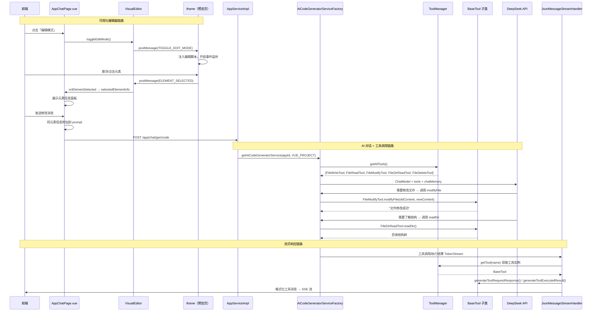

### 版本概述

本次 `1.7` 分支聚焦于 **AI 工具架构重构与可视化编辑器实现**。在 `1.6` 已具备「智能路由 + 项目下载」完整链路的基础上，本版从两个维度大幅增强产品能力：

1. **后端 AI 工具架构全面升级**：仿照 OpenManus 引入 `BaseTool` 抽象基类，统一所有 AI 文件操作工具的标准接口；新增 `ToolManager` 工具管理器实现自动注册与动态发现；新增 `FileModifyTool`（文件修改）与 `FileDirReadTool`（目录读取）两大工具，让 AI 具备对已生成项目的增量修改能力。
2. **前端可视化编辑器落地**：新增 `visualEditor.ts` 编辑器引擎，实现 iframe 内元素的悬浮高亮、点击选中、选择器自动生成；`AppChatPage.vue` 集成可视化编辑面板，用户可在预览页面直接点选元素，将元素信息（标签、选择器、内容）自动附加到对话中，实现「所见即所得」的 AI 辅助修改。

这一版实现，核心上完成了五件事：

1. 新增 `BaseTool` 抽象基类，定义工具统一接口（`getToolName`、`getDisplayName`、`generateToolExecutedResult`），仿照 OpenManus 架构。
2. 重构全部文件操作工具（`FileWriteTool`、`FileReadTool`、`FileDeleteTool`、`FileModifyTool`、`FileDirReadTool`）继承 `BaseTool`，新增 `ToolManager` 实现自动注册与统一管理。
3. `AiCodeGeneratorServiceFactory` 与 `JsonMessageStreamHandler` 全面接入 `ToolManager`，从硬编码工具列表升级为动态工具发现，并引入幻觉处理策略。
4. 三种生成模式的 `System Prompt` 全面增强，要求 AI 在生成后利用工具响应用户的修改需求，而非重新输出全部代码。
5. 前端实现 `VisualEditor` 可视化编辑器，支持 iframe 内元素交互式点选，选中信息自动注入用户对话上下文。

---

### 核心目标

#### 为什么需要工具架构重构

`1.3 ~ 1.6` 已支持 `FileWriteTool` 等工具，但存在以下问题：

- **工具缺乏统一标准**：每个工具独立实现，没有共同的接口规范，新增工具成本高
- **硬编码耦合严重**：`AiCodeGeneratorServiceFactory` 中手动 `new` 每个工具实例，新增工具需修改工厂代码，违反开闭原则
- `JsonMessageStreamHandler` 中工具调用信息的格式化逻辑硬编码，无法自动适配新工具
- **缺少增量修改能力**：AI 只能写入新文件，无法读取已有文件、修改部分内容或查看目录结构，导致用户后续修改需求只能重新生成全部代码

因此需要一套**统一的工具抽象层 + 管理器 + 增量编辑工具集**。

#### 为什么需要可视化编辑器

`1.5 ~ 1.6` 用户可在对话页右侧预览生成的网页，但存在体验断层：

- 用户想修改「导航栏背景色」或「按钮文字」，需要手动描述位置，容易歧义
- 用户不清楚页面的 DOM 结构，无法精确表达修改需求
- 前端预览只是静态展示，与 AI 对话之间没有视觉桥梁

因此需要在预览区实现**交互式元素点选**，让用户**直接点击页面元素**，自动提取元素信息注入对话，实现「指哪改哪」。

#### 本版采用的总体方案

```
【后端工具架构重构】
定义 BaseTool（getToolName / getDisplayName / generateToolExecutedResult）
    ↓
所有工具继承 BaseTool → @Component 自动注册为 Spring Bean
    ↓
ToolManager 通过 @Resource BaseTool[] 自动收集全部工具，构建 name→tool 映射
    ↓
AiCodeGeneratorServiceFactory 从硬编码 new Tool() 改为 toolManager.getAllTools()
    ↓
JsonMessageStreamHandler 通过 toolManager.getTool(name) 动态获取工具实例，格式化消息

【新增工具能力】
FileModifyTool  → 用新内容替换文件中旧内容（增量修改）
FileDirReadTool → 读取项目目录结构（AI 先了解结构再修改）
FileDeleteTool  → 删除文件（带重要文件保护：package.json、vite.config 等不可删）

【前端可视化编辑器】
用户点击「编辑模式」→ visualEditor 向 iframe 注入编辑脚本
    ↓
iframe 内悬浮元素 → 蓝色虚线高亮（edit-hover）
    ↓
用户点击元素 → 绿色实线选中（edit-selected），通过 postMessage 返回父窗口
    ↓
父窗口展示元素信息：tagName、id、className、textContent、selector、pagePath
    ↓
用户发送消息时，选中元素信息自动附加到 prompt：
    "选中元素信息：\n- 标签: div\n- 选择器: body > div:nth-child(2) > nav\n- 当前内容: 首页..."
    ↓
AI 根据精确的元素选择器定位，使用 FileModifyTool 等执行增量修改
```

---

### 技术栈

| 层次 | 技术 / 组件 | 用途 |
|------|-------------|------|
| 工具抽象 | `BaseTool` 抽象类 + 模板方法 | 统一所有 AI 工具的接口规范 |
| 工具管理 | `ToolManager` + `@Resource BaseTool[]` | Spring 自动注入并注册全部工具 |
| 新增工具 | `FileModifyTool` / `FileDirReadTool` / `FileDeleteTool` | 文件修改、目录读取、安全删除 |
| 现有工具重构 | `FileWriteTool` / `FileReadTool` | 继承 `BaseTool`，接入统一管理 |
| 工厂重构 | `AiCodeGeneratorServiceFactory` | `toolManager.getAllTools()` 动态传入 |
| 流处理重构 | `JsonMessageStreamHandler` | `toolManager.getTool(name)` 动态格式化 |
| 幻觉处理 | `hallucinatedToolNameStrategy` | AI 调用不存在工具时返回错误提示 |
| 前端编辑 | `VisualEditor` 类 + `postMessage` | iframe 内元素交互式点选 |
| 脚本注入 | `iframe.contentDocument.createElement('script')` | 动态注入编辑脚本到预览页 |
| 元素选择器 | 递归生成 `tagName + id + class + nth-child` | 精确定位 DOM 元素 |
| 样式隔离 | CSS 类名 `edit-hover` / `edit-selected` | 不影响原页面样式的编辑态高亮 |
| 前端框架 | Vue 3 + Ant Design Vue | 编辑按钮、元素信息面板、消息集成 |
| Prompt 工程 | System Prompt 修改指导段落 | 引导 AI 使用工具而非重新输出代码 |

---

### 架构与完整调用链

#### 整体流程图



#### 后端调用链路（文字版）

```text
【工具初始化】
Spring 启动
    -> @Component BaseTool 子类被扫描为 Bean
    -> ToolManager.@PostConstruct initTools()
    -> toolMap.put(tool.getToolName(), tool)
    -> 注册工具：writeFile、readFile、deleteFile、modifyFile、readDir

【AI 服务创建】
AppServiceImpl.chatToGenCode(appId, message)
    -> AiCodeGeneratorServiceFactory.getAiCodeGeneratorService(appId, VUE_PROJECT)
    -> createAiCodeGeneratorService()
    -> AiServices.builder()
        .tools(toolManager.getAllTools())  // 动态获取全部工具
        .hallucinatedToolNameStrategy(...)  // 幻觉处理
        .build()

【流式处理工具消息】
JsonMessageStreamHandler.handle(originFlux)
    -> handleJsonMessageChunk()
    TOOL_REQUEST:
        -> toolManager.getTool(toolRequestMessage.getName())
        -> tool.generateToolRequestResponse()  // 返回格式化的【选择工具】消息
    TOOL_EXECUTED:
        -> toolManager.getTool(toolExecutedMessage.getName())
        -> tool.generateToolExecutedResult(arguments)  // 返回格式化的工具执行结果
```

#### 前端可视化编辑器链路

```text
用户点击「编辑模式」
    -> AppChatPage.toggleEditMode()
    -> VisualEditor.toggleEditMode()
    -> sendMessageToIframe({ type: 'TOGGLE_EDIT_MODE', editMode: true })
    -> iframe 注入编辑脚本（generateEditScript）

iframe 内交互
    -> mouseover: 添加 edit-hover 类（蓝色虚线框）
    -> click: 添加 edit-selected 类（绿色实线框）
    -> 生成 elementInfo（tagName, id, className, textContent, selector, pagePath, rect）
    -> window.parent.postMessage({ type: 'ELEMENT_SELECTED', data: { elementInfo } })

父窗口接收
    -> window.addEventListener('message', handler)
    -> VisualEditor.handleIframeMessage()
    -> onElementSelected(elementInfo) 回调
    -> AppChatPage.selectedElementInfo = elementInfo
    -> 展示元素信息面板（标签、选择器、内容）

用户发送消息（有选中元素）
    -> AppChatPage.sendMessage()
    -> 自动附加元素信息到 prompt：
       "选中元素信息：\n- 页面路径: ?page=home\n- 标签: div\n- 选择器: body > nav\n- 当前内容: 首页 关于..."
    -> 清除选中元素、退出编辑模式
    -> 调用后端 AI 生成代码
```

---

### 功能拆解

#### 1. BaseTool 抽象基类

`BaseTool` 仿照 OpenManus 设计，定义所有 AI 工具的通用契约：

```java
// YuCodeMother-Backend/.../ai/tools/BaseTool.java

public abstract class BaseTool {
    // 工具英文名称（对应方法名）
    public abstract String getToolName();
    // 工具中文显示名称
    public abstract String getDisplayName();
    // 生成工具请求时的返回值（显示给用户）
    public String generateToolRequestResponse() {
        return String.format("\n\n【选择工具】%s\n\n", getDisplayName());
    }
    // 生成工具执行结果格式（保存到数据库）
    public abstract String generateToolExecutedResult(JSONObject arguments);
}
```

**设计要点**：

- `getToolName()` 返回的值必须与 `@Tool` 注解的方法映射名一致（如 `writeFile`、`readFile`），否则 `ToolManager` 无法匹配
- `generateToolRequestResponse()` 有默认实现，子类可覆盖
- `generateToolExecutedResult()` 子类必须实现，用于统一格式化工具执行结果，持久化到对话历史

#### 2. ToolManager 工具管理器

`ToolManager` 通过 Spring 依赖注入自动收集所有 `BaseTool` 子类：

```java
// YuCodeMother-Backend/.../ai/tools/ToolManager.java

@Slf4j
@Component
public class ToolManager {
    private final Map<String, BaseTool> toolMap = new HashMap<>();
    @Resource
    private BaseTool[] tools;  // Spring 自动注入所有 BaseTool Bean

    @PostConstruct
    public void initTools() {
        for (BaseTool tool : tools) {
            toolMap.put(tool.getToolName(), tool);
            log.info("注册工具：{} -> {}", tool.getToolName(), tool.getDisplayName());
        }
    }

    public BaseTool getTool(String toolName) {
        return toolMap.get(toolName);
    }

    public BaseTool[] getAllTools() {
        return tools;
    }
}
```

**关键机制**：`@Resource BaseTool[] tools` 利用 Spring 的数组注入特性，自动将容器中所有 `BaseTool` 类型的 Bean 收集为数组，实现**零配置新增工具**——只需新增一个继承 `BaseTool` 的 `@Component` 类即可自动注册。

#### 3. 新增工具详解

**FileModifyTool** — 增量修改文件内容：

```java
@Tool("修改文件内容，用新内容替换指定的旧内容")
public String modifyFile(
    @P("文件的相对路径") String relativeFilePath,
    @P("要替换的旧内容") String oldContent,
    @P("替换后的新内容") String newContent,
    @ToolMemoryId Long appId) {
    // 1. 解析路径（相对路径基于 vue_project_{appId}）
    // 2. 读取原始文件内容
    // 3. 检查 oldContent 是否存在
    // 4. String.replace(oldContent, newContent)
    // 5. 写入文件（CREATE + TRUNCATE_EXISTING）
}
```

**FileDirReadTool** — 读取项目目录结构：

```java
@Tool("读取目录结构，获取指定目录下的所有文件和子目录信息")
public String readDir(
    @P("目录的相对路径，为空则读取整个项目结构") String relativeDirPath,
    @ToolMemoryId Long appId) {
    // 1. 使用 Hutool FileUtil.loopFiles 递归遍历
    // 2. 过滤 node_modules、.git、dist、build、.env 等忽略目录
    // 3. 按路径深度排序，缩进输出树形结构
}
```

忽略规则：

| 类型 | 忽略项 |
|------|--------|
| 目录名 | `node_modules`, `.git`, `dist`, `build`, `DS_Store`, `.env`, `target`, `.mvn`, `.idea`, `.vscode`, `coverage` |
| 扩展名 | `.log`, `.tmp`, `.cache`, `.lock` |

**FileDeleteTool** — 安全删除文件：

```java
@Tool("删除指定路径的文件")
public String deleteFile(@P("文件的相对路径") String relativeFilePath, @ToolMemoryId Long appId) {
    // 1. 路径解析（同其他工具）
    // 2. 安全检查：isImportantFile() 保护核心文件
    // 3. Files.delete(path)
}

private boolean isImportantFile(String fileName) {
    // 保护：package.json、vite.config.js、tsconfig.json、
    //       index.html、main.ts、App.vue、.gitignore、README.md 等
}
```

#### 4. 现有工具重构（继承 BaseTool）

`FileWriteTool` 和 `FileReadTool` 重构为继承 `BaseTool`：

```java
@Slf4j
@Component
public class FileWriteTool extends BaseTool {
    @Tool("写入文件到指定路径")
    public String writeFile(...) { ... }

    @Override public String getToolName() { return "writeFile"; }
    @Override public String getDisplayName() { return "写入文件"; }
    @Override public String generateToolExecutedResult(JSONObject arguments) {
        // 返回格式化结果：【工具调用】写入文件 xxx.vue
        // ```vue
        // <template>...</template>
        // ```
    }
}
```

#### 5. AiCodeGeneratorServiceFactory 重构

从硬编码工具列表升级为动态获取：

```java
// 1.7 之前（硬编码）
.tools(
    new FileWriteTool(),
    new FileReadTool(),
    new FileModifyTool(),
    new FileDirReadTool(),
    new FileDeleteTool()
)

// 1.7 之后（动态获取）
@Resource
private ToolManager toolManager;

.tools(toolManager.getAllTools())
.hallucinatedToolNameStrategy(toolExecutionRequest ->
    ToolExecutionResultMessage.from(toolExecutionRequest,
        "Error: there is no tool called " + toolExecutionRequest.name()))
```

**幻觉处理**：当 AI 出现幻觉调用不存在的工具名时，`hallucinatedToolNameStrategy` 构造错误结果返回给 AI，引导其纠正。

#### 6. JsonMessageStreamHandler 重构

从硬编码工具名判断升级为通过 `ToolManager` 动态获取：

```java
@Resource
private ToolManager toolManager;

// 工具调用请求
BaseTool tool = toolManager.getTool(toolRequestMessage.getName());
return tool.generateToolRequestResponse();

// 工具执行完成
BaseTool tool = toolManager.getTool(toolExecutedMessage.getName());
String result = tool.generateToolExecutedResult(jsonObject);
```

**优势**：新增工具无需修改 `JsonMessageStreamHandler`，自动适配格式化输出。

#### 7. System Prompt 增强（支持增量修改）

三种生成模式的 System Prompt 均新增「修改支持」段落：

```text
## 特别注意

在生成代码后，用户可能会提出修改要求并给出要修改的元素信息。
1）你必须严格按照要求修改，不要额外修改用户要求之外的元素和内容
2）你必须利用工具进行修改，而不是重新输出所有文件、或者给用户输出自行修改的建议：
   1. 首先使用【目录读取工具】了解当前项目结构
   2. 使用【文件读取工具】查看需要修改的文件内容
   3. 根据用户需求，使用对应的工具进行修改：
      - 【文件修改工具】：修改现有文件的部分内容
      - 【文件写入工具】：创建新文件或完全重写文件
      - 【文件删除工具】：删除不需要的文件
```

**Prompt 目标**：引导 AI 从「重新生成全部代码」转变为「使用工具读取 → 修改 → 删除」的增量编辑模式，大幅节省 token 和提升响应速度。

#### 8. VisualEditor 可视化编辑器引擎

`VisualEditor` 是一个独立的 TypeScript 类，负责管理 iframe 内的可视化编辑功能：

```typescript
// YuCodeMother-Frontend/src/utils/visualEditor.ts

export class VisualEditor {
  private iframe: HTMLIFrameElement | null = null
  private isEditMode = false
  private options: VisualEditorOptions

  constructor(options: VisualEditorOptions = {}) {
    this.options = options
  }

  init(iframe: HTMLIFrameElement) { this.iframe = iframe }
  enableEditMode() { ... }    // 开启编辑模式
  disableEditMode() { ... }   // 关闭编辑模式
  toggleEditMode() { ... }    // 切换编辑模式
  handleIframeMessage(event: MessageEvent) { ... }  // 处理 iframe 消息
  private injectEditScript() { ... }  // 注入编辑脚本
  private generateEditScript() { ... }  // 生成编辑脚本内容
}
```

**核心编辑脚本功能**（注入到 iframe 内执行）：

| 功能 | 实现 |
|------|------|
| 悬浮高亮 | `mouseover` 事件 → 添加 `edit-hover` 类（`outline: 2px dashed #1890ff`） |
| 点击选中 | `click` 事件 → 阻止默认行为 → 添加 `edit-selected` 类（`outline: 3px solid #52c41a`） |
| 选择器生成 | 递归向上遍历 DOM：tagName + id + class（过滤 edit-*）+ nth-child |
| 元素信息提取 | tagName、id、className、textContent、selector、pagePath、rect |
| 消息通信 | `window.parent.postMessage({ type: 'ELEMENT_SELECTED', data: { elementInfo } })` |
| 编辑提示 | 右上角显示浮动提示「🎯 编辑模式已开启」3 秒后淡出 |

#### 9. AppChatPage.vue 集成可视化编辑器

**模板层新增**：

```vue
<!-- 选中元素信息展示面板 -->
<a-alert v-if="selectedElementInfo" class="selected-element-alert" type="info" closable>
  <template #message>
    <div class="selected-element-info">
      <div class="element-header">
        <span class="element-tag">选中元素：{{ selectedElementInfo.tagName.toLowerCase() }}</span>
        <span v-if="selectedElementInfo.id" class="element-id">#{{ selectedElementInfo.id }}</span>
        <span v-if="selectedElementInfo.className" class="element-class">.{{ ... }}</span>
      </div>
      <div class="element-details">
        <div class="element-item">内容: {{ selectedElementInfo.textContent.substring(0, 50) }}</div>
        <div class="element-item">页面路径: {{ selectedElementInfo.pagePath }}</div>
        <div class="element-item">选择器: <code>{{ selectedElementInfo.selector }}</code></div>
      </div>
    </div>
  </template>
</a-alert>

<!-- 预览区头部新增编辑按钮 -->
<div class="preview-actions">
  <a-button v-if="isOwner && previewUrl" type="link" :danger="isEditMode" @click="toggleEditMode">
    <template #icon><EditOutlined /></template>
    {{ isEditMode ? '退出编辑' : '编辑模式' }}
  </a-button>
</div>
```

**逻辑层新增**：

```typescript
// 可视化编辑相关状态
const isEditMode = ref(false)
const selectedElementInfo = ref<ElementInfo | null>(null)

// 初始化 VisualEditor
const visualEditor = new VisualEditor({
  onElementSelected: (elementInfo: ElementInfo) => {
    selectedElementInfo.value = elementInfo
  },
})

// 发送消息时自动附加元素信息
const sendMessage = async () => {
  let message = userInput.value.trim()
  if (selectedElementInfo.value) {
    let elementContext = `\n\n选中元素信息：`
    elementContext += `\n- 页面路径: ${selectedElementInfo.value.pagePath}`
    elementContext += `\n- 标签: ${selectedElementInfo.value.tagName.toLowerCase()}`
    elementContext += `\n- 选择器: ${selectedElementInfo.value.selector}`
    elementContext += `\n- 当前内容: ${selectedElementInfo.value.textContent.substring(0, 100)}`
    message += elementContext
  }
  // ... 发送消息，发送后清除选中元素并退出编辑模式
}
```

---

### 配置说明

#### 无新增依赖

`1.7` 未引入新的 Maven 或 npm 依赖，全部基于现有技术栈实现：

| 层次 | 依赖 | 说明 |
|------|------|------|
| 后端 | Hutool、LangChain4j、Spring Boot | 已有依赖，无需新增 |
| 前端 | Vue 3、Ant Design Vue | 已有依赖，无需新增 |

#### 前端代理配置（vite.config.ts）

```typescript
server: {
  proxy: {
    '/api': {
      target: 'http://localhost:8123',
      changeOrigin: true,
      secure: false
    },
  },
},
```

确认 `/api` 代理到后端 `8123` 端口，确保 EventSource 和下载接口正常通信。

#### 环境依赖清单

| 依赖 | 说明 |
|------|------|
| Chrome 浏览器 | 继承 1.5，截图功能依赖 |
| Nginx 80 端口 | 继承 1.4/1.5，预览和截图依赖 |
| 腾讯云 COS | 继承 1.5，封面存储依赖 |
| 后端 8123 端口 | API 服务端口 |

---

### 数据流视角

```text
【工具架构数据流】
Spring 启动
    -> BaseTool 子类实例化（@Component）
    -> ToolManager 收集全部 tools 数组
    -> initTools() 构建 name→tool 映射表

【AI 对话数据流】
用户发送消息（含选中元素信息）
    -> AppServiceImpl.chatToGenCode()
    -> AiCodeGeneratorServiceFactory 创建 AiService（传入 toolManager.getAllTools()）
    -> DeepSeek 分析需求，选择工具调用
    -> 工具执行（FileModifyTool / FileReadTool 等）
    -> JsonMessageStreamHandler 通过 ToolManager 格式化工具消息
    -> SSE 流返回前端

【可视化编辑数据流】
用户点击「编辑模式」
    -> VisualEditor.injectEditScript() → iframe 注入脚本
    -> 用户悬浮/点击 iframe 内元素
    -> iframe 生成 elementInfo → postMessage 到父窗口
    -> VisualEditor.handleIframeMessage() → 回调 onElementSelected
    -> AppChatPage 展示元素信息面板
    -> 用户发送消息 → 元素信息自动附加到 prompt
    -> AI 使用选择器精确修改对应元素
```

---

### 测试与验证

#### 测试用例

**ToolManager 验证**：启动应用后观察日志：

```text
注册工具：writeFile -> 写入文件
注册工具：readFile -> 读取文件
注册工具：deleteFile -> 删除文件
注册工具：modifyFile -> 修改文件
注册工具：readDir -> 读取文件目录
工具管理器初始化完成，共注册 5 个工具
```

**FileModifyTool 验证**：

```java
// 验证 modifyFile 能正确替换文件内容
String oldContent = "<div class=\"header\">原内容</div>";
String newContent = "<div class=\"header\">新内容</div>";
// 调用 modifyFile，验证文件内容已替换
```

**FileDirReadTool 验证**：

```java
// 验证 readDir 返回正确的目录结构，且排除了 node_modules
String result = fileDirReadTool.readDir("", appId);
// 结果中不应包含 node_modules 目录
```

**FileDeleteTool 安全验证**：

```java
// 尝试删除 package.json，应返回错误提示
String result = fileDeleteTool.deleteFile("package.json", appId);
// 预期："错误：不允许删除重要文件 - package.json"
```

#### 验证清单

1. 应用启动后，日志显示 5 个工具全部注册成功。
2. `AiCodeGeneratorServiceFactory` 中 `toolManager.getAllTools()` 返回非空数组。
3. 创建一个 Vue 工程应用，生成代码后，在对话中要求修改某个元素。
4. AI 调用 `readDir` 了解项目结构，再调用 `readFile` 读取目标文件。
5. AI 调用 `modifyFile` 执行增量修改（而非重新输出全部文件）。
6. 前端对话页点击「编辑模式」，iframe 内元素可悬浮高亮（蓝色虚线）。
7. 点击元素后，左下角展示元素信息面板（标签、选择器、内容）。
8. 在输入框发送消息，元素信息自动附加到 prompt 中。
9. AI 根据选择器精确修改，前端预览刷新后可见修改效果。
10. 尝试删除 `package.json`，`FileDeleteTool` 返回安全保护错误。

---

### 与前后分支关系

#### 与 1.6 智能路由与项目下载的关系

| 1.6 能力 | 1.7 中的延续与扩展 |
|----------|-------------------|
| `AiCodeGenTypeRoutingService` 智能路由 | 完全继承，路由结果写入 `codeGenType` 不变 |
| `createApp` 创建应用 | 完全继承，创建逻辑不变 |
| `ProjectDownloadService` ZIP 下载 | 完全继承，下载能力不变 |
| `AppChatPage` 对话页 | 新增可视化编辑器集成，原有下载/部署按钮保留 |
| `AppDetailModal` 详情弹窗 | 完全继承 |

#### 与 1.5 应用截图封面的关系

| 1.5 能力 | 1.7 中的延续 |
|----------|-------------|
| `WebScreenshotUtils` 无头截图 | 完全继承，截图链路不变 |
| `ScreenshotService` 异步封面 | 完全继承 |
| `CosManager` COS 上传 | 完全继承 |
| `deployApp` 部署后截图 | 完全继承 |

#### 与 1.4 Vue 构建部署的关系

| 1.4 能力 | 1.7 中的延续 |
|----------|-------------|
| `VueProjectBuilder` npm 构建 | 完全继承 |
| `deployApp` 复制 dist | 完全继承 |
| `JsonMessageStreamHandler` 异步构建 | 重构为接入 `ToolManager`，功能不变 |

#### 与 1.3 三种生成模式的关系

| 1.3 能力 | 1.7 中的扩展 |
|----------|-------------|
| `CodeGenTypeEnum` 三分流 | 完全继承，新增工具能力同样适用于 HTML / MULTI_FILE 模式（prompt 已同步增强） |
| `StreamHandlerExecutor` 分流 | 完全继承 |
| `FileWriteTool` 写文件 | 重构为继承 `BaseTool`，功能不变 |

#### 前端联动

- `AppChatPage.vue`：新增编辑模式按钮、元素信息面板、选中元素注入消息逻辑
- `visualEditor.ts`：新增独立编辑器引擎，可复用于其他 iframe 预览场景
- `vite.config.ts`：代理配置调整，确保 `/api` 正确转发

---

### 常见问题与注意事项

#### 1. ⚠️ 新增工具后未自动注册

**原因**：新增工具类未标注 `@Component` 或未继承 `BaseTool`。

**解决**：所有工具必须同时满足：

```java
@Component  // Spring 扫描为 Bean
public class NewTool extends BaseTool {  // 继承基类
    @Override public String getToolName() { return "toolName"; }  // 与 @Tool 方法映射名一致
    ...
}
```

#### 2. ⚠️ ToolManager 获取工具返回 null

**原因**：`getToolName()` 返回值与 AI 实际调用的工具名不一致（如大小写、拼写错误）。

**解决**：`getToolName()` 必须与 LangChain4j `@Tool` 注解映射后的方法名完全一致。

#### 3. ⚠️ AI 幻觉调用不存在的工具

**现象**：日志中出现 `Error: there is no tool called xxx`。

**说明**：这是 `hallucinatedToolNameStrategy` 的正常工作，会将错误返回给 AI，引导其自我纠正。若频繁出现，需检查 Prompt 中工具名称描述是否准确。

#### 4. ⚠️ 编辑模式注入脚本失败

**原因**：iframe 跨域限制（`contentDocument` 访问权限）。

**解决**：当前实现要求预览页与主页面**同源**（通过 `getStaticPreviewUrl` 读取本地 `/api/static` 或 Nginx 同域部署）。若使用第三方跨域预览，编辑脚本注入会失败。

#### 5. ⚠️ 选中元素后发送消息，元素信息未附加

**原因**：`selectedElementInfo` 在 `sendMessage` 时已被提前清空。

**检查**：代码逻辑为「先拼接元素信息到 message，再清空 selectedElementInfo」，确保顺序正确。

#### 6. ⚠️ FileModifyTool 替换失败

**原因**：`oldContent` 与文件实际内容不完全匹配（如空格、换行差异）。

**建议**：AI 使用 `readFile` 先读取文件内容，再基于实际内容构造 `oldContent`，确保精确匹配。

#### 7. ⚠️ 编辑模式样式污染原页面

**说明**：`edit-hover` / `edit-selected` 类使用 `!important` 强制覆盖，但仅通过 `outline` 和 `background` 高亮，不修改原页面布局或内容。退出编辑模式后清除所有效果。

#### 8. ⚠️ 前端样式未生效

**原因**：`AppChatPage.vue` 的样式块使用了 `<style scoped>`，部分 deep 选择器可能未生效。

**检查**：确保 `.selected-element-info`、`.element-tag`、`.element-selector-code` 等样式类正确定义在 scoped 样式块中，或通过 `:deep()` 穿透。

---

### 技术亮点

#### 1. OpenManus 式工具架构

引入 `BaseTool` 抽象层 + `ToolManager` 管理器，实现工具的标准化、自动注册、动态发现，新增工具只需继承 + `@Component`，零配置接入 AI 对话链路。

#### 2. 从硬编码到动态发现

`AiCodeGeneratorServiceFactory` 和 `JsonMessageStreamHandler` 从硬编码 `new FileWriteTool()` 升级为 `toolManager.getAllTools()` / `toolManager.getTool(name)`，新增工具无需修改任何已有工厂/流处理代码，完全符合开闭原则。

#### 3. AI 增量编辑能力

新增 `FileModifyTool` + `FileDirReadTool` + `FileDeleteTool`，让 AI 从「只能写文件」升级为「能读、能改、能删、能看结构」，实现真正的增量开发，大幅降低后续修改的 token 消耗和响应时间。

#### 4. 可视化编辑闭环

前端 `VisualEditor` + iframe 脚本注入 + postMessage 通信，实现「点选元素 → 提取选择器 → 注入对话 → AI 精确修改 → 预览刷新」的完整闭环，用户无需手动描述位置。

#### 5. 幻觉处理机制

`hallucinatedToolNameStrategy` 捕获 AI 调用不存在工具的情况，构造错误结果反馈给模型，引导其自我纠正，提升工具调用稳定性。

#### 6. 安全保护设计

`FileDeleteTool` 内置 `isImportantFile` 白名单，防止 AI 误删 `package.json`、`vite.config.js` 等核心工程文件，避免项目损坏。

---

### 核心收益总结

#### 从「只能生成」到「生成 + 增量编辑」

`1.7` 让 AI 生成的项目不再是一次性产物，用户可以持续对话要求修改，AI 通过工具精确调整特定文件，而非重新生成全部代码，**大幅节省 token、提升响应速度**。

#### 从「文字描述修改」到「指哪改哪」

可视化编辑器让用户在预览页直接点击目标元素，自动提取选择器、内容、路径等元信息注入对话，**消除描述歧义，降低修改门槛**。

#### 工具架构可无限扩展

`BaseTool` + `ToolManager` 架构下，新增任意 AI 工具（如 `GitCommitTool`、`NpmInstallTool`）只需继承基类并标注 `@Component`，自动注册、自动格式化、自动接入流处理，**零侵入扩展**。

---

### 后续可优化方向

1. **编辑模式元素批量选择**：支持 `Ctrl + 点击` 多选多个元素，一次性提交多个修改点。
2. **元素属性面板**：选中元素后展示可编辑属性（文本、颜色、字体大小），用户直接修改属性值而非通过对话。
3. **AI 修改预览对比**：`FileModifyTool` 返回修改前后的 diff 对比，前端展示变更内容供用户确认。
4. **工具调用历史**：持久化 AI 工具调用记录，展示「AI 做了哪些操作」的时间线。
5. **编辑模式跨域支持**：通过 `postMessage` 双向握手 + 白名单域名，支持跨域 iframe 的编辑模式注入。
6. **AI 自动修复**：`FileModifyTool` 替换失败时，AI 自动尝试模糊匹配或读取文件重新构造 oldContent。
7. **HTML / MULTI_FILE 模式可视化编辑**：当前编辑模式对所有预览类型生效，可针对不同类型优化选择器生成策略。

---

### 发布信息

**发布日期**: 2026-06-12  
**版本号**: v1.7  
**分支**: 1.7 - AI工具架构重构与可视化编辑器实现  
**核心能力**: BaseTool 抽象架构 + ToolManager 自动注册 + FileModifyTool/FileDirReadTool/FileDeleteTool 增量编辑 + 前端 VisualEditor 可视化点选 + Prompt 修改引导增强 + 幻觉处理策略  
**变更规模**: 相对 1.6 共 16 个文件，+1,375 / -102 行（含 BaseTool/ToolManager 体系、5 个工具重构、AiCodeGeneratorServiceFactory 升级、JsonMessageStreamHandler 升级、3 个 Prompt 增强、visualEditor.ts、AppChatPage.vue 大幅改动、vite.config.ts 调整）
