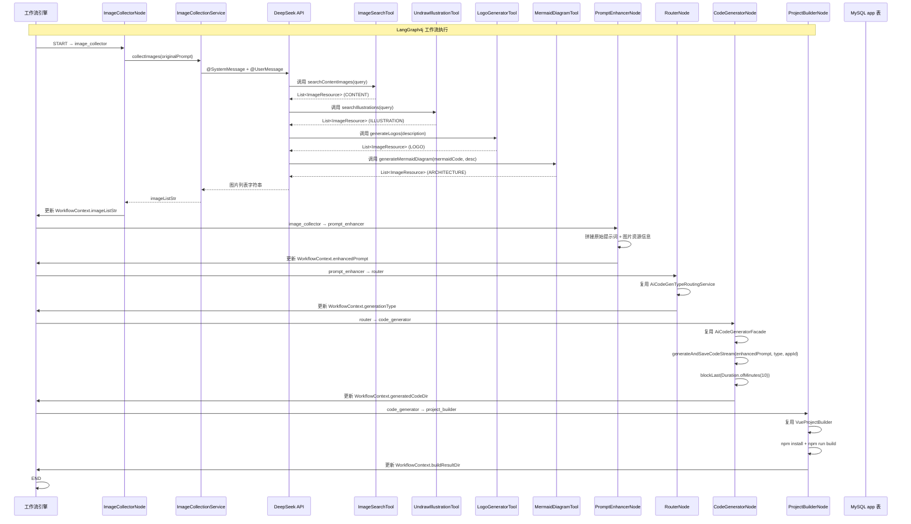

### 版本概述

本次 `1.8` 分支是项目的 **重大架构升级**，聚焦于 **LangGraph4j AI 工作流引擎与智能图片素材收集体系**。在 `1.7` 已具备「工具架构 + 可视化编辑器」的基础上，本版引入 **LangGraph4j** 状态图工作流框架，将原本分散在 `AppServiceImpl` 中的「创建 → 路由 → 生成 → 构建」链路，重构为**节点化、可编排、可视化**的工作流。同时，引入 **AI 驱动的智能图片素材收集**，在代码生成之前自动收集图片资源（内容图片、插画、Logo、架构图），并拼接到用户提示词中增强生成效果。

这一版实现，核心上完成了五件事：

1. 引入 `langgraph4j-core` 依赖，构建 **LangGraph4j 状态图工作流引擎**，定义 `WorkflowContext` 全局状态上下文。
2. 实现 **5 个工作流节点**（ImageCollector → PromptEnhancer → Router → CodeGenerator → ProjectBuilder），串联完整代码生成链路。
3. 实现 **AI 图片素材收集体系**：`ImageCollectionService` + 4 大工具（Pexels 内容搜索、unDraw 插画搜索、阿里云 DashScope Logo 生成、Mermaid 架构图生成），覆盖 `CONTENT` / `LOGO` / `ILLUSTRATION` / `ARCHITECTURE` 四大图片类型。
4. 新增 `SpringContextUtil` 静态 Spring 上下文工具，解决工作流节点中无法依赖注入的问题，实现与已有 `AiCodeGenTypeRoutingService`、`AiCodeGeneratorFacade`、`VueProjectBuilder` 等服务的无缝复用。
5. 提供完整的 Demo 和测试套件（`SimpleWorkflowApp`、`WorkflowApp`、`CodeGenWorkflow`、全套节点测试）。

---

### 核心目标

#### 为什么需要 LangGraph4j 工作流引擎

`1.3 ~ 1.7` 的代码生成链路是**线性内嵌在 Service 方法**中的：

- `AppServiceImpl.chatToGenCode` 中直接调用 `AiCodeGeneratorFacade.generateAndSaveCodeStream`，逻辑耦合严重
- 图片收集、路由、代码生成、项目构建等步骤**没有状态隔离**，异常时难以定位问题
- 不支持**可视化编排**和**动态调整步骤顺序**，新增步骤需修改多处代码
- 无法**复用 LangChain 生态**的图执行能力（状态管理、分支路由、条件边等）

因此需要引入 **LangGraph4j** 状态图工作流，将代码生成链路建模为「节点 + 边 + 状态」的有向图。

#### 为什么需要 AI 智能图片素材收集

`1.3 ~ 1.7` 生成代码时，图片资源完全依赖 AI 用 `picsum.photos` 或占位图：

- 用户想生成「电商网站」，但产品图片是随机占位图，展示效果不真实
- 用户想生成「技术博客」，但系统架构图需要 AI 手绘，质量不稳定
- 品牌 Logo、装饰插画等缺乏，网站整体视觉单薄

因此需要在代码生成之前，由 AI 根据用户需求**主动调用工具收集/生成真实图片素材**，并将图片信息注入提示词，让生成的网站**直接使用真实图片**。

#### 本版采用的总体方案

```
【LangGraph4j 工作流编排】
START
    ↓
ImageCollectorNode（图片收集节点）
    → 调用 ImageCollectionService（AI 工具调用）
    → 收集 Pexels 内容图 / unDraw 插画 / DashScope Logo / Mermaid 架构图
    → 更新 WorkflowContext.imageList / imageListStr
    ↓
PromptEnhancerNode（提示词增强节点）
    → 读取原始提示词 + 图片列表
    → 拼接增强提示词："## 可用素材资源\n- 内容图片: xxx (url)\n- Logo: xxx (url)..."
    → 更新 WorkflowContext.enhancedPrompt
    ↓
RouterNode（智能路由节点）
    → 复用 1.6 的 AiCodeGenTypeRoutingService
    → 根据原始提示词选择 HTML / MULTI_FILE / VUE_PROJECT
    → 更新 WorkflowContext.generationType
    ↓
CodeGeneratorNode（代码生成节点）
    → 复用 1.7 的 AiCodeGeneratorFacade
    → 使用增强提示词 + 生成类型进行流式代码生成
    → 同步等待生成完成（blockLast 10min）
    → 更新 WorkflowContext.generatedCodeDir
    ↓
ProjectBuilderNode（项目构建节点）
    → 复用 1.4 的 VueProjectBuilder
    → Vue 项目执行 npm install + npm run build
    → HTML/MultiFile 直接返回源码目录
    → 更新 WorkflowContext.buildResultDir
    ↓
END

【图片素材收集工具链】
用户原始提示词
    → ImageCollectionService（@SystemMessage 引导 AI 选择工具）
    → AI 根据需求分析选择工具组合：
        - 技术/系统 → MermaidDiagramTool（架构图）
        - 品牌 → LogoGeneratorTool（Logo）
        - 内容 → ImageSearchTool（Pexels 内容图）
        - 装饰 → UndrawIllustrationTool（插画）
    → 返回图片资源列表（ImageResource）
```

---

### 技术栈

| 层次 | 技术 / 组件 | 用途 |
|------|-------------|------|
| 工作流引擎 | LangGraph4j `1.6.0-rc2` | 状态图工作流编排（节点 + 边 + 状态管理） |
| 状态管理 | `MessagesState<String>` / `WorkflowContext` | 工作流全局状态上下文 |
| 节点动作 | `AsyncNodeAction` / `node_async` | 异步节点执行封装 |
| 可视化输出 | `GraphRepresentation.Type.MERMAID` | 工作流图自动输出 Mermaid 语法 |
| 图片搜索 | Pexels API v1 | 搜索内容相关图片（摄影/高清图） |
| 插画搜索 | unDraw API | 搜索 SVG 矢量插画 |
| Logo 生成 | 阿里云 DashScope `wan2.2-t2i-flash` | AI 文生图生成品牌 Logo |
| 架构图生成 | Mermaid CLI (`mmdc`) + 腾讯云 COS | 将 Mermaid 代码转为 SVG 并上传云端 |
| AI 服务调用 | LangChain4j `AiServices` + `@Tool` | 图片收集服务中 AI 自主选择工具调用 |
| 工具调用 | `@SystemMessage` + `@UserMessage` | 图片收集服务的提示词工程 |
| 资源模型 | `ImageResource` + `ImageCategoryEnum` | 统一图片资源数据模型与分类 |
| Spring 集成 | `SpringContextUtil` | 静态获取 Spring Bean，解决工作流节点中依赖注入问题 |
| 复用 1.6 | `AiCodeGenTypeRoutingService` | 路由节点直接复用智能路由服务 |
| 复用 1.7 | `AiCodeGeneratorFacade` | 代码生成节点复用门面服务 |
| 复用 1.4 | `VueProjectBuilder` | 项目构建节点复用 Vue 构建器 |
| 复用 1.5 | `CosManager` | 架构图生成后上传 COS |

---

### 架构与完整调用链

#### 整体流程图



#### 后端调用链路（文字版）

```text
【工作流启动】
CodeGenWorkflow.executeWorkflow(originalPrompt)
    -> createWorkflow() 编译工作流图
    -> WorkflowContext.builder().originalPrompt(originalPrompt).currentStep("初始化")
    -> workflow.stream(Map.of(WORKFLOW_CONTEXT_KEY, initialContext))

【图片收集节点】
ImageCollectorNode.create()
    -> node_async(state -> {
           WorkflowContext context = WorkflowContext.getContext(state);
           ImageCollectionService service = SpringContextUtil.getBean(ImageCollectionService.class);
           imageListStr = service.collectImages(context.getOriginalPrompt());
           context.setCurrentStep("图片收集");
           context.setImageListStr(imageListStr);
           return WorkflowContext.saveContext(context);
       })

【图片收集 AI 服务】
ImageCollectionService.collectImages(@UserMessage userPrompt)
    -> @SystemMessage(fromResource = "image-collection-system-prompt.txt")
    -> DeepSeek 分析需求，选择工具组合
    -> 工具调用（并行/串行取决于 AI 决策）
    -> 返回格式化的图片资源字符串

【提示词增强节点】
PromptEnhancerNode.create()
    -> originalPrompt + imageListStr
    -> 拼接 "## 可用素材资源\n请在生成网站使用以下图片资源..."
    -> context.setEnhancedPrompt(enhancedPromptBuilder.toString())

【路由节点】
RouterNode.create()
    -> AiCodeGenTypeRoutingService routingService = SpringContextUtil.getBean(...)
    -> generationType = routingService.routeCodeGenType(context.getOriginalPrompt())
    -> 异常降级：默认 HTML

【代码生成节点】
CodeGeneratorNode.create()
    -> AiCodeGeneratorFacade facade = SpringContextUtil.getBean(...)
    -> Flux<String> codeStream = facade.generateAndSaveCodeStream(enhancedPrompt, type, 0L)
    -> codeStream.blockLast(Duration.ofMinutes(10))
    -> generatedCodeDir = tmp/code_output/{type}_0/

【项目构建节点】
ProjectBuilderNode.create()
    -> if VUE_PROJECT: VueProjectBuilder.buildProject(generatedCodeDir)
    -> buildResultDir = generatedCodeDir + /dist (成功) / generatedCodeDir (失败)
    -> else: buildResultDir = generatedCodeDir
```

---

### 功能拆解

#### 1. LangGraph4j 工作流引擎

**LangGraph4j** 是 LangChain 生态的 Java 图工作流实现，核心概念：

| 概念 | 说明 | 本版应用 |
|------|------|----------|
| `StateGraph` | 状态图定义 | `MessagesStateGraph<String>` 内置消息状态图 |
| `Node` | 工作节点 | 5 个自定义节点：ImageCollector / PromptEnhancer / Router / CodeGenerator / ProjectBuilder |
| `Edge` | 节点连接边 | 线性链路：START → A → B → C → D → E → END |
| `State` | 全局状态 | `WorkflowContext` 存储在 `MessagesState.data()` 中 |
| `AsyncNodeAction` | 异步节点执行 | `node_async()` 包装异步 Lambda |
| `CompiledGraph` | 编译后的图 | `.compile()` 后不可变，可多次执行 |
| `GraphRepresentation` | 图可视化 | `.getGraph(Type.MERMAID)` 输出 Mermaid 语法 |

**工作流定义**（`CodeGenWorkflow.createWorkflow()`）：

```java
new MessagesStateGraph<String>()
    .addNode("image_collector", ImageCollectorNode.create())
    .addNode("prompt_enhancer", PromptEnhancerNode.create())
    .addNode("router", RouterNode.create())
    .addNode("code_generator", CodeGeneratorNode.create())
    .addNode("project_builder", ProjectBuilderNode.create())
    .addEdge(START, "image_collector")
    .addEdge("image_collector", "prompt_enhancer")
    .addEdge("prompt_enhancer", "router")
    .addEdge("router", "code_generator")
    .addEdge("code_generator", "project_builder")
    .addEdge("project_builder", END)
    .compile();
```

#### 2. WorkflowContext 状态上下文

`WorkflowContext` 是贯穿整个工作流的全局状态对象，存储在 `MessagesState` 的 `data()` 中：

```java
@Data
@Builder
public class WorkflowContext implements Serializable {
    public static final String WORKFLOW_CONTEXT_KEY = "workflowContext";
    
    private String currentStep;           // 当前执行步骤
    private String originalPrompt;        // 用户原始提示词
    private String imageListStr;          // 图片资源字符串
    private List<ImageResource> imageList; // 图片资源列表（预留）
    private String enhancedPrompt;        // 增强后的提示词
    private CodeGenTypeEnum generationType; // 代码生成类型
    private String generatedCodeDir;      // 生成的代码目录
    private String buildResultDir;        // 构建结果目录
    private String errorMessage;          // 错误信息

    public static WorkflowContext getContext(MessagesState<String> state) {
        return (WorkflowContext) state.data().get(WORKFLOW_CONTEXT_KEY);
    }
    public static Map<String, Object> saveContext(WorkflowContext context) {
        return Map.of(WORKFLOW_CONTEXT_KEY, context);
    }
}
```

**设计要点**：每个节点执行完毕后，通过 `saveContext()` 将更新后的状态写回 `MessagesState`，下一个节点通过 `getContext()` 读取上一节点留下的状态。

#### 3. ImageCollectionService 图片收集服务

```java
public interface ImageCollectionService {
    @SystemMessage(fromResource = "prompt/image-collection-system-prompt.txt")
    String collectImages(@UserMessage String userPrompt);
}
```

**System Prompt 核心指令**：引导 AI 根据需求分析选择工具，4 种工具按需调用：

| 工具 | 触发条件 | 用途 |
|------|----------|------|
| `searchContentImages` | 内容相关图片 | 网站内容展示（Pexels 搜索） |
| `searchIllustrations` | 装饰性插画 | 网站美化和装饰（unDraw 搜索） |
| `generateArchitectureDiagram` | 技术/系统/架构 | 展示系统结构和技术关系（Mermaid 生成） |
| `generateLogos` | 品牌标识/Logo | 网站品牌标识（DashScope 生成） |

**工厂注册**（`ImageCollectionServiceFactory`）：

```java
@Configuration
public class ImageCollectionServiceFactory {
    @Resource private ChatModel chatModel;
    @Resource private ImageSearchTool imageSearchTool;
    @Resource private UndrawIllustrationTool undrawIllustrationTool;
    @Resource private MermaidDiagramTool mermaidDiagramTool;
    @Resource private LogoGeneratorTool logoGeneratorTool;

    @Bean
    public ImageCollectionService createImageCollectionService() {
        return AiServices.builder(ImageCollectionService.class)
                .chatModel(chatModel)
                .tools(imageSearchTool, undrawIllustrationTool, mermaidDiagramTool, logoGeneratorTool)
                .build();
    }
}
```

#### 4. 四大图片收集工具详解

**ImageSearchTool — Pexels 内容图片搜索**：

```java
@Tool("搜索内容相关的图片，用于网站内容展示")
public List<ImageResource> searchContentImages(@P("搜索关键词") String query) {
    // Pexels API: https://api.pexels.com/v1/search
    // Header: Authorization = pexelsApiKey
    // Query: per_page=12, page=1
    // 返回：ImageResource(category=CONTENT, description=alt, url=src.medium)
}
```

**UndrawIllustrationTool — unDraw 插画搜索**：

```java
@Tool("搜索插画图片，用于网站美化和装饰")
public List<ImageResource> searchIllustrations(@P("搜索关键词") String query) {
    // unDraw API: https://undraw.co/_next/data/.../search/{query}.json
    // 解析 Next.js 的 pageProps.initialResults
    // 返回：ImageResource(category=ILLUSTRATION, description=title, url=media)
}
```

**LogoGeneratorTool — 阿里云 DashScope Logo 生成**：

```java
@Tool("根据描述生成 Logo 设计图片，用于网站品牌标识")
public List<ImageResource> generateLogos(@P("Logo 设计描述") String description) {
    // 模型：wan2.2-t2i-flash（阿里云 DashScope 文生图）
    // 提示词："生成 Logo，Logo 中禁止包含任何文字！Logo 介绍：{description}"
    // 尺寸：512*512，数量：1
    // 返回：ImageResource(category=LOGO, description=description, url=result.url)
}
```

**MermaidDiagramTool — Mermaid 架构图生成 + COS 上传**：

```java
@Tool("将 Mermaid 代码转换为架构图图片，用于展示系统结构和技术关系")
public List<ImageResource> generateMermaidDiagram(
        @P("Mermaid 图标代码") String mermaidCode,
        @P("架构图描述") String description) {
    // 1. 创建临时输入文件 .mmd，写入 mermaidCode
    // 2. 创建临时输出文件 .svg
    // 3. 调用 mmdc CLI：mmdc -i input.mmd -o output.svg -b transparent
    // 4. 上传 SVG 到 COS：/mermaid/{random}/output.svg
    // 5. 清理临时文件
    // 返回：ImageResource(category=ARCHITECTURE, description=description, url=cosUrl)
}
```

**操作系统兼容性**：`SystemUtil.getOsInfo().isWindows()` 判断使用 `mmdc.cmd`（Windows）或 `mmdc`（Linux/macOS）。

#### 5. ImageResource 与 ImageCategoryEnum

```java
@Data
@Builder
public class ImageResource implements Serializable {
    private ImageCategoryEnum category;   // CONTENT / LOGO / ILLUSTRATION / ARCHITECTURE
    private String description;           // 图片描述
    private String url;                   // 图片 URL
}

@Getter
public enum ImageCategoryEnum {
    CONTENT("内容图片", "CONTENT"),
    LOGO("LOGO图片", "LOGO"),
    ILLUSTRATION("插画图片", "ILLUSTRATION"),
    ARCHITECTURE("架构图片", "ARCHITECTURE");
}
```

#### 6. SpringContextUtil 静态 Spring 上下文工具

```java
@Component
public class SpringContextUtil implements ApplicationContextAware {
    private static ApplicationContext applicationContext;

    public static <T> T getBean(Class<T> clazz) {
        return applicationContext.getBean(clazz);
    }
}
```

**为什么需要**：LangGraph4j 的 `AsyncNodeAction` 是静态工厂方法创建的匿名 Lambda，**无法通过 Spring 依赖注入**获取 Service Bean。`SpringContextUtil` 通过 `ApplicationContextAware` 在应用启动后缓存 `ApplicationContext`，节点内部通过 `getBean()` 动态获取已注册的 Spring Bean。

#### 7. 工作流节点设计模式

所有节点采用 **样板代码** 模式：

```java
public class XXXNode {
    public static AsyncNodeAction<MessagesState<String>> create() {
        return node_async(state -> {
            WorkflowContext context = WorkflowContext.getContext(state);
            log.info("执行节点: XXX");
            // 1. 从 SpringContextUtil 获取所需 Service Bean
            // 2. 执行节点逻辑
            // 3. 更新 context.currentStep / 相关字段
            // 4. 返回 WorkflowContext.saveContext(context)
        });
    }
}
```

| 节点 | 输入 | 输出 | 复用服务 |
|------|------|------|----------|
| ImageCollectorNode | `originalPrompt` | `imageListStr` | `ImageCollectionService` |
| PromptEnhancerNode | `originalPrompt` + `imageListStr` | `enhancedPrompt` | 纯逻辑拼接 |
| RouterNode | `originalPrompt` | `generationType` | `AiCodeGenTypeRoutingService` (1.6) |
| CodeGeneratorNode | `enhancedPrompt` + `generationType` | `generatedCodeDir` | `AiCodeGeneratorFacade` (1.7) |
| ProjectBuilderNode | `generatedCodeDir` + `generationType` | `buildResultDir` | `VueProjectBuilder` (1.4) |

#### 8. 三种工作流应用形式

| 类 | 用途 | 特点 |
|------|------|------|
| `SimpleWorkflowApp` | 演示/学习 | 使用 `makeNode()` 模拟节点，无实际业务逻辑，演示工作流框架用法 |
| `WorkflowApp` | 模拟/调试 | 使用真实节点，但 `main()` 直接运行，输出 Mermaid 图和工作流日志 |
| `CodeGenWorkflow` | 生产/复用 | 提供 `createWorkflow()` + `executeWorkflow()`，可注入到 Service 中复用 |

**Demo 基础**：`SimpleGraphApp` + `GreeterNode` + `ResponderNode` + `SimpleState` 展示 LangGraph4j 最基础的节点实现、状态 Schema 定义、Channel（appender）机制。

---

### 配置说明

#### pom.xml 新增依赖

```xml
<!-- 19.引入 LangGraph4j AI工作流 -->
<dependency>
    <groupId>org.bsc.langgraph4j</groupId>
    <artifactId>langgraph4j-core</artifactId>
    <version>1.6.0-rc2</version>
</dependency>

<!-- 20.引入阿里云 DashScope SDK -->
<dependency>
    <groupId>com.alibaba</groupId>
    <artifactId>dashscope-sdk-java</artifactId>
    <version>2.21.1</version>
</dependency>
```

#### application.yml / application-local.yml 新增配置

```yaml
# Pexels 图片搜索配置
pexels:
  api-key: <Your API Key>

# 阿里云 DashScope 配置
dashscope:
  api-key: <Your API Key>
  image-model: wan2.2-t2i-flash
```

**环境依赖清单**：

| 依赖 | 说明 |
|------|------|
| Pexels API Key | 内容图片搜索（https://www.pexels.com/api/） |
| 阿里云 DashScope API Key | Logo 生成（https://dashscope.aliyun.com/） |
| Mermaid CLI (`mmdc`) | 架构图生成（`npm install -g @mermaid-js/mermaid-cli`） |
| 腾讯云 COS | 架构图上传（继承 1.5） |
| Nginx 80 端口 | 部署预览（继承 1.4） |
| Chrome 浏览器 | 截图封面（继承 1.5） |

---

### 数据流视角

```text
【工作流状态流转】
WorkflowContext 初始化（originalPrompt）
    → ImageCollectorNode: 填充 imageListStr
    → PromptEnhancerNode: 填充 enhancedPrompt
    → RouterNode: 填充 generationType
    → CodeGeneratorNode: 填充 generatedCodeDir
    → ProjectBuilderNode: 填充 buildResultDir

【图片收集数据流】
用户原始提示词
    → ImageCollectionService (DeepSeek AI)
    → 工具调用选择（1~4 个工具）
    → ImageSearchTool / Pexels API → List<ImageResource>
    → UndrawIllustrationTool / unDraw API → List<ImageResource>
    → LogoGeneratorTool / DashScope → List<ImageResource>
    → MermaidDiagramTool / mmdc + COS → List<ImageResource>
    → 合并为图片列表字符串

【提示词增强数据流】
originalPrompt + "## 可用素材资源\n" + imageList
    → enhancedPrompt
    → CodeGeneratorNode 使用增强提示词生成代码

【工作流可视化】
CompiledGraph.getGraph(MERMAID)
    → 输出 Mermaid 语法
    → 可在 Markdown / Mermaid Live Editor 中渲染为流程图
```

---

### 测试与验证

#### 测试用例

**CodeGenWorkflowTest** — 集成测试完整工作流：

```java
@SpringBootTest
class CodeGenWorkflowTest {
    @Test
    void testTechBlogWorkflow() {
        WorkflowContext result = new CodeGenWorkflow().executeWorkflow(
            "创建一个技术博客网站，需要展示编程教程和系统架构");
        Assertions.assertNotNull(result);
        System.out.println("生成类型: " + result.getGenerationType());
        System.out.println("生成的代码目录: " + result.getGeneratedCodeDir());
        System.out.println("构建结果目录: " + result.getBuildResultDir());
    }

    @Test void testCorporateWorkflow() { ... }
    @Test void testVueProjectWorkflow() { ... }
    @Test void testSimpleHtmlWorkflow() { ... }
}
```

**ImageCollectionServiceTest** — 图片收集服务测试：

```java
@SpringBootTest
class ImageCollectionServiceTest {
    @Resource private ImageCollectionService imageCollectionService;

    @Test
    void testTechWebsiteImageCollection() {
        String result = imageCollectionService.collectImages(
            "创建一个技术博客网站，需要展示编程教程和系统架构");
        Assertions.assertNotNull(result);
        System.out.println("技术网站收集到的图片: " + result);
    }
}
```

**工具单元测试**：

| 测试类 | 测试内容 |
|--------|----------|
| `ImageSearchToolTest` | 搜索 "phone" 关键词，验证返回图片 URL 以 http 开头 |
| `LogoGeneratorToolTest` | 生成 "技术公司现代简约风格Logo"，验证 category=LOGO |
| `MermaidDiagramToolTest` | 传入 flowchart 代码，验证生成架构图 URL 以 http 开头 |
| `UndrawIllustrationToolTest` | 搜索 "happy" 关键词，验证返回插画 URL 以 http 开头 |

#### 验证清单

1. 配置 `pexels.api-key` 和 `dashscope.api-key`，应用可正常启动。
2. 安装 Mermaid CLI：`npm install -g @mermaid-js/mermaid-cli`。
3. 运行 `SimpleWorkflowApp.main()`，观察日志输出 Mermaid 工作流图语法。
4. 运行 `WorkflowApp.main()`，观察 5 个节点依次执行，状态正确流转。
5. 运行 `ImageSearchToolTest`，验证 Pexels API 返回图片列表。
6. 运行 `LogoGeneratorToolTest`，验证 DashScope 生成 Logo 图片 URL。
7. 运行 `MermaidDiagramToolTest`，验证本地 mmdc 生成 SVG 并上传 COS 成功。
8. 运行 `ImageCollectionServiceTest`，验证 AI 根据提示词自动选择工具组合。
9. 运行 `CodeGenWorkflowTest`，验证完整工作流从图片收集到项目构建成功完成。
10. 检查 `WorkflowContext` 最终状态：`generationType`、`generatedCodeDir`、`buildResultDir` 均有值。

---

### 与前后分支关系

#### 与 1.7 AI 工具架构与可视化编辑器的关系

| 1.7 能力 | 1.8 中的延续与扩展 |
|----------|-------------------|
| `BaseTool` + `ToolManager` 工具架构 | 完全继承，图片收集工具的 4 个工具同样继承/使用 `@Tool` 注解 |
| `AiCodeGeneratorFacade` 代码生成门面 | 完全复用，`CodeGeneratorNode` 直接调用 |
| `AiCodeGeneratorServiceFactory` 工厂 | 完全继承，`CodeGeneratorNode` 通过 `SpringContextUtil` 获取 |
| `VisualEditor` 可视化编辑器 | 完全继承，前端预览和编辑能力不变 |
| `AppChatPage` 对话页 | 完全继承，本版工作流为后端新增链路，不改动前端 |

#### 与 1.6 智能路由与项目下载的关系

| 1.6 能力 | 1.8 中的复用 |
|----------|-------------|
| `AiCodeGenTypeRoutingService` 智能路由 | `RouterNode` 直接复用，`SpringContextUtil.getBean()` 获取 |
| `createApp` 创建应用 | 本版工作流为独立执行路径，尚未替换原有 `chatToGenCode` |
| `ProjectDownloadService` ZIP 下载 | 完全继承，工作流生成的代码目录同样可下载 |

#### 与 1.4/1.5 Vue 构建部署与 COS 的关系

| 1.4/1.5 能力 | 1.8 中的复用 |
|--------------|-------------|
| `VueProjectBuilder` npm 构建 | `ProjectBuilderNode` 直接复用 |
| `CosManager` COS 上传 | `MermaidDiagramTool` 复用，架构图上传 COS |
| `WebScreenshotUtils` 截图 | 完全继承，封面生成不受影响 |
| Nginx 部署 | 完全继承，工作流构建结果同样可部署 |

#### 架构演进关系

```
1.3 单流式生成 → 1.4 Vue构建 → 1.5 截图部署 → 1.6 智能路由 → 1.7 工具架构+可视化编辑
                                                                    ↓
1.8 LangGraph4j 工作流编排：将 1.4~1.7 的核心能力封装为节点，按图执行
    ImageCollectorNode（新增）
    PromptEnhancerNode（新增）
    RouterNode（复用 1.6）
    CodeGeneratorNode（复用 1.7）
    ProjectBuilderNode（复用 1.4）
```

---

### 常见问题与注意事项

#### 1. ⚠️ Mermaid CLI 未安装导致架构图生成失败

**原因**：`MermaidDiagramTool` 调用本地 `mmdc` 命令，若未安装则 `RuntimeUtil.execForStr()` 执行失败。

**解决**：

```bash
npm install -g @mermaid-js/mermaid-cli
# 验证
mmdc --version  # 注意：mmdc 不支持 -v，使用 --version
```

#### 2. ⚠️ SpringContextUtil 获取 Bean 为 null

**原因**：`SpringContextUtil` 是 `@Component`，需要 Spring 容器已启动。在 `main()` 方法中直接运行工作流时，若未启动 Spring Boot 应用，则 `applicationContext` 为 null。

**解决**：通过 `@SpringBootTest` 或启动 Spring Boot 应用后执行工作流。`SimpleWorkflowApp` / `WorkflowApp` 的 `main()` 方法仅用于演示框架，真实业务需在 Spring 环境中执行 `CodeGenWorkflow.executeWorkflow()`。

#### 3. ⚠️ Pexels API 限流或网络超时

**现象**：`ImageSearchTool.searchContentImages()` 返回空列表。

**解决**：检查 `pexels.api-key` 配置；Pexels 免费版有每小时 200 请求限制，生产环境需考虑缓存或降级。

#### 4. ⚠️ DashScope Logo 生成失败

**原因**：`wan2.2-t2i-flash` 模型可能需要特定地域权限，或 API Key 未开通图像生成服务。

**解决**：在阿里云 DashScope 控制台确认已开通「图像生成」服务，并检查 `dashscope.api-key` 正确性。

#### 5. ⚠️ 工作流节点中异常导致流程中断

**现象**：某个节点异常后，整个工作流停止，后续节点不执行。

**设计**：当前工作流为线性链路，无异常降级和重试机制。每个节点应 `try-catch` 记录错误日志，并设置 `context.errorMessage`，但不抛出异常以允许流程继续。

#### 6. ⚠️ 代码生成节点同步阻塞 10 分钟

`CodeGeneratorNode` 使用 `codeStream.blockLast(Duration.ofMinutes(10))`，在等待流式生成完成期间**阻塞工作流线程**。若 AI 响应慢，可能长时间占用线程。

**建议**：后续可优化为异步回调或工作流状态机，避免阻塞。

#### 7. ⚠️ 图片收集节点的图片列表为字符串而非对象列表

当前 `ImageCollectorNode` 通过 `imageListStr` 传递图片信息，`PromptEnhancerNode` 读取字符串拼接。`WorkflowContext.imageList`（`List<ImageResource>`）已预留但尚未使用。

**后续优化**：将 `ImageCollectionService.collectImages()` 返回类型从 `String` 改为 `List<ImageResource>`，实现结构化数据传递。

#### 8. ⚠️ LangGraph4j 版本为 rc2（候选版）

`langgraph4j-core:1.6.0-rc2` 是候选发布版本，API 可能存在变更。

**建议**：关注官方版本更新，稳定版发布后及时升级。

---

### 技术亮点

#### 1. LangGraph4j 状态图工作流

将原本线性硬编码的代码生成链路，重构为**节点化、状态驱动、可视化**的工作流。支持 `stream()` 逐步执行、Mermaid 图输出、状态上下文传递，为后续分支路由、条件边、循环节点等高级编排奠定基础。

#### 2. AI 驱动的图片素材收集

`ImageCollectionService` 通过 AI 自主决策调用 4 种图片工具，实现「需求分析 → 工具选择 → 素材收集」的智能化。不同于传统固定资源库，AI 能根据用户描述动态选择最合适的图片来源和类型。

#### 3. 工具链复用与扩展

4 个图片工具覆盖不同场景：搜索（Pexels/unDraw）、生成（DashScope）、转换（Mermaid CLI），全部使用 `ImageResource` + `ImageCategoryEnum` 统一模型，新增图片工具只需实现 `@Tool` 接口并注册到工厂。

#### 4. SpringContextUtil 桥接方案

优雅解决 LangGraph4j 节点（静态 Lambda）与 Spring 依赖注入的冲突。节点内部通过 `SpringContextUtil.getBean()` 获取已有服务，实现**工作流节点与 Spring 生态的无缝集成**，避免重复造轮子。

#### 5. 历史能力全面复用

`RouterNode` 复用 `AiCodeGenTypeRoutingService`（1.6）、`CodeGeneratorNode` 复用 `AiCodeGeneratorFacade`（1.7）、`ProjectBuilderNode` 复用 `VueProjectBuilder`（1.4）、`MermaidDiagramTool` 复用 `CosManager`（1.5）。工作流是**编排层**，底层能力全部复用已有实现。

#### 6. Mermaid 架构图生成与云端化

本地 `mmdc` 生成 SVG + COS 上传，实现「代码描述 → 架构图 → 云端 URL」的完整链路，技术博客/系统展示类网站可直接使用真实架构图。

---

### 核心收益总结

#### 从「线性硬编码」到「节点化工作流」

`1.8` 将代码生成链路从 Service 方法内嵌的线性调用，升级为**可编排、可视化、状态驱动**的工作流。新增步骤只需增加节点和边，无需修改已有节点逻辑，架构扩展性大幅提升。

#### 从「占位图」到「AI 智能收集真实素材」

代码生成之前自动收集/生成内容图片、插画、Logo、架构图，并将素材信息注入提示词。生成的网站**使用真实图片资源**，视觉效果和产品完整度显著提升。

#### 从「单线程阻塞」到「状态图流式执行」

工作流支持 `stream()` 逐步执行，每个节点完成后状态上下文自动传递到下一节点。日志可清晰追踪「当前执行到第几步」，问题定位更加直观。

#### 为后续高级编排奠基

当前工作流为线性链路，LangGraph4j 天然支持**条件分支（Conditional Edge）**、**循环（Loop）**、**并行（Parallel）**、**人工介入（Human-in-the-loop）**。后续可扩展：并行收集图片、根据路由结果分支执行不同节点、生成失败后自动重试等。

---

### 后续可优化方向

1. **条件分支路由**：`RouterNode` 后根据 `generationType` 走不同分支（HTML 简化链路 / VUE 完整链路），而非所有类型都走 ProjectBuilder。
2. **并行图片收集**：`ImageCollectorNode` 内部 4 个工具改为并行调用，缩短收集时间。
3. **图片去重与缓存**：相同关键词的搜索结果加入本地缓存，避免重复调用 Pexels/unDraw API。
4. **工作流异常降级**：节点异常时设置 `errorMessage` 并继续执行，而非中断流程；或增加重试节点。
5. **结构化图片列表**：`ImageCollectionService` 返回 `List<ImageResource>` 而非字符串，PromptEnhancerNode 直接遍历对象生成增强提示词。
6. **前端工作流可视化**：前端展示工作流执行进度（第几步 / 总步数 / 当前节点状态）。
7. **人工介入审核**：`CodeGeneratorNode` 后增加人工审核节点，用户确认增强提示词后再生成代码。
8. **LangGraph4j 稳定版升级**：`1.6.0-rc2` 升级至正式版，跟进 API 变化。

---

### 发布信息

**发布日期**: 2026-06-14  
**版本号**: v1.8  
**分支**: 1.8 - LangGraph4j AI工作流引擎与智能图片素材收集体系  
**核心能力**: LangGraph4j 状态图工作流编排 + 5 节点代码生成链路 + AI 智能图片收集（Pexels/unDraw/DashScope/Mermaid）+ ImageResource 统一模型 + SpringContextUtil 桥接 + 完整测试套件  
**变更规模**: 相对 1.7 新增 30+ 文件，覆盖 `langgraph4j` 包（工作流、节点、工具、模型、枚举、服务、工厂、Demo、测试）、`utils/SpringContextUtil`、新增 2 个 Maven 依赖、新增 2 项 yml 配置、新增 1 个 System Prompt  
**关键复用**: 复用 1.4 VueProjectBuilder、1.5 CosManager、1.6 AiCodeGenTypeRoutingService、1.7 AiCodeGeneratorFacade，工作流为编排层不破坏既有链路
