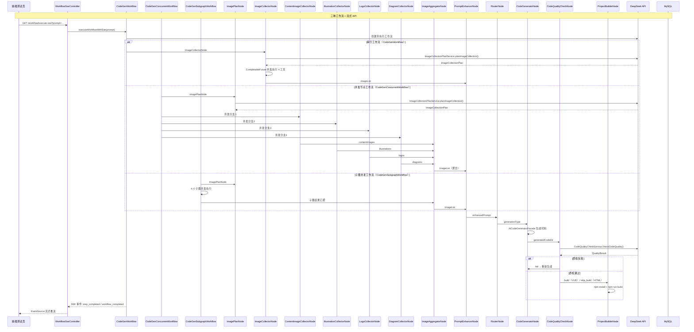

### 版本概述

本次 `1.9` 分支是项目的 **重大架构升级与能力增强**，聚焦于 **AI 驱动的图片收集规划、三种并发执行方案、代码质量检查闭环、以及流式执行 API**。在 `1.8` 已具备「LangGraph4j 工作流引擎 + 智能图片素材收集」的基础上，本版引入三大核心增强：

1. **AI 图片收集计划化**：新增 `ImageCollectionPlanService`，AI 先分析用户提示词制定结构化图片收集计划（内容图/插画/架构图/Logo），再按 plan 精确执行，避免盲目搜索。
2. **三种并发执行方案**：从 `1.8` 的串行图片收集升级为 **节点内部 CompletableFuture 并发、LangGraph4j 并发节点、LangGraph4j 子图并发** 三种并行方案，显著缩短图片收集耗时。
3. **代码质量检查闭环**：新增 `CodeQualityCheckNode` + `CodeQualityCheckService`，AI 自动检查生成代码的语法/结构/功能问题，质检失败自动回退到 `code_generator` 重新生成，确保输出质量。
4. **流式执行 API**：`WorkflowSseController` 提供 `/workflow/execute`（同步）、`/workflow/execute-flux`（Flux 流式）、`/workflow/execute-sse`（SSE 流式）三种接口，前端可实时追踪工作流每一步执行状态。
5. **条件边结构修复**：`1.8` 中 `code_generator` 节点同时存在普通边和条件边导致 `GraphStateException`，本版将条件边从 `code_quality_check` 节点出发，修复工作流编译问题。

这一版实现，核心上完成了五件事：

1. 新增 `ImageCollectionPlanService` / Factory，AI 分析需求输出结构化图片收集计划 `ImageCollectionPlan`，取代 `1.8` 中 AI 直接调用工具的方式。
2. 重构 `ImageCollectorNode` 为 **节点内部并发方案**（`CompletableFuture`），同时新增 `CodeGenConcurrentWorkflow`（并发节点方案）和 `CodeGenSubgraphWorkflow`（子图并发方案）。
3. 新增 `CodeQualityCheckService` / Factory + `CodeQualityCheckNode`，在代码生成后执行 AI 质检，通过 `QualityResult`（isValid / errors / suggestions）决定构建/回退/结束。
4. 新增 `WorkflowSseController` + 两个流式执行方法，支持 `Flux`（Reactor）和 `SseEmitter`（Spring MVC）两种流式输出，前端通过 EventSource 实时接收工作流事件。
5. 包结构重构：`ImageCategoryEnum` 从 `enums` 移至 `model/enums`，`WorkflowContext` 新增 `imageCollectionPlan` 和 4 个并发中间字段。

---

### 核心目标

#### 为什么需要 AI 图片收集计划

`1.8` 中 `ImageCollectionService` 让 AI 直接调用工具收集图片，但存在以下问题：

- **AI 决策不透明**：用户不知道 AI 会调用哪些工具、收集什么图片
- **关键词不精准**：AI 可能使用模糊关键词搜索，导致图片与需求不匹配
- **类型缺失**：AI 可能遗漏某些图片类型（如 Logo 或架构图）
- **无法并行优化**：AI 串行调用工具，无法发挥并发优势

因此需要 **先规划后执行**——AI 先分析需求，制定结构化 `ImageCollectionPlan`，再按 plan 精确并发执行。

#### 为什么需要三种并发方案

图片收集涉及 4 个独立工具（Pexels/unDraw/Mermaid/DashScope），每个工具都是网络 I/O 密集型操作，串行执行时延累加：

| 串行执行 | 4 个工具依次执行 | 总耗时 ≈ T1 + T2 + T3 + T4 |
|----------|-----------------|---------------------------|
| 并发执行 | 4 个工具同时执行 | 总耗时 ≈ max(T1, T2, T3, T4) |

三种并发方案覆盖不同场景：

| 方案 | 适用场景 | 特点 |
|------|----------|------|
| 节点内部 CompletableFuture | 简单并发，无需复杂编排 | 在单个节点内并发，框架无感知 |
| LangGraph4j 并发节点 | 需要框架级调度、可视化 | 每个工具一个节点，框架自动调度线程池 |
| LangGraph4j 子图并发 | 需要模块化、复用子图 | 每个工具封装为子图，子图内部可独立扩展 |

#### 为什么需要代码质量检查闭环

`1.8` 生成代码后直接构建，若代码存在语法错误（如 HTML 标签未闭合、CSS 语法错误、JavaScript 引用错误），构建会失败或页面功能异常。用户只能在预览后发现问题，再手动反馈修改。

因此需要在 **代码生成后、项目构建前** 插入 AI 质检节点：
- 检查语法和结构错误
- 检查代码质量（命名规范、代码重复）
- 检查功能完整性（响应式、交互逻辑）
- 质检失败 → 自动回退到 `code_generator` 重新生成
- 质检通过 → 继续构建流程

#### 为什么需要流式执行 API

`1.8` 的工作流通过 `executeWorkflow()` 同步执行，前端只能等待最终结果，无法感知中间进度（如「正在收集图片」「正在生成代码」）。对于长耗时工作流（AI 图片收集 + 代码生成 + 构建可能超过 2 分钟），用户体验差。

因此需要提供 **流式执行 API**，前端通过 SSE / EventSource 实时接收每个步骤的完成事件，展示工作流进度。

---

### 技术栈

| 层次 | 技术 / 组件 | 用途 |
|------|-------------|------|
| 图片计划 | `ImageCollectionPlanService` + `image-collection-plan-system-prompt.txt` | AI 分析需求制定结构化图片收集计划 |
| 计划模型 | `ImageCollectionPlan`（record 内嵌） | 4 种任务类型：ImageSearchTask / IllustrationTask / DiagramTask / LogoTask |
| 并发方案1 | `CompletableFuture` + `allOf` + `join` | `ImageCollectorNode` 内部并发调用 4 种工具 |
| 并发方案2 | `CodeGenConcurrentWorkflow` + `RunnableConfig` | LangGraph4j 并发节点 + `ExecutorBuilder` 线程池配置 |
| 并发方案3 | `CodeGenSubgraphWorkflow` + `StateGraph` 子图 | LangGraph4j 子图封装，父图编译子图为节点 |
| 代码质检 | `CodeQualityCheckService` + `code-quality-check-system-prompt.txt` | AI 检查代码语法/结构/功能 |
| 质检模型 | `QualityResult`（isValid / errors / suggestions） | 结构化质检结果 |
| 条件边 | `addConditionalEdges` + `edge_async` | 根据质检结果路由到 build / skip / fail |
| 流式同步 | `executeWorkflow()` | 同步执行，返回最终结果 |
| 流式Flux | `Flux.create` + `Thread.startVirtualThread` | Reactor 流式输出，每步通过 `sink.next()` 推送 |
| 流式SSE | `SseEmitter` + `emitter.send(SseEmitter.event())` | Spring MVC SSE，30 分钟超时 |
| 流式控制器 | `WorkflowSseController` | `/workflow/execute` / `/execute-flux` / `/execute-sse` |
| 测试页面 | `test-SSEemitter-workflow.html` / `text-flux-workflow.html` | EventSource 前端演示页面 |
| 虚拟线程 | `Thread.startVirtualThread()` | 流式执行中启动虚拟线程避免阻塞主线程 |
| 包重构 | `ImageCategoryEnum` → `model/enums` | 枚举与模型统一包结构 |
| 状态扩展 | `WorkflowContext` + 5 个新字段 | 支持计划和并发中间结果存储 |

---

### 架构与完整调用链

#### 整体流程图



#### 后端调用链路（文字版）

```text
【图片收集计划制定】
ImageCollectionPlanService.planImageCollection(@UserMessage prompt)
    -> @SystemMessage(image-collection-plan-system-prompt.txt)
    -> DeepSeek 分析需求
    -> 返回 ImageCollectionPlan:
        contentImageTasks: [{query: "搜索关键词"}]
        illustrationTasks: [{query: "插画关键词"}]
        diagramTasks: [{mermaidCode: "...", description: "..."}]
        logoTasks: [{description: "..."}]

【方案1：节点内部 CompletableFuture 并发】
ImageCollectorNode.create()
    -> ImageCollectionPlanService.planImageCollection(originalPrompt)
    -> CompletableFuture.supplyAsync(() -> imageSearchTool.searchContentImages(query))
    -> CompletableFuture.supplyAsync(() -> illustrationTool.searchIllustrations(query))
    -> CompletableFuture.supplyAsync(() -> diagramTool.generateMermaidDiagram(mermaidCode, desc))
    -> CompletableFuture.supplyAsync(() -> logoTool.generateLogos(description))
    -> CompletableFuture.allOf(futures.toArray()).join()
    -> 收集所有结果 -> context.setImageList(collectedImages)

【方案2：LangGraph4j 并发节点】
CodeGenConcurrentWorkflow.createWorkflow()
    -> addNode("image_plan", ImagePlanNode)
    -> addNode("content_image_collector", ContentImageCollectorNode)
    -> addNode("illustration_collector", IllustrationCollectorNode)
    -> addNode("logo_collector", LogoCollectorNode)
    -> addNode("diagram_collector", DiagramCollectorNode)
    -> addNode("image_aggregator", ImageAggregatorNode)
    -> addEdge("image_plan", "content_image_collector")  // 分发
    -> addEdge("image_plan", "illustration_collector")
    -> addEdge("image_plan", "logo_collector")
    -> addEdge("image_plan", "diagram_collector")
    -> addEdge("content_image_collector", "image_aggregator")  // 汇聚
    -> addEdge("illustration_collector", "image_aggregator")
    -> addEdge("logo_collector", "image_aggregator")
    -> addEdge("diagram_collector", "image_aggregator")
    -> RunnableConfig.builder().addParallelNodeExecutor("image_plan", pool).build()
    -> workflow.stream(initialContext, runnableConfig)  // 并发执行

【方案3：LangGraph4j 子图并发】
CodeGenSubgraphWorkflow.createWorkflow()
    -> createContentImageSubgraph() // StateGraph + compile
    -> createIllustrationSubgraph()
    -> createDiagramSubgraph()
    -> createLogoSubgraph()
    -> addNode("content_image_subgraph", contentImageSubgraph)  // 子图作为节点
    -> addNode("illustration_subgraph", illustrationSubgraph)
    -> addNode("diagram_subgraph", diagramSubgraph)
    -> addNode("logo_subgraph", logoSubgraph)
    -> 同样分发 → 汇聚 → 聚合器

【代码质量检查】
CodeQualityCheckNode.create()
    -> readAndConcatenateCodeFiles(generatedCodeDir) // 读取所有代码文件
    -> CodeQualityCheckService.checkCodeQuality(codeContent)
    -> @SystemMessage(code-quality-check-system-prompt.txt)
    -> DeepSeek 检查语法/结构/功能
    -> 返回 QualityResult: {isValid, errors[], suggestions[]}
    -> context.setQualityResult(qualityResult)

【条件边路由】
CodeGenWorkflow.addConditionalEdges("code_quality_check",
    edge_async(this::routeAfterQualityCheck),
    Map.of(
        "build", "project_builder",      // 质检通过 + VUE_PROJECT
        "skip_build", END,               // 质检通过 + HTML/MULTI_FILE
        "fail", "code_generator"         // 质检失败，重新生成
    ))

【流式执行】
CodeGenWorkflow.executeWorkflowWithFlux(prompt)
    -> Flux.create(sink -> Thread.startVirtualThread(() -> {
           for (NodeOutput step : workflow.stream(...)) {
               sink.next(formatSseEvent("step_completed", data));
           }
           sink.next(formatSseEvent("workflow_completed", data));
       }))

CodeGenWorkflow.executeWorkflowWithSse(prompt)
    -> SseEmitter emitter = new SseEmitter(30 * 60 * 1000L)
    -> Thread.startVirtualThread(() -> {
           for (NodeOutput step : workflow.stream(...)) {
               sendSseEvent(emitter, "step_completed", data);
           }
           sendSseEvent(emitter, "workflow_completed", data);
           emitter.complete();
       })
    -> return emitter;
```

---

### 功能拆解

#### 1. AI 图片收集计划服务

`ImageCollectionPlanService` 是核心新增服务，先制定计划再执行：

```java
public interface ImageCollectionPlanService {
    @SystemMessage(fromResource = "prompt/image-collection-plan-system-prompt.txt")
    ImageCollectionPlan planImageCollection(@UserMessage String userPrompt);
}
```

**计划模型**（`ImageCollectionPlan.java`）使用 Java Record 内嵌定义：

```java
@Data
public class ImageCollectionPlan implements Serializable {
    private List<ImageSearchTask> contentImageTasks;       // 内容图片搜索
    private List<IllustrationTask> illustrationTasks;     // 插画搜索
    private List<DiagramTask> diagramTasks;               // 架构图生成
    private List<LogoTask> logoTasks;                     // Logo生成

    public record ImageSearchTask(String query) implements Serializable {}
    public record IllustrationTask(String query) implements Serializable {}
    public record DiagramTask(String mermaidCode, String description) implements Serializable {}
    public record LogoTask(String description) implements Serializable {}
}
```

**System Prompt 规划原则**：

| 原则 | 说明 |
|------|------|
| 需求导向 | 根据网站类型和用途规划图片 |
| 适量原则 | 每种类型数量合理，避免过多/过少 |
| 关键词精准 | 选择最能体现需求的关键词 |
| 描述清晰 | 为每个任务提供清晰的用途说明 |
| Mermaid 有效 | diagramTasks 的 mermaidCode 必须是有效语法 |

#### 2. 三种并发图片收集方案

**方案 1：节点内部 CompletableFuture 并发（`ImageCollectorNode`）**

```java
// 第一步：获取计划
ImageCollectionPlan plan = planService.planImageCollection(originalPrompt);

// 第二步：创建 CompletableFuture 列表
List<CompletableFuture<List<ImageResource>>> futures = new ArrayList<>();
for (ImageSearchTask task : plan.getContentImageTasks()) {
    futures.add(CompletableFuture.supplyAsync(() ->
        imageSearchTool.searchContentImages(task.query())));
}
// ... 同样处理插画、架构图、Logo

// 第三步：等待全部完成
CompletableFuture.allOf(futures.toArray(new CompletableFuture[0])).join();

// 第四步：收集结果
for (CompletableFuture<List<ImageResource>> future : futures) {
    collectedImages.addAll(future.get());
}
```

**特点**：在单个节点内部完成并发，LangGraph4j 框架无感知，实现最简单。

**方案 2：LangGraph4j 并发节点（`CodeGenConcurrentWorkflow`）**

```java
// 6 个并发相关节点
.addNode("image_plan", ImagePlanNode.create())              // 制定计划
.addNode("content_image_collector", ContentImageCollectorNode.create())
.addNode("illustration_collector", IllustrationCollectorNode.create())
.addNode("logo_collector", LogoCollectorNode.create())
.addNode("diagram_collector", DiagramCollectorNode.create())
.addNode("image_aggregator", ImageAggregatorNode.create()) // 汇聚结果

// 分发边：image_plan -> 4 个收集器
.addEdge("image_plan", "content_image_collector")
.addEdge("image_plan", "illustration_collector")
.addEdge("image_plan", "logo_collector")
.addEdge("image_plan", "diagram_collector")

// 汇聚边：4 个收集器 -> image_aggregator
.addEdge("content_image_collector", "image_aggregator")
.addEdge("illustration_collector", "image_aggregator")
.addEdge("logo_collector", "image_aggregator")
.addEdge("diagram_collector", "image_aggregator")

// 配置线程池实现并发
ExecutorService pool = ExecutorBuilder.create()
    .setCorePoolSize(10)
    .setMaxPoolSize(20)
    .setWorkQueue(new LinkedBlockingQueue<>(100))
    .setThreadFactory(ThreadFactoryBuilder.create()
        .setNamePrefix("Parallel-Image_Collect").build())
    .build();
RunnableConfig runnableConfig = RunnableConfig.builder()
    .addParallelNodeExecutor("image_plan", pool)
    .build();
workflow.stream(initialContext, runnableConfig);  // 并发执行
```

**特点**：每个收集器是独立节点，LangGraph4j 框架通过 `RunnableConfig` 调度线程池，可视化图结构清晰展示并发分支。

**方案 3：LangGraph4j 子图并发（`CodeGenSubgraphWorkflow`）**

```java
// 创建子图（未编译，与父图共享状态）
private StateGraph<MessagesState<String>> createContentImageSubgraph() {
    return new MessagesStateGraph<String>()
        .addNode("content_collect", ContentImageCollectorNode.create())
        .addEdge(START, "content_collect")
        .addEdge("content_collect", END);
}
// ... 同样创建插画、架构图、Logo 子图

// 父图将子图作为节点添加
.addNode("content_image_subgraph", contentImageSubgraph)
.addNode("illustration_subgraph", illustrationSubgraph)
.addNode("diagram_subgraph", diagramSubgraph)
.addNode("logo_subgraph", logoSubgraph)

// 分发和汇聚同方案2
```

**特点**：子图内部可独立扩展（如增加子图内质检节点），子图可复用，父图编译时自动整合子图状态。

#### 3. 代码质量检查节点

```java
// CodeQualityCheckNode
public static AsyncNodeAction<MessagesState<String>> create() {
    return node_async(state -> {
        String generatedCodeDir = context.getGeneratedCodeDir();
        // 1. 读取并拼接所有代码文件
        String codeContent = readAndConcatenateCodeFiles(generatedCodeDir);
        // 2. 调用 AI 质检
        CodeQualityCheckService service = SpringContextUtil.getBean(...);
        QualityResult qualityResult = service.checkCodeQuality(codeContent);
        // 3. 更新状态
        context.setQualityResult(qualityResult);
        return WorkflowContext.saveContext(context);
    });
}
```

**AI 质检检查重点**：

| 维度 | 检查内容 |
|------|----------|
| 语法和结构 | HTML 标签闭合、CSS 语法、JS 语法、文件引用路径、缺失依赖 |
| 代码质量 | 代码结构合理性、命名规范一致性、代码重复性 |
| 功能完整性 | 页面功能完整、交互逻辑正确、响应式设计 |

**质检结果模型**（`QualityResult`）：

```java
@Data
@Builder
@NoArgsConstructor
@AllArgsConstructor
public class QualityResult implements Serializable {
    private Boolean isValid;        // 是否通过
    private List<String> errors;    // 必须修复的错误
    private List<String> suggestions; // 改进建议
}
```

#### 4. 条件边路由与质检闭环

```java
// 修复 1.8 的结构问题：条件边从 code_quality_check 出发
.addEdge("code_generator", "code_quality_check")  // 普通边：生成 → 质检
.addConditionalEdges("code_quality_check",           // 条件边：质检后路由
    edge_async(this::routeAfterQualityCheck),
    Map.of(
        "build", "project_builder",      // 通过 + VUE
        "skip_build", END,                // 通过 + HTML/MULTI_FILE
        "fail", "code_generator"         // 失败 → 重新生成
    ))

// 路由逻辑
private String routeAfterQualityCheck(MessagesState<String> state) {
    QualityResult qualityResult = context.getQualityResult();
    if (qualityResult == null || !qualityResult.getIsValid()) {
        return "fail";  // 质检失败，回退到 code_generator
    }
    // 质检通过，按原有构建路由逻辑
    CodeGenTypeEnum type = context.getGenerationType();
    return type == VUE_PROJECT ? "build" : "skip_build";
}
```

**闭环流程**：

```
code_generator ──→ code_quality_check ──质检通过──→ project_builder / END
                        │
                        └── 质检失败 ──→ fail ──→ code_generator（重新生成）
```

#### 5. 流式执行 API

**`WorkflowSseController` 提供三种接口**：

| 接口 | 方法 | 返回类型 | 用途 |
|------|------|----------|------|
| `POST /workflow/execute` | `executeWorkflow()` | `WorkflowContext` | 同步执行，返回完整结果 |
| `GET /workflow/execute-flux` | `executeWorkflowWithFlux()` | `Flux<String>` | Reactor 流式，SSE 格式 |
| `GET /workflow/execute-sse` | `executeWorkflowWithSse()` | `SseEmitter` | Spring MVC SSE，30 分钟超时 |

**Flux 流式实现**：

```java
public Flux<String> executeWorkflowWithFlux(String originalPrompt) {
    return Flux.create(sink -> {
        Thread.startVirtualThread(() -> {  // 虚拟线程避免阻塞
            try {
                sink.next(formatSseEvent("workflow_start", data));
                for (NodeOutput<MessagesState<String>> step : workflow.stream(...)) {
                    sink.next(formatSseEvent("step_completed", data));
                }
                sink.next(formatSseEvent("workflow_completed", data));
            } catch (Exception e) {
                sink.next(formatSseEvent("workflow_error", data));
                sink.error(e);
            }
        });
    });
}

// SSE 格式：event：step_completed
data：{"stepNumber":1,"currentStep":"图片收集"}


```

**SSE 流式实现**：

```java
public SseEmitter executeWorkflowWithSse(String originalPrompt) {
    SseEmitter emitter = new SseEmitter(30 * 60 * 1000L);  // 30 分钟超时
    Thread.startVirtualThread(() -> {
        for (NodeOutput<MessagesState<String>> step : workflow.stream(...)) {
            sendSseEvent(emitter, "step_completed", data);  // emitter.send(SseEmitter.event())
        }
        sendSseEvent(emitter, "workflow_completed", data);
        emitter.complete();
    });
    return emitter;
}
```

**前端 EventSource 事件类型**：

| 事件类型 | 触发时机 | 数据内容 |
|----------|----------|----------|
| `workflow_start` | 工作流开始 | originalPrompt, message |
| `step_completed` | 每步完成 | stepNumber, currentStep |
| `workflow_completed` | 全部完成 | message |
| `workflow_error` | 执行异常 | error, message |

#### 6. 包结构重构与状态扩展

**`ImageCategoryEnum` 包迁移**：从 `langgraph4j.enums` 移至 `langgraph4j.model.enums`，与模型类统一包结构。

**`WorkflowContext` 新增字段**：

```java
// 图片收集计划
private ImageCollectionPlan imageCollectionPlan;

// 并发图片收集中间结果（汇聚前临时存储）
private List<ImageResource> contentImages;
private List<ImageResource> illustrations;
private List<ImageResource> diagrams;
private List<ImageResource> logos;
```

---

### 配置说明

#### 无新增 Maven 依赖

`1.9` 未引入新的 Maven 依赖，全部基于 `1.8` 已有依赖：

| 依赖 | 来源 | 说明 |
|------|------|------|
| `langgraph4j-core` | 1.8 引入 | 并发节点/子图需要 `1.6.0-rc2` |
| `reactor-core` | Spring Boot 自带 | `Flux` 流式输出 |
| `Spring MVC` | Spring Boot 自带 | `SseEmitter` |

#### 新增 System Prompt

| Prompt 文件 | 用途 | 关键指令 |
|-------------|------|----------|
| `image-collection-plan-system-prompt.txt` | 图片收集计划 | 输出 JSON 格式 ImageCollectionPlan，4 种任务类型，mermaidCode 有效 |
| `code-quality-check-system-prompt.txt` | 代码质量检查 | 输出 JSON 格式 QualityResult，检查语法/结构/功能，isValid 判断 |

#### 环境依赖清单（继承 1.8）

| 依赖 | 说明 |
|------|------|
| Pexels API Key | 内容图片搜索 |
| 阿里云 DashScope API Key | Logo 生成 |
| Mermaid CLI (`mmdc`) | 架构图生成 |
| 腾讯云 COS | 架构图上传 |
| Nginx 80 端口 | 部署预览 |
| MySQL | 数据持久化 |
| DeepSeek API | 工作流 AI 服务 |

---

### 数据流视角

```text
【图片收集计划数据流】
用户原始提示词
    → ImageCollectionPlanService (DeepSeek AI)
    → 分析需求类型（电商/博客/企业/教育...）
    → 制定 ImageCollectionPlan:
        contentImageTasks: [{query: "产品图片"}, {query: "购物车图标"}]
        illustrationTasks: [{query: "online shopping"}]
        diagramTasks: [{mermaidCode: "flowchart LR...", description: "购物流程"}]
        logoTasks: [{description: "电商品牌Logo，现代简约风格"}]

【三种并发方案数据流】
方案1（节点内部）:
    ImageCollectorNode
    → planImageCollection() → plan
    → CompletableFuture.supplyAsync() × N
    → allOf().join() → collectedImages
    → context.setImageList()

方案2（并发节点）:
    ImagePlanNode → plan → context.imageCollectionPlan
    → LangGraph4j 分发到 4 个收集器节点
    → RunnableConfig + ExecutorService 并发调度
    → 4 个收集器分别写入 contentImages/illustrations/diagrams/logos
    → ImageAggregatorNode 读取 4 个字段 → 合并为 imageList

方案3（子图并发）:
    同方案2，但 4 个收集器替换为子图
    → 每个子图内部 START → 收集节点 → END
    → 父图编译子图，共享 MessagesState
    → 子图结果同样汇聚到 ImageAggregatorNode

【代码质量检查数据流】
generatedCodeDir
    → readAndConcatenateCodeFiles() → 拼接所有代码文件内容为字符串
    → CodeQualityCheckService.checkCodeQuality(codeContent)
    → DeepSeek 检查语法/结构/功能
    → QualityResult: {isValid: true/false, errors: [...], suggestions: [...]}
    → routeAfterQualityCheck:
        isValid=false → "fail" → code_generator（重新生成）
        isValid=true + VUE → "build" → project_builder
        isValid=true + HTML → "skip_build" → END

【流式执行数据流】
前端 EventSource → GET /workflow/execute-sse?prompt=...
    → SseEmitter emitter
    → Thread.startVirtualThread(() -> {
           for (NodeOutput step : workflow.stream(...)) {
               emitter.send("step_completed", {stepNumber, currentStep});
           }
           emitter.send("workflow_completed", {message});
           emitter.complete();
       })
    → 前端实时接收：workflow_start → step_completed × N → workflow_completed
```

---

### 测试与验证

#### 测试用例

**`CodeGenWorkflowTest`**（串行 + 质检）：

```java
@SpringBootTest
class CodeGenWorkflowTest {
    @Test
    void testTechBlogWorkflow() {
        WorkflowContext result = new CodeGenWorkflow().executeWorkflow(
            "创建一个技术博客网站，需要展示编程教程和系统架构");
        Assertions.assertNotNull(result);
        System.out.println("生成类型: " + result.getGenerationType());
        System.out.println("质检结果: " + result.getQualityResult());
    }
}
```

**`CodeGenConcurrentWorkflowTest`**（并发节点）：

```java
@SpringBootTest
class CodeGenConcurrentWorkflowTest {
    @Test
    void testConcurrentWorkflow() {
        WorkflowContext result = new CodeGenConcurrentWorkflow().executeWorkflow(
            "创建一个技术博客网站，需要展示编程教程和系统架构");
        Assertions.assertNotNull(result);
        System.out.println("收集的图片数量: " + 
            (result.getImageList() != null ? result.getImageList().size() : 0));
    }

    @Test
    void testEcommerceWorkflow() { ... }
}
```

**`CodeGenSubgraphWorkflowTest`**（子图并发）：

```java
@SpringBootTest
class CodeGenSubgraphWorkflowTest {
    @Test
    void testSubgraphWorkflow() {
        WorkflowContext result = new CodeGenSubgraphWorkflow().executeWorkflow(
            "创建一个在线学习平台，需要课程展示、视频播放和学习进度跟踪");
        Assertions.assertNotNull(result);
        System.out.println("收集的图片数量: " + 
            (result.getImageList() != null ? result.getImageList().size() : 0));
    }

    @Test
    void testPortfolioWorkflow() { ... }
}
```

#### 流式 API 验证

1. 启动后端应用，访问 `http://localhost:8123/test-SSEemitter-workflow.html`
2. 输入提示词，点击「开始 SSE 工作流」
3. 观察实时事件流：`workflow_start` → `step_completed`（每步） → `workflow_completed`
4. 同样测试 `text-flux-workflow.html` 的 Flux 接口

#### 验证清单

1. 启动应用后，`ImageCollectionPlanService` 和 `CodeQualityCheckService` Bean 注册成功。
2. 运行 `ImageCollectorNode` 对应测试，验证 `CompletableFuture` 并发收集图片成功。
3. 运行 `CodeGenConcurrentWorkflowTest`，验证 4 个并发节点同时执行，汇聚到 `ImageAggregatorNode`。
4. 运行 `CodeGenSubgraphWorkflowTest`，验证 4 个子图并发执行，结果正确汇聚。
5. 运行 `CodeGenWorkflowTest`，验证串行工作流 + 质检闭环：质检失败时回退到 `code_generator`。
6. 访问 `test-SSEemitter-workflow.html`，SSE 接口返回正确的事件流格式。
7. 访问 `text-flux-workflow.html`，Flux 接口返回正确的事件流格式。
8. 检查 `WorkflowContext` 中 `imageCollectionPlan` 和 `imageList` 均有值。
9. 检查 `QualityResult` 中 `isValid` / `errors` / `suggestions` 字段正确填充。
10. 检查 `CodeGenWorkflow` 条件边从 `code_quality_check` 出发，不再抛出 `GraphStateException`。

---

### 与前后分支关系

#### 与 1.8 LangGraph4j 工作流引擎的关系

| 1.8 能力 | 1.9 中的延续与扩展 |
|----------|-------------------|
| `CodeGenWorkflow` 基础工作流 | 完全继承，修复条件边结构（从 `code_generator` 改为 `code_quality_check` 出发） |
| `ImageCollectionService` 图片收集 | 重构为 `ImageCollectionPlanService` + 计划驱动，原 `ImageCollectorNode` 保留为并发方案1 |
| 5 个基础工作流节点 | 完全继承，新增 `CodeQualityCheckNode` 插入到 `code_generator` 和 `project_builder` 之间 |
| `WorkflowContext` 状态 | 扩展 5 个新字段（`imageCollectionPlan` + 4 个并发中间结果） |
| `ImageCategoryEnum` | 包迁移：`enums` → `model/enums` |
| `SpringContextUtil` | 完全继承，新增服务同样通过 `getBean()` 获取 |
| 4 个图片工具 | 完全继承，新增并发节点直接调用 |
| 测试套件 | 扩展：新增 `CodeGenConcurrentWorkflowTest` / `CodeGenSubgraphWorkflowTest` |

#### 1.9 新增能力矩阵

| 新增能力 | 类型 | 说明 |
|----------|------|------|
| `ImageCollectionPlanService` | AI 服务 | 计划制定 |
| `ImageCollectionPlan` | 数据模型 | 结构化计划 |
| `CodeQualityCheckService` | AI 服务 | 代码质检 |
| `QualityResult` | 数据模型 | 质检结果 |
| `CodeQualityCheckNode` | 工作流节点 | 质检执行 |
| `ImagePlanNode` | 工作流节点 | 并发方案2/3的计划节点 |
| `ContentImageCollectorNode` | 工作流节点 | 并发方案2/3的内容图收集 |
| `IllustrationCollectorNode` | 工作流节点 | 并发方案2/3的插画收集 |
| `LogoCollectorNode` | 工作流节点 | 并发方案2/3的Logo生成 |
| `DiagramCollectorNode` | 工作流节点 | 并发方案2/3的架构图生成 |
| `ImageAggregatorNode` | 工作流节点 | 并发结果汇聚 |
| `CodeGenConcurrentWorkflow` | 工作流类 | 并发节点方案 |
| `CodeGenSubgraphWorkflow` | 工作流类 | 子图并发方案 |
| `WorkflowSseController` | REST 控制器 | 流式 API |
| 两个测试 HTML | 前端页面 | SSE / Flux 演示 |

---

### 常见问题与注意事项

#### 1. ⚠️ 条件边必须从单一节点出发

`1.8` 中 `code_generator` 同时定义了普通边 `addEdge("code_generator", "code_quality_check")` 和条件边 `addConditionalEdges("code_generator", ...)`，导致 `GraphStateException: 工作流创建失败`。

**修复**：条件边必须从 `code_quality_check` 出发，普通边连接 `code_generator → code_quality_check`。

#### 2. ⚠️ CompletableFuture 默认使用 ForkJoinPool

`ImageCollectorNode` 中 `CompletableFuture.supplyAsync()` 默认使用 `ForkJoinPool.commonPool()`，线程数有限（CPU 核心数 - 1）。大量并发任务可能阻塞。

**建议**：生产环境使用自定义线程池：`CompletableFuture.supplyAsync(() -> ..., customExecutor)`。

#### 3. ⚠️ LangGraph4j 并发需要 `RunnableConfig`

`CodeGenConcurrentWorkflow` 必须配置 `RunnableConfig` + `ExecutorService`，否则即使写了并发节点，框架仍按串行执行。

```java
RunnableConfig runnableConfig = RunnableConfig.builder()
    .addParallelNodeExecutor("image_plan", pool)  // 关键配置
    .build();
workflow.stream(initialContext, runnableConfig);  // 必须传入配置
```

#### 4. ⚠️ SseEmitter 超时问题

`SseEmitter` 默认超时时间可能较短，工作流执行超过 30 秒会断开连接。

**解决**：`new SseEmitter(30 * 60 * 1000L)` 设置为 30 分钟，或根据实际工作流耗时调整。

#### 5. ⚠️ 虚拟线程异常处理

`Thread.startVirtualThread()` 中抛出的异常不会自动传播到主线程，需要 `try-catch` 包裹并在 `sink.error(e)` 或 `emitter.completeWithError(e)` 中处理。

#### 6. ⚠️ 图片收集计划可能返回 null 字段

AI 制定的 `ImageCollectionPlan` 中某些类型任务列表可能为 `null`（如不需要架构图），节点代码中需判空：`if (plan != null && plan.getContentImageTasks() != null)`。

#### 7. ⚠️ 代码质检读取文件范围

`CodeQualityCheckNode` 读取 `generatedCodeDir` 下所有代码文件，如果目录包含大量文件（如 `node_modules`），会导致 token 超限。

**当前过滤**：已过滤 `node_modules`、`.git`、`dist` 等目录，但需注意生成的代码目录规模。

#### 8. ⚠️ 质检失败循环风险

`fail → code_generator` 路由可能导致质检失败 → 重新生成 → 再次质检失败 → 无限循环。

**建议**：增加重试次数限制（如最多 3 次），或质检失败时直接返回错误而非强制重试。

---

### 技术亮点

#### 1. 计划-执行分离架构

引入 `ImageCollectionPlanService` 实现「先规划后执行」，AI 从「直接调用工具」升级为「制定结构化计划再精确执行」，提升图片收集的精准度和可观测性。

#### 2. 三种并发方案覆盖全场景

从简单到复杂，提供 `CompletableFuture`（节点内部）、`LangGraph4j 并发节点`（框架调度）、`LangGraph4j 子图`（模块化复用）三种并发实现，满足不同复杂度需求。

#### 3. AI 质检闭环

`CodeQualityCheckNode` 在代码生成和构建之间插入 AI 质检，形成「生成 → 检查 → 修复/通过」的质量闭环，避免将问题代码交付给用户。

#### 4. 流式执行与前端实时反馈

通过 `Flux` + `SseEmitter` + `EventSource` 实现工作流执行进度的实时推送，前端可展示「第 3/8 步：代码生成中」等进度信息，大幅改善长耗时任务的用户体验。

#### 5. 虚拟线程避免阻塞

`Thread.startVirtualThread()` 在流式执行中启动轻量级虚拟线程，不阻塞 Spring 的 Servlet 线程，支持高并发 SSE 连接。

#### 6. 条件边结构修复

精准识别 `1.8` 中 LangGraph4j 的图结构约束（一个节点不能同时有普通边和条件边），将条件边从质检节点出发，确保工作流正确编译。

---

### 核心收益总结

#### 从「盲目收集」到「计划驱动」

`1.9` 让 AI 先分析需求、制定图片计划，再按 plan 精确执行，避免 `1.8` 中 AI 随机调用工具的问题。每种图片类型都有明确的任务列表和参数，收集结果更精准。

#### 从「串行收集」到「并行加速」

三种并发方案让 4 个图片工具的串行耗时（T1+T2+T3+T4）缩短为并行耗时（max(T1,T2,T3,T4)），对于网络 I/O 密集型操作，效率提升 3-4 倍。

#### 从「生成即交付」到「质检闭环」

代码质量检查节点在生成后自动拦截问题代码，质检失败自动回退重生成，确保交付给用户的代码可正常运行、无严重语法错误。

#### 从「黑盒等待」到「实时可见」

流式执行 API 让前端实时展示工作流每一步的进度，用户知道系统正在做什么、还剩多少步骤，大幅降低等待焦虑。

---

### 后续可优化方向

1. **质检重试次数限制**：`fail → code_generator` 路由增加最大重试次数（如 3 次），防止无限循环。
2. **质检差异化提示**：根据 `CodeGenTypeEnum`（HTML/VUE/MULTI_FILE）提供不同的质检重点和 prompt。
3. **并发方案性能对比**：通过测试对比三种并发方案的实际耗时，选择最优默认方案。
4. **图片缓存去重**：相同 `query` 的搜索结果加入本地缓存，避免重复调用 Pexels/unDraw API。
5. **计划可编辑**：前端展示 `ImageCollectionPlan`，允许用户修改/删除/增加图片任务后再执行。
6. **流式事件增强**：增加 `step_started` 事件（步骤开始），前端可展示「执行中」进度条。
7. **工作流持久化**：将 `WorkflowContext` 持久化到数据库，支持工作流中断后恢复执行。
8. **子图复用**：将 `CodeQualityCheckNode` 也封装为可复用子图，供其他工作流引用。
9. **虚拟线程池管理**：`Thread.startVirtualThread()` 无上限，大量并发请求可能导致资源耗尽，需引入虚拟线程池管理。
10. **前端集成**：将 `test-SSEemitter-workflow.html` 的 EventSource 逻辑集成到 `AppChatPage.vue`，实现生产级工作流进度展示。

---

### 发布信息

**发布日期**: 2026-06-22  
**版本号**: v1.9  
**分支**: 1.9 - AI图片收集计划化与三种并发工作流+代码质检闭环+流式执行API  
**核心能力**: ImageCollectionPlan 计划驱动 + 三种并发方案（CompletableFuture/并发节点/子图）+ CodeQualityCheckNode 质检闭环 + WorkflowSseController 流式 API（Flux/SSE）+ 条件边结构修复 + 包重构  
**变更规模**: 相对 1.8 新增/修改 40+ 文件，约 +2,000 / -66 行，覆盖 `langgraph4j` 包全面扩展（并发节点、子图、质检、计划、流式）、新增 `WorkflowSseController`、新增 2 个 System Prompt、新增 2 个测试 HTML、新增 3 个测试类  
**关键复用**: 复用 1.8 全部基础节点（Router/PromptEnhancer/CodeGenerator/ProjectBuilder）、复用 4 个图片工具、复用 `SpringContextUtil`
