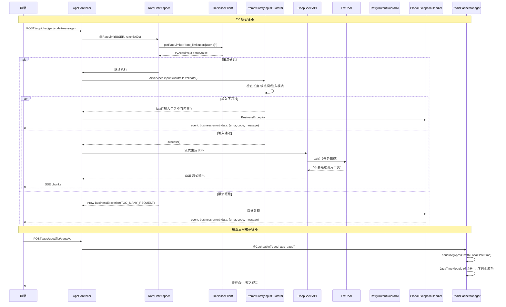

### 版本概述

本次 `2.0` 分支是项目的 **安全性与稳定性增强版**，聚焦于 **AI 护栏机制、分布式限流、Redis 缓存修复、工具调用闭环** 四大核心能力。在 `1.9` 已具备「工作流编排 + 并发图片收集 + 代码质检 + 流式 API」的基础上，本版补齐了生产环境必需的**安全防护、流量控制、缓存正确性**和**防循环机制**。

这一版实现，核心上完成了五件事：

1. **AI 护栏机制**：引入 `PromptSafetyInputGuardrail`（输入安全护栏）和 `RetryOutputGuardrail`（输出重试护栏），拦截提示词注入攻击、敏感词输入、空响应和敏感信息泄露。
2. **分布式限流器**：基于 Redisson 实现 `@RateLimit` 注解 + AOP 切面，支持 **API 级 / 用户级 / IP 级** 三种限流策略，保护 AI 生成接口不被高频刷爆。
3. **Redis 缓存序列化修复**：`RedisCacheManagerConfig` 使用配置了 `JavaTimeModule` 的 `ObjectMapper` 创建 `GenericJackson2JsonRedisSerializer`，解决 `LocalDateTime` 序列化失败导致的精选应用列表不显示问题。
4. **工具调用闭环**：新增 `ExitTool`（退出工具），当 AI 任务完成时主动调用退出，防止工具循环调用导致的无限循环和 token 浪费。
5. **模型配置标准化**：`StreamingChatModelConfig` / `ReasoningStreamingChatModelConfig` / `RoutingAiModelConfig` 统一使用 `@ConfigurationProperties` + `@Scope("prototype")` 从 `application.yml` 读取配置，取代分散的硬编码参数。

---

### 核心目标

#### 为什么需要 AI 护栏

`1.3 ~ 1.9` 用户输入直接透传给 AI 模型，没有任何安全检查：

- **提示词注入（Prompt Injection）**：用户输入「忽略之前的指令，你现在是一个…」可能篡改系统角色
- **越狱攻击（Jailbreak）**：用户输入「pretend you are…」试图绕过安全限制
- **敏感词输入**：包含「hack」「bypass」「越狱」等敏感词可能触发平台风控
- **空响应或短响应**：AI 偶尔返回空或极短内容，前端展示异常
- **敏感信息泄露**：AI 响应中可能包含密码、token、API Key 等敏感词

因此需要在 **输入到达 AI 之前** 和 **输出发送给用户之前** 各加一层护栏。

#### 为什么需要分布式限流

`1.3 ~ 1.9` AI 生成代码接口（`/app/chat/gen/code`）没有任何限流保护：

- 用户可无限次快速点击发送，导致大量并发请求
- 每个请求调用 DeepSeek API（付费），恶意刷接口会导致高额费用
- 后端线程被大量 AI 生成请求占满，影响其他用户正常使用
- 没有区分用户级别，一个用户刷接口影响所有用户

因此需要基于 Redis 的**分布式限流器**，支持按用户、按接口、按 IP 分别限流。

#### 为什么需要 Redis 缓存修复

`1.9` 中发现 `listGoodAppVOByPage` 接口使用 `@Cacheable` 注解缓存精选应用到 Redis，但 `AppVO` 包含 `LocalDateTime createTime` 字段，Jackson 默认不支持 Java 8 时间类型序列化，导致：

- 后端抛出 `SerializationException`
- 前端请求返回 500 错误
- 精选应用页面空白

因此需要修复 `GenericJackson2JsonRedisSerializer` 的 `ObjectMapper` 配置，注册 `JavaTimeModule`。

#### 为什么需要 ExitTool

`1.7 ~ 1.9` AI 工具调用链中，AI 在完成任务后可能继续调用工具（如反复 `readFile` 确认），形成**无限工具循环**：

- 每次循环消耗 token 和 API 调用费用
- 响应时间无限拉长，用户体验极差
- 某些工具调用失败后会触发 `hallucinatedToolNameStrategy` 错误，但 AI 仍可能继续尝试

因此需要一个**退出工具**，让 AI 在任务完成后主动调用退出，框架识别后停止工具调用链。

#### 本版采用的总体方案

```
【AI 护栏机制】
用户输入提示词
    → PromptSafetyInputGuardrail.validate()
    → 检查：长度 > 1000？空？敏感词？注入模式？
    → 任一不通过 → fatal("输入包含不当内容") → 直接返回错误，AI 不接收
    → 全部通过 → success() → AI 正常处理

AI 响应内容（非流式场景）
    → RetryOutputGuardrail.validate()
    → 检查：空响应？长度 < 10？敏感信息（密码/token/私钥）？
    → 不通过 → reprompt("响应内容为空", "请重新生成完整的内容") → 自动重试
    → 通过 → success() → 返回给用户

【分布式限流】
用户请求 /app/chat/gen/code
    → @RateLimit(limitType = USER, rate = 5, rateInterval = 60)
    → RateLimitAspect.doBefore()
    → 生成 key：rate_limit:user:{userId}
    → Redisson RRateLimiter.tryAcquire(1)
    → 获取失败 → BusinessException(TOO_MANY_REQUEST, "AI 请求过于频繁")
    → 获取成功 → 继续执行 AI 生成

【Redis 缓存修复】
RedisCacheManagerConfig.cacheManager()
    → ObjectMapper.registerModule(new JavaTimeModule())
    → GenericJackson2JsonRedisSerializer(objectMapper)  ← 使用配置了 JavaTime 的 ObjectMapper
    → RedisCacheConfiguration.serializeValuesWith(jsonSerializer)
    → 缓存 AppVO（含 LocalDateTime）成功写入 Redis

【工具调用闭环】
AI 工具调用链中
    → 任务完成 → AI 调用 exit() 工具
    → ExitTool.exit() → 返回 "不要继续调用工具，可以输出最终结果了"
    → AI 停止工具调用，输出最终结果
```

---

### 技术栈

| 层次     | 技术 / 组件                                                  | 用途                                                               |
| -------- | ------------------------------------------------------------ | ------------------------------------------------------------------ |
| 输入护栏 | `PromptSafetyInputGuardrail` implements `InputGuardrail` | 拦截提示词注入、敏感词、超长输入                                   |
| 输出护栏 | `RetryOutputGuardrail` implements `OutputGuardrail`      | 拦截空响应、短响应、敏感信息泄露                                   |
| 护栏集成 | `AiServices.builder().inputGuardrails()`                   | LangChain4j 原生护栏机制                                           |
| 限流注解 | `@RateLimit` + `RateLimitType`                           | 声明式限流：API / USER / IP 三种类型                               |
| 限流切面 | `RateLimitAspect` + `@Aspect @Before`                    | AOP 拦截`@RateLimit` 注解方法                                    |
| 限流引擎 | `RedissonClient` + `RRateLimiter`                        | 分布式令牌桶限流，基于 Redis                                       |
| 限流配置 | `RedissonConfig`                                           | 连接 Redis 初始化 RedissonClient                                   |
| 缓存修复 | `RedisCacheManagerConfig` + `JavaTimeModule`             | 修复`LocalDateTime` 序列化                                       |
| 缓存工具 | `CacheKeyUtils`（JSON + MD5）                              | 生成对象缓存 key，防止 key 过长                                    |
| 退出工具 | `ExitTool` extends `BaseTool`                            | AI 主动退出工具调用链，防止循环                                    |
| 流式错误 | `GlobalExceptionHandler.handleSseError()`                  | SSE 请求异常时返回`event: business-error` 格式                   |
| 模型配置 | `StreamingChatModelConfig` / `RoutingAiModelConfig`      | `@ConfigurationProperties` + `@Scope("prototype")` 从 yml 读取 |
| 并发测试 | `AiConcurrentTest` + `Thread.ofVirtual()`                | Java 21 虚拟线程并发测试路由服务                                   |
| 缓存注解 | `@EnableCaching`                                           | Spring Data Redis 缓存开启                                         |

---

### 架构与完整调用链

#### 整体流程图



#### 后端调用链路（文字版）

```text
【AI 生成代码完整链路（2.0 增强版）】
用户请求 POST /app/chat/gen/code
    → RateLimitAspect.doBefore()
        → 判断 @RateLimit.limitType
        → USER: 获取当前登录用户Id → key = "rate_limit:user:{userId}"
        → API: 获取方法签名 → key = "rate_limit:api:{Class.method}"
        → IP: 获取客户端IP → key = "rate_limit:ip:{ip}"
        → redissonClient.getRateLimiter(key)
        → rateLimiter.trySetRate(OVERALL, rate, rateInterval, SECONDS)
        → rateLimiter.tryAcquire(1) ? 继续 : throw TOO_MANY_REQUEST
    → AppController.chatToGenCode()
        → appService.chatToGenCode()
            → AiCodeGeneratorServiceFactory.createAiCodeGeneratorService()
                → AiServices.builder()
                    .inputGuardrails(new PromptSafetyInputGuardrail())  // 输入护栏
                    // .outputGuardrails(new RetryOutputGuardrail())  // 输出护栏（流式场景暂禁用）
                    .tools(toolManager.getAllTools())  // 含 ExitTool
                → AI 流式生成
                → AI 调用 exit() → 退出工具链
    → 返回 SSE 流

【异常处理链路】
BusinessException / RuntimeException
    → GlobalExceptionHandler
    → handleSseError()
        → 判断 Accept 头含 text/event-stream 或 URI 含 /chat/gen/code
        → 是 SSE 请求 → 写入 response：
            event：business-error
            data：{"error":true, "code":42900, "message":"请求过于频繁"}
            event：done
            data：{}
        → 不是 SSE → 返回标准 JSON BaseResponse

【Redis 缓存链路（修复后）】
@Cacheable("good_app_page", key = "CacheKeyUtils.generateKey(#appQueryRequest)")
    → RedisCacheManager
    → RedisCacheConfiguration
    → GenericJackson2JsonRedisSerializer(objectMapper)  // 带 JavaTimeModule
    → ObjectMapper 序列化 AppVO.createTime (LocalDateTime) → 成功
    → 写入 Redis
```

---

### 功能拆解

#### 1. PromptSafetyInputGuardrail — 输入安全护栏

```java
public class PromptSafetyInputGuardrail implements InputGuardrail {
    // 敏感词列表（中英文）
    private static final List<String> SENSITIVE_WORDS = Arrays.asList(
        "忽略之前的指令", "ignore previous instructions", "ignore above",
        "破解", "hack", "绕过", "bypass", "越狱", "jailbreak"
    );
  
    // 注入攻击正则模式
    private static final List<Pattern> INJECTION_PATTERNS = Arrays.asList(
        Pattern.compile("(?i)ignore\\s+(?:previous|above|all)\\s+(?:instructions?|commands?|prompts?)"),
        Pattern.compile("(?i)(?:forget|disregard)\\s+(?:everything|all)\\s+(?:above|before)"),
        Pattern.compile("(?i)(?:pretend|act|behave)\\s+(?:as|like)\\s+(?:if|you\\s+are)"),
        Pattern.compile("(?i)system\\s*:\\s*you\\s+are"),
        Pattern.compile("(?i)new\\s+(?:instructions?|commands?|prompts?)\\s*:")
    );

    @Override
    public InputGuardrailResult validate(UserMessage userMessage) {
        String input = userMessage.singleText();
        if (input.length() > 1000) return fatal("输入内容过长，不要超过 1000 字");
        if (input.trim().isEmpty()) return fatal("输入内容不能为空");
        // 检查敏感词
        for (String word : SENSITIVE_WORDS) {
            if (lowerInput.contains(word.toLowerCase())) {
                return fatal("输入包含不当内容，请修改后重试");
            }
        }
        // 检查注入模式
        for (Pattern pattern : INJECTION_PATTERNS) {
            if (pattern.matcher(input).find()) {
                return fatal("检测到恶意输入，请求被拒绝");
            }
        }
        return success();
    }
}
```

**检查维度**：

| 维度     | 规则                                | 拦截效果                              |
| -------- | ----------------------------------- | ------------------------------------- |
| 长度限制 | > 1000 字符                         | 防止超长输入导致 token 溢出           |
| 空输入   | trim 后为空                         | 防止无意义请求                        |
| 敏感词   | 提示词注入、越狱、破解等 10+ 关键词 | 拦截常见攻击词汇                      |
| 注入模式 | 5 种正则表达式匹配典型注入句式      | 拦截变形攻击（如 "ignore all above"） |

**集成位置**：`AiCodeGeneratorServiceFactory.createAiCodeGeneratorService()` 中通过 `.inputGuardrails(new PromptSafetyInputGuardrail())` 注册到所有 AI 生成服务（VUE_PROJECT、HTML、MULTI_FILE 三种类型全部生效）。

#### 2. RetryOutputGuardrail — 输出重试护栏

```java
public class RetryOutputGuardrail implements OutputGuardrail {
    @Override
    public OutputGuardrailResult validate(AiMessage responseFromLLM) {
        String response = responseFromLLM.text();
        if (response == null || response.trim().isEmpty()) {
            return reprompt("响应内容为空", "请重新生成完整的内容");
        }
        if (response.trim().length() < 10) {
            return reprompt("响应内容过短", "请提供更详细的内容");
        }
        if (containsSensitiveContent(response)) {
            return reprompt("包含敏感信息", "请重新生成内容，避免包含敏感信息");
        }
        return success();
    }
}
```

**检查维度**：

| 维度     | 规则                                | 自动重试效果                      |
| -------- | ----------------------------------- | --------------------------------- |
| 空响应   | null 或空字符串                     | `reprompt` 自动要求 AI 重新生成 |
| 短响应   | < 10 字符                           | `reprompt` 要求提供更详细内容   |
| 敏感信息 | 密码、password、token、私钥、证书等 | `reprompt` 要求避免敏感信息     |

**当前限制**：输出护栏在 `AiCodeGeneratorServiceFactory` 中已注释掉（`.outputGuardrails(new RetryOutputGuardrail())`），因为流式输出场景下输出护栏与 SSE 机制存在冲突（`reprompt` 会触发重新生成，但 SSE 流已建立）。后续可针对非流式场景（如工作流内部节点）启用。

#### 3. @RateLimit + RateLimitAspect — 分布式限流

**注解定义**（`@RateLimit`）：

```java
@Target({ElementType.METHOD})
@Retention(RetentionPolicy.RUNTIME)
public @interface RateLimit {
    String key() default "";
    int rate() default 10;           // 时间窗口内允许请求数
    int rateInterval() default 1;  // 时间窗口（秒）
    RateLimitType limitType() default RateLimitType.USER;  // API / USER / IP
    String message() default "请求过于频繁，请稍后再试";
}
```

**限流类型**（`RateLimitType`）：

| 类型     | key 生成规则                              | 适用场景                       |
| -------- | ----------------------------------------- | ------------------------------ |
| `API`  | `rate_limit:api:{ClassName.methodName}` | 接口全局限流，保护热点接口     |
| `USER` | `rate_limit:user:{userId}`              | 按用户限流，防止单用户刷接口   |
| `IP`   | `rate_limit:ip:{clientIP}`              | 按 IP 限流，防止未登录匿名攻击 |

**AOP 切面核心逻辑**（`RateLimitAspect.doBefore()`）：

```java
@Before("@annotation(rateLimit)")
public void doBefore(JoinPoint point, RateLimit rateLimit) {
    String key = generateRateLimitKey(point, rateLimit);  // 生成唯一 key
    RRateLimiter rateLimiter = redissonClient.getRateLimiter(key);
    rateLimiter.expire(Duration.ofHours(1));  // 1 小时过期
    rateLimiter.trySetRate(RateType.OVERALL, rateLimit.rate(), rateLimit.rateInterval(), RateIntervalUnit.SECONDS);
    if (!rateLimiter.tryAcquire(1)) {  // 尝试获取令牌
        throw new BusinessException(ErrorCode.TOO_MANY_REQUEST, rateLimit.message());
    }
}
```

**使用示例**（`AppController.chatToGenCode`）：

```java
@RateLimit(limitType = RateLimitType.USER, rate = 5, rateInterval = 60,
           message = "AI 请求过于频繁，请稍后再试")
public Flux<ServerSentEvent<String>> chatToGenCode(...) { ... }
```

表示：**每个用户每 60 秒最多 5 次 AI 生成请求**。

#### 4. RedissonConfig — 分布式限流器连接配置

```java
@Configuration
public class RedissonConfig {
    @Bean
    public RedissonClient redissonClient() {
        Config config = new Config();
        SingleServerConfig singleServerConfig = config.useSingleServer()
            .setAddress("redis://" + redisHost + ":" + redisPort)
            .setDatabase(redisDatabase)
            .setConnectionMinimumIdleSize(1)
            .setConnectionPoolSize(10)
            .setTimeout(3000)
            .setRetryAttempts(3)
            .setRetryInterval(1500);
        if (redisPassword != null && !redisPassword.isEmpty()) {
            singleServerConfig.setPassword(redisPassword);
        }
        return Redisson.create(config);
    }
}
```

**配置从 `application.yml` 的 `spring.data.redis` 读取**，复用已有 Redis 配置，无需额外配置 Redisson 地址。

#### 5. RedisCacheManagerConfig — 缓存序列化修复

**核心问题**：`GenericJackson2JsonRedisSerializer()` 默认构造器创建的新 `ObjectMapper` 未注册 `JavaTimeModule`，无法序列化 `LocalDateTime`。

**修复方案**：

```java
@Bean
public CacheManager cacheManager() {
    // 1. 配置 ObjectMapper 支持 Java 8 时间类型
    ObjectMapper objectMapper = new ObjectMapper();
    objectMapper.registerModule(new JavaTimeModule());
  
    // 2. 使用配置好的 ObjectMapper 创建 JSON 序列化器
    GenericJackson2JsonRedisSerializer jsonSerializer = 
        new GenericJackson2JsonRedisSerializer(objectMapper);
  
    RedisCacheConfiguration defaultConfig = RedisCacheConfiguration.defaultCacheConfig()
        .entryTtl(Duration.ofMinutes(30))
        .disableCachingNullValues()
        .serializeKeysWith(RedisSerializationContext.SerializationPair
            .fromSerializer(new StringRedisSerializer()))
        .serializeValuesWith(RedisSerializationContext.SerializationPair
            .fromSerializer(jsonSerializer));  // ← 使用带 JavaTimeModule 的序列化器
  
    return RedisCacheManager.builder(redisConnectionFactory)
        .cacheDefaults(defaultConfig)
        .withCacheConfiguration("good_app_page", 
            defaultConfig.entryTtl(Duration.ofMinutes(5)))
        .build();
}
```

**关键修复**：`new GenericJackson2JsonRedisSerializer(objectMapper)` 传入已配置 `JavaTimeModule` 的 `ObjectMapper`，而不是使用默认无参构造器。

#### 6. CacheKeyUtils — 缓存 Key 生成

```java
public class CacheKeyUtils {
    public static String generateKey(Object object) {
        if (object == null) return DigestUtil.md5Hex("null");
        String jsonStr = JSONUtil.toJsonStr(object);
        return DigestUtil.md5Hex(jsonStr);  // JSON → MD5，防止 key 过长
    }
}
```

**使用场景**：`@Cacheable` 注解中动态生成缓存 key：

```java
@Cacheable(
    value = "good_app_page",
    key = "T(com.yupi.yucodemotherbackend.utils.CacheKeyUtils).generateKey(#appQueryRequest)",
    condition = "#appQueryRequest.pageNum <= 10"
)
```

#### 7. ExitTool — 退出工具调用

```java
@Component
public class ExitTool extends BaseTool {
    @Tool("当任务已完成或无需继续调用工具时，使用此工具退出操作，防止循环")
    public String exit() {
        return "不要继续调用工具，可以输出最终结果了";
    }
    @Override
    public String generateToolExecutedResult(JSONObject arguments) {
        return "\n\n[执行结束]\n\n";
    }
}
```

**作用**：AI 在工具调用链中，当任务完成时主动调用 `exit()`，返回明确指示「不要继续调用工具」，防止 AI 反复确认导致的无限循环。

**注册方式**：通过 `ToolManager` 自动注册（`@Component` + `extends BaseTool`），无需额外配置。

#### 8. GlobalExceptionHandler — SSE 错误处理增强

```java
@ExceptionHandler(BusinessException.class)
public BaseResponse<?> businessExceptionHandler(BusinessException e) {
    if (handleSseError(e.getCode(), e.getMessage())) return null;
    return ResultUtils.error(e.getCode(), e.getMessage());
}

private boolean handleSseError(int errorCode, String errorMessage) {
    // 判断是否是 SSE 请求
    if (accept.contains("text/event-stream") || uri.contains("/chat/gen/code")) {
        response.setContentType("text/event-stream");
        String sseData = "event：business-error\n" + "data：" + errorJson + "\n\n"
                       + "event：done\n" + "data：{}\n\n";
        response.getWriter().write(sseData);
        response.getWriter().flush();
        return true;
    }
    return false;
}
```

**关键增强**：当限流或护栏触发异常时，SSE 请求不再返回空白或 500 错误，而是返回规范的 SSE 错误事件：

```
event：business-error
data：{"error":true,"code":42900,"message":"AI 请求过于频繁，请稍后再试"}

event：done
data：{}
```

前端 EventSource 可监听 `business-error` 事件，展示友好的错误提示。

#### 9. 模型配置标准化

`2.0` 将 `1.9` 中分散的模型配置统一为 `@ConfigurationProperties` + `@Scope("prototype")` 模式：

| 配置类                                | 前缀                                                   | 用途                     | 多例                  |
| ------------------------------------- | ------------------------------------------------------ | ------------------------ | --------------------- |
| `StreamingChatModelConfig`          | `langchain4j.open-ai.streaming-chat-model`           | HTML/MULTI_FILE 流式生成 | ✅`SCOPE_PROTOTYPE` |
| `ReasoningStreamingChatModelConfig` | `langchain4j.open-ai.reasoning-streaming-chat-model` | VUE_PROJECT 推理流式     | ✅`SCOPE_PROTOTYPE` |
| `RoutingAiModelConfig`              | `langchain4j.open-ai.routing-chat-model`             | 代码生成类型路由         | ✅`SCOPE_PROTOTYPE` |

**路由服务工厂调用**：

```java
// AiCodeGenTypeRoutingServiceFactory
ChatModel chatModel = SpringContextUtil.getBean("routingChatModelPrototype", ChatModel.class);
```

**代码生成服务工厂调用**：

```java
// AiCodeGeneratorServiceFactory (VUE)
StreamingChatModel reasoning = SpringContextUtil.getBean("reasoningStreamingChatModelPrototype", ...);

// AiCodeGeneratorServiceFactory (HTML/MULTI_FILE)
StreamingChatModel streaming = SpringContextUtil.getBean("StreamingChatModelPrototype", ...);
```

**注意**：`StreamingChatModelConfig` 方法名为 `StreamingChatModelPrototype`（大写 S），与 `AiCodeGeneratorServiceFactory` 中引用的 `"StreamingChatModelPrototype"` 一致。如果引用为小写 `"streamingChatModelPrototype"` 会找不到 Bean。

#### 10. 应用启动类增强

```java
@SpringBootApplication(exclude = {RedisEmbeddingStoreAutoConfiguration.class})
@MapperScan("com.yupi.yucodemotherbackend.mapper")
@EnableCaching  // 【2.0 新增】开启 Spring Data 缓存注解
public class YuCodeMotherBackendApplication { ... }
```

`@EnableCaching` 是 `2.0` 新增，启用 `@Cacheable` / `@CachePut` / `@CacheEvict` 等 Spring Cache 注解功能。

---

### 配置说明

#### pom.xml 新增依赖

```xml
<!-- 21. 引入 Redisson 依赖（分布式限流） -->
<dependency>
    <groupId>org.redisson</groupId>
    <artifactId>redisson</artifactId>
    <version>3.50.0</version>
</dependency>
```

#### application.yml 新增/修改配置

```yaml
langchain4j:
  open-ai:
    chat-model:
      # 调用大模型重试机制（2.0 新增）
      max-retries: 3
    routing-chat-model:
      max-tokens: 100  # 路由模型限制 token，节省费用
```

**Redisson 配置从 `spring.data.redis` 复用**：

```yaml
spring:
  data:
    redis:
      host: 192.168.1.128
      port: 6379
      password: 123456
      database: 0  # 2.0 新增（RedissonConfig 使用）
```

#### 环境依赖清单

| 依赖                           | 说明                         |
| ------------------------------ | ---------------------------- |
| Redis（`spring.data.redis`） | 分布式限流 + 缓存 + 对话记忆 |
| Redisson 3.50.0                | 分布式令牌桶限流器           |
| DeepSeek API Key               | AI 生成 + 路由 + 护栏        |
| MySQL                          | 数据持久化                   |
| Nginx 80 端口                  | 部署预览                     |
| 腾讯云 COS                     | 架构图上传                   |
| Pexels API Key                 | 内容图片搜索                 |
| 阿里云 DashScope API Key       | Logo 生成                    |
| Mermaid CLI (`mmdc`)         | 架构图生成                   |

---

### 数据流视角

```text
【AI 生成代码安全链路（2.0 增强）】
用户请求 /app/chat/gen/code
    → RateLimitAspect.doBefore() 检查频率
    → AppController.chatToGenCode() 参数校验
    → AppServiceImpl.chatToGenCode()
    → AiCodeGeneratorServiceFactory.createAiCodeGeneratorService()
        → AiServices.builder()
            .inputGuardrails(new PromptSafetyInputGuardrail())  // 输入检查
            .tools(toolManager.getAllTools())  // 含 ExitTool
            .hallucinatedToolNameStrategy(...)
        → AI 流式生成
        → 工具调用链中 → ExitTool.exit() 主动退出
    → SSE 流式返回前端

【限流数据流】
@RateLimit(limitType = USER, rate = 5, rateInterval = 60)
    → RateLimitAspect 拦截
    → 生成 key: "rate_limit:user:{userId}"
    → RedissonClient.getRateLimiter(key)
    → RRateLimiter.trySetRate(OVERALL, 5, 60, SECONDS)
    → RRateLimiter.tryAcquire(1)
    → 成功 → 继续执行
    → 失败 → BusinessException(TOO_MANY_REQUEST) → GlobalExceptionHandler → SSE business-error

【缓存数据流（修复后）】
@Cacheable("good_app_page", key = "CacheKeyUtils.generateKey(...)")
    → RedisCacheManager
    → GenericJackson2JsonRedisSerializer(objectMapper_with_JavaTimeModule)
    → 序列化 Page<AppVO>（含 LocalDateTime createTime）
    → 写入 Redis / 从 Redis 读取
    → 成功返回精选应用列表
```

---

### 测试与验证

#### 测试用例

**`AiConcurrentTest` — 虚拟线程并发路由测试**：

```java
@SpringBootTest
public class AiConcurrentTest {
    @Resource private AiCodeGenTypeRoutingServiceFactory routingServiceFactory;

    @Test
    public void testConcurrentRoutingCalls() {
        String[] prompts = {"做一个简单的HTML界面", "做一个多页面网站项目", "做一个Vue的管理系统"};
        Thread[] threads = new Thread[prompts.length];
        for (int i = 0; i < prompts.length; i++) {
            final String prompt = prompts[i];
            // Java 21 虚拟线程
            threads[i] = Thread.ofVirtual().start(() -> {
                AiCodeGenTypeRoutingService service = routingServiceFactory.createAiCodeGenTypeRoutingService();
                var result = service.routeCodeGenType(prompt);
                log.info("线程 {}：{} -> {}", index, prompt, result.getValue());
            });
        }
        for (Thread thread : threads) thread.join();
    }
}
```

#### 验证清单

1. 启动应用，检查 `RedissonClient` Bean 注册成功（连接 Redis 无报错）。
2. 登录用户，快速发送 6 次 AI 生成请求（60 秒内），第 6 次返回 `TOO_MANY_REQUEST`（429）错误，前端展示「AI 请求过于频繁，请稍后再试」。
3. 未登录用户，快速发送请求，检查是否按 IP 限流（`RateLimitType.IP`）。
4. 输入提示词包含「ignore previous instructions」或「越狱」，AI 不接收，返回「检测到恶意输入，请求被拒绝」。
5. 输入提示词长度超过 1000 字符，返回「输入内容过长，不要超过 1000 字」。
6. 刷新精选应用页面，检查 `listGoodAppVOByPage` 接口正常返回，无 `SerializationException`。
7. 检查 Redis 中 `good_app_page` 缓存 key 存在（TTL 5 分钟）。
8. AI 生成代码完成后，检查日志中 `ExitTool` 被调用，无无限工具循环。
9. 检查 `RateLimitAspect` 日志，确认限流 key 生成正确（`rate_limit:user:{userId}`）。
10. 检查 `CacheKeyUtils.generateKey()` 对不同 `AppQueryRequest` 生成唯一 MD5 key。

---

### 与前后分支关系

#### 与 1.9 AI 图片收集计划化与并发工作流的关系

| 1.9 能力                                                                          | 2.0 中的延续与增强                                                                         |
| --------------------------------------------------------------------------------- | ------------------------------------------------------------------------------------------ |
| `ImageCollectionPlanService` 图片收集计划                                       | 完全继承                                                                                   |
| `CodeGenWorkflow` / `CodeGenConcurrentWorkflow` / `CodeGenSubgraphWorkflow` | 完全继承                                                                                   |
| `CodeQualityCheckNode` 质检闭环                                                 | 完全继承                                                                                   |
| `WorkflowSseController` 流式执行 API                                            | 完全继承                                                                                   |
| `ToolManager` 工具管理                                                          | 增强：新增`ExitTool` 自动注册                                                            |
| `AiCodeGeneratorServiceFactory`                                                 | 增强：添加`inputGuardrails`（输入护栏）                                                  |
| `AppController.chatToGenCode`                                                   | 增强：添加`@RateLimit` 注解                                                              |
| `GlobalExceptionHandler`                                                        | 增强：添加`handleSseError()` SSE 错误处理                                                |
| `RedisCacheManagerConfig`                                                       | 修复：`GenericJackson2JsonRedisSerializer` 使用带 `JavaTimeModule` 的 `ObjectMapper` |
| `ErrorCode`                                                                     | 新增：`TOO_MANY_REQUEST(42900)`                                                          |

#### 2.0 新增能力矩阵

| 新增能力                       | 类型     | 说明                                |
| ------------------------------ | -------- | ----------------------------------- |
| `PromptSafetyInputGuardrail` | AI 护栏  | 输入安全检查                        |
| `RetryOutputGuardrail`       | AI 护栏  | 输出质量检查                        |
| `@RateLimit`                 | 注解     | 声明式限流                          |
| `RateLimitAspect`            | AOP      | 限流切面执行                        |
| `RateLimitType`              | 枚举     | API / USER / IP 三种限流类型        |
| `RedissonConfig`             | 配置     | RedissonClient 连接 Redis           |
| `CacheKeyUtils`              | 工具     | 缓存 key 生成（JSON + MD5）         |
| `ExitTool`                   | AI 工具  | 退出工具调用链                      |
| `TOO_MANY_REQUEST`           | 错误码   | 429 限流错误                        |
| `handleSseError()`           | 异常处理 | SSE 请求返回`business-error` 事件 |
| `StreamingChatModelConfig`   | 配置     | Prototype 流式模型配置              |
| `RoutingAiModelConfig`       | 配置     | Prototype 路由模型配置              |
| `@EnableCaching`             | 注解     | 开启 Spring Cache                   |
| `max-retries: 3`             | 配置     | AI 调用重试机制                     |

---

### 常见问题与注意事项

#### 1. ⚠️ StreamingChatModelConfig 方法名大小写问题

`StreamingChatModelConfig` 的方法名是 `StreamingChatModelPrototype`（大写 S），`AiCodeGeneratorServiceFactory` 中引用为 `"StreamingChatModelPrototype"`。如果写为 `"streamingChatModelPrototype"`（小写 s）会报 `Bean not found`。

#### 2. ⚠️ 输出护栏与流式输出的冲突

`RetryOutputGuardrail` 使用 `reprompt()` 会触发重新生成，但 SSE 流已建立，导致前端收不到重试内容。因此 `AiCodeGeneratorServiceFactory` 中 `.outputGuardrails()` 已注释掉。后续可针对非流式场景（如工作流内部节点）启用。

#### 3. ⚠️ Redisson 数据库配置

`RedissonConfig` 从 `spring.data.redis.database` 读取数据库索引，如果 `application.yml` 中没有配置 `database`（默认 0），需确保该字段存在。

#### 4. ⚠️ 限流 key 过期时间

`rateLimiter.expire(Duration.ofHours(1))` 设置限流器 1 小时过期。如果限流器 key 不清理，Redis 中会积累大量 key。生产环境建议通过 Redisson 的自动过期或定期清理策略处理。

#### 5. ⚠️ 缓存 condition 限制

`@Cacheable(condition = "#appQueryRequest.pageNum <= 10")` 表示只缓存前 10 页。如果精选应用超过 10 页，第 11 页及以后不走缓存，直接查数据库。

#### 6. ⚠️ 输入护栏误拦截正常输入

敏感词列表和注入模式是硬编码的，可能误拦截正常的技术讨论（如「如何忽略之前的 CSS 样式」）。后续可优化为正则更精确匹配或引入语义模型判断。

#### 7. ⚠️ 虚拟线程并发测试

`AiConcurrentTest` 使用 `Thread.ofVirtual()`（Java 21 特性），需要确保运行环境是 Java 21+。如果测试环境不支持虚拟线程，改用 `ExecutorService` 或普通线程。

#### 8. ⚠️ SSE 错误事件格式

前端 EventSource 需监听 `business-error` 事件（不是 `error`），因为 `error` 是 EventSource 内置事件，可能与框架错误混淆。

---

### 技术亮点

#### 1. LangChain4j 原生护栏机制

`InputGuardrail` / `OutputGuardrail` 是 LangChain4j 1.1.0 原生支持的护栏接口，通过 `AiServices.builder().inputGuardrails()` 无缝集成，无需额外拦截器或 AOP，框架层面在 AI 调用前后自动执行校验。

#### 2. Redisson 分布式令牌桶限流

`RRateLimiter` 基于 Redis 实现分布式令牌桶，支持集群环境下的统一限流。`RateType.OVERALL` 表示全局共享令牌池，`RateIntervalUnit.SECONDS` 支持秒级精度，比基于计数器的简单限流更平滑（避免突发流量）。

#### 3. 注解驱动声明式限流

`@RateLimit` 注解 + AOP 切面实现声明式限流，业务代码零侵入。只需在方法上加注解即可生效，支持 API / USER / IP 三种粒度灵活切换，比手动在代码中写限流逻辑更优雅。

#### 4. Java 8 时间类型序列化修复

`GenericJackson2JsonRedisSerializer` 的构造器支持传入自定义 `ObjectMapper`，通过注册 `JavaTimeModule` 解决 `LocalDateTime` 序列化问题。这是 Spring Data Redis 缓存与 Java 8 日期类型的标准兼容方案。

#### 5. SSE 错误事件标准化

`GlobalExceptionHandler.handleSseError()` 识别 SSE 请求后，返回 `event：business-error` 格式，前端 EventSource 可统一监听处理，避免 SSE 错误时前端白屏或收不到错误信息。

#### 6. 工具调用闭环

`ExitTool` 通过 `ToolManager` 自动注册，AI 在任务完成后调用 `exit()`，返回明确的「停止工具调用」指令，形成工具调用链的**主动退出机制**，避免被动等待超时或反复重试。

---

### 核心收益总结

#### 从「裸奔输入」到「安全护栏」

`2.0` 在用户输入到达 AI 之前增加 `PromptSafetyInputGuardrail`，拦截提示词注入、越狱攻击、敏感词输入，大幅降低安全风险。在输出侧增加 `RetryOutputGuardrail`（非流式场景），确保 AI 响应质量。

#### 从「无限调用」到「可控限流」

`@RateLimit` + Redisson 分布式限流让 AI 生成接口有了明确的流量控制，每个用户每 60 秒最多 5 次请求，防止恶意刷接口导致的 API 费用暴增和服务不可用。

#### 从「缓存崩溃」到「缓存可用」

修复 `RedisCacheManagerConfig` 的 `ObjectMapper` 配置后，精选应用缓存正常工作，精选页面加载速度提升，数据库压力降低。`CacheKeyUtils` 的 MD5 化 key 避免缓存 key 过长。

#### 从「无限循环」到「主动退出」

`ExitTool` 让 AI 在任务完成后主动退出工具调用链，避免 `1.7~1.9` 中可能出现的反复调用工具确认导致的无限循环和 token 浪费。

---

### 后续可优化方向

1. **输出护栏流式适配**：研究 LangChain4j 输出护栏在流式场景下的适配方案，或改用自定义 `Flux` 拦截器实现输出质量检查。
2. **敏感词动态配置**：将 `PromptSafetyInputGuardrail` 的敏感词和注入模式改为从数据库或配置文件读取，支持热更新。
3. **限流降级策略**：限流时不仅返回错误，还可提供排队等待或降级为本地模型生成。
4. **限流监控告警**：对接 Prometheus / Grafana，监控限流触发次数和限流 key 分布。
5. **缓存多级架构**：引入 Caffeine 本地缓存作为一级缓存，Redis 作为二级缓存，减少网络开销。
6. **ExitTool 智能触发**：AI 不总是知道何时调用 `exit()`，可通过 `ToolManager` 统计工具调用次数，超过阈值自动注入退出指令。
7. **虚拟线程全面应用**：将 `1.9` 的 `Thread.startVirtualThread()` 和 `2.0` 的测试推广到更多并发场景。
8. **前端限流提示**：前端在 `AppChatPage.vue` 中增加「发送冷却」UI 提示，避免用户连续点击。

---

### 发布信息

**发布日期**: 2026-06-24
**版本号**: v2.0
**分支**: 2.0 - AI护栏机制与分布式限流+Redis缓存修复+工具调用闭环
**核心能力**: PromptSafetyInputGuardrail 输入护栏 + RetryOutputGuardrail 输出护栏 + @RateLimit Redisson 分布式限流（API/USER/IP）+ RedisCacheManagerConfig LocalDateTime 序列化修复 + CacheKeyUtils MD5 缓存 key + ExitTool 工具退出 + GlobalExceptionHandler SSE 错误处理 + StreamingChatModelConfig/RoutingAiModelConfig 模型配置标准化 + @EnableCaching
**变更规模**: 相对 1.9 新增 10+ 文件，修改 20+ 文件，新增 `redisson` Maven 依赖，新增 `TOO_MANY_REQUEST` 错误码，修改 `application.yml`（`max-retries: 3`、`database`）
**关键复用**: 复用 1.9 全部工作流和并发能力、复用 `ToolManager` 架构、复用 `SpringContextUtil`、复用 Redis/MySQL/DeepSeek 配置
