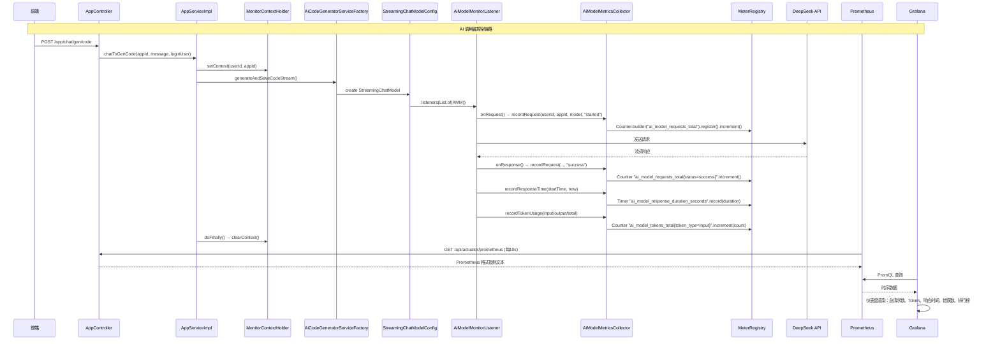

### 版本概述

本次 `2.1` 分支是项目的 **可观测性增强版**，聚焦于 **Prometheus + Grafana 业务监控体系**。在 `2.0` 已具备「AI 护栏 + 分布式限流 + 缓存修复 + 工具闭环」的基础上，本版引入 **Micrometer 指标收集 + LangChain4j ChatModelListener 监听机制 + ThreadLocal 跨线程上下文传递 + Prometheus 抓取 + Grafana 可视化仪表盘**，实现对 AI 大模型调用链路的**全维度监控**。

这一版实现，核心上完成了五件事：

1. 引入 `spring-boot-starter-actuator` + `micrometer-registry-prometheus` 依赖，**暴露 `/actuator/prometheus` 端点**，让 Prometheus 能够拉取标准格式的监控数据。
2. 实现 **`AiModelMetricsCollector` 指标收集器**，基于 Micrometer `Counter` + `Timer` 注册 4 类指标：请求次数、错误次数、Token 消耗、响应时间，支持 `user_id` / `app_id` / `model_name` / `status` / `token_type` / `error_message` 等多维度标签。
3. 实现 **`AiModelMonitorListener`** 实现 LangChain4j `ChatModelListener` 接口，通过 `onRequest` / `onResponse` / `onError` 三个生命周期钩子，在 AI 调用前后自动采集指标；通过 `requestContext.attributes()` 实现**跨线程 MonitorContext 传递**（因请求和响应事件触发不在同一线程）。
4. 实现 **`MonitorContext` + `MonitorContextHolder`**（ThreadLocal），在 `AppServiceImpl.chatToGenCode` 中设置用户/应用上下文，在 AI 监听器中读取并注入标签，实现**业务维度（哪个用户、哪个应用）与技术指标的关联**。
5. 提供 **Prometheus 抓取配置**（`prometheus.yml`）和 **Grafana 仪表盘配置**（`ai_model_grafana_config.json`），开箱即用的监控面板覆盖：总成功请求数、总 Token 消耗、平均响应时间、总错误数、Token 消耗趋势、模型调用次数趋势、热门应用排行、用户活跃排行、应用 Token 消耗排行、错误分析。

---

### 核心目标

#### 为什么需要 AI 大模型调用监控

`2.0` 及之前版本，AI 调用是**黑盒操作**：

- 不知道一天调用了多少次 DeepSeek API，花了多少 token
- 不知道哪个应用生成代码最频繁，哪个用户消耗最多
- 不知道 AI 响应平均耗时多少，是否存在超时或错误高峰
- 不知道不同模型（`deepseek-chat` vs `deepseek-reasoner`）的使用分布
- 限流触发时，无法判断是「正常高并发」还是「恶意刷接口」

因此需要对 AI 大模型调用的**请求、响应、错误、Token、耗时**进行全链路监控，并可视化展示。

#### 为什么需要 LangChain4j 原生监听机制

直接在 `AppServiceImpl` 中手动埋点（如 `System.currentTimeMillis()` 前后计算耗时）存在以下问题：

- 代码侵入性强，每个调用点都要写埋点逻辑
- 无法精确统计 Token 消耗（需从 AI 响应元数据读取）
- 错误统计不完整（AI 层抛出的异常 vs 业务层异常难以区分）
- 流式输出场景下，响应完成时间难以准确获取

LangChain4j 提供 `ChatModelListener` 接口，在**模型层面**提供 `onRequest` / `onResponse` / `onError` 三个标准钩子，无需修改业务代码即可实现**无侵入监控**。

#### 为什么需要 ThreadLocal 跨线程上下文传递

LangChain4j 的 `ChatModelListener` 中，`onRequest` 和 `onResponse` / `onError` **触发在不同线程**（尤其流式场景，请求线程和响应回调线程分离）。`AppServiceImpl` 中通过 `loginUser.getId()` 获取的用户 ID 和 `appId` 在 `onResponse` 中无法直接访问。

因此需要在 `onRequest` 时通过 `requestContext.attributes().put()` 将 `MonitorContext` 存入属性映射，在 `onResponse` 时通过 `responseContext.attributes().get()` 取出，实现**跨线程上下文传递**。

#### 本版采用的总体方案

```
【AI 调用监控链路】
用户请求 /app/chat/gen/code
    → AppServiceImpl.chatToGenCode()
        → MonitorContextHolder.setContext(userId, appId)  // 设置 ThreadLocal 上下文
        → AiCodeGeneratorFacade.generateAndSaveCodeStream()
            → AiCodeGeneratorServiceFactory.createAiCodeGeneratorService()
                → OpenAiStreamingChatModel.builder()
                    .listeners(List.of(aiModelMonitorListener))  // 注册监听器
            → AI 流式生成
                → onRequest(): 记录请求开始时间 + 读取 MonitorContext + 记录 started 请求
                → onResponse(): 读取属性中 MonitorContext + 记录 success + 响应时间 + Token 消耗
                → onError(): 读取 ThreadLocal MonitorContext + 记录 error + 错误信息 + 响应时间
        → streamHandlerExecutor.doExecute()
        → doFinally(): MonitorContextHolder.clearContext()  // 清理 ThreadLocal

【Prometheus 抓取链路】
Prometheus Server
    → 每 10s 抓取 http://localhost:8123/api/actuator/prometheus
    → 拉取指标数据：ai_model_requests_total, ai_model_errors_total, ai_model_tokens_total, ai_model_response_duration_seconds
    → 存储时序数据

【Grafana 可视化链路】
Grafana Server
    → 配置 Prometheus 数据源
    → 导入 ai_model_grafana_config.json
    → 展示仪表盘：概览指标、Token 消耗分析、模型调用分析、排行榜、错误分析
```

---

### 技术栈

| 层次 | 技术 / 组件 | 用途 |
|------|-------------|------|
| 指标门面 | Micrometer `MeterRegistry` | 统一指标收集 API（类似 Slf4j 对于日志） |
| 指标引擎 | Micrometer `Counter` / `Timer` | 计数器（请求/错误/Token）和计时器（响应时间） |
| 指标注册 | `ConcurrentHashMap` 缓存 | 按 key 缓存已创建的指标，避免重复注册性能损耗 |
| 指标暴露 | Spring Boot Actuator `/actuator/prometheus` | 生产就绪监控端点 |
| 格式转换 | `micrometer-registry-prometheus` | Micrometer 指标 → Prometheus 文本格式 |
| 指标抓取 | Prometheus Server (`prometheus.yml`) | 每 10s 拉取应用指标 |
| 可视化 | Grafana + JSON 配置导入 | 仪表盘展示：统计、趋势图、饼图、排行榜、表格 |
| 监听机制 | LangChain4j `ChatModelListener` | 模型请求/响应/错误生命周期钩子 |
| 上下文传递 | `requestContext.attributes()` + `MonitorContext` | 跨线程传递 user_id / app_id |
| 线程隔离 | `ThreadLocal<MonitorContext>` | 同线程内共享监控上下文 |
| 模型配置 | `StreamingChatModelConfig` / `ReasoningStreamingChatModelConfig` | 通过 `.listeners(List.of(...))` 注册监听器 |

---

### 架构与完整调用链

#### 整体流程图



#### 后端调用链路（文字版）

```text
【监控上下文设置】
AppServiceImpl.chatToGenCode()
    → MonitorContextHolder.setContext(
           MonitorContext.builder()
               .userId(loginUser.getId().toString())
               .appId(appId.toString())
               .build()
       )
    → 后续 AI 监听器通过 ThreadLocal 读取 userId / appId

【模型创建时注册监听器】
StreamingChatModelConfig.StreamingChatModelPrototype()
    → OpenAiStreamingChatModel.builder()
        .listeners(List.of(aiModelMonitorListener))  // 注册监听器
        .build()

【请求阶段】
AiModelMonitorListener.onRequest(ChatModelRequestContext requestContext)
    → requestContext.attributes().put(REQUEST_START_TIME_KEY, Instant.now())
    → MonitorContext monitorContext = MonitorContextHolder.getContext()
    → requestContext.attributes().put(MONITOR_CONTEXT_KEY, monitorContext)
    → String modelName = requestContext.chatRequest().modelName()
    → aiModelMetricsCollector.recordRequest(userId, appId, modelName, "started")

【响应阶段】
AiModelMonitorListener.onResponse(ChatModelResponseContext responseContext)
    → Map<Object, Object> attributes = responseContext.attributes()
    → MonitorContext context = (MonitorContext) attributes.get(MONITOR_CONTEXT_KEY)
    → String modelName = responseContext.chatResponse().modelName()
    → aiModelMetricsCollector.recordRequest(userId, appId, modelName, "success")
    → recordResponseTime(attributes, userId, appId, modelName)
        → Instant startTime = (Instant) attributes.get(REQUEST_START_TIME_KEY)
        → Duration.between(startTime, Instant.now())
    → recordTokenUsage(responseContext, userId, appId, modelName)
        → TokenUsage tokenUsage = responseContext.chatResponse().metadata().tokenUsage()
        → inputTokenCount / outputTokenCount / totalTokenCount

【错误阶段】
AiModelMonitorListener.onError(ChatModelErrorContext errorContext)
    → MonitorContext context = MonitorContextHolder.getContext()  // 从 ThreadLocal 读取
    → String modelName = errorContext.chatRequest().modelName()
    → String errorMessage = errorContext.error().getMessage()
    → aiModelMetricsCollector.recordRequest(userId, appId, modelName, "error")
    → aiModelMetricsCollector.recordError(userId, appId, modelName, errorMessage)
    → recordResponseTime(attributes, userId, appId, modelName)

【指标注册与缓存】
AiModelMetricsCollector.recordRequest(userId, appId, modelName, status)
    → String key = String.format("%s_%s_%s_%s", userId, appId, modelName, status)
    → requestCountersCache.computeIfAbsent(key, k ->
           Counter.builder("ai_model_requests_total")
               .tag("user_id", userId)
               .tag("app_id", appId)
               .tag("model_name", modelName)
               .tag("status", status)
               .register(meterRegistry))
    → counter.increment()

【上下文清理】
streamHandlerExecutor.doExecute(...)
    → .doFinally(signalType -> MonitorContextHolder.clearContext())
    // 无论成功/失败/取消，流结束时清理 ThreadLocal
```

---

### 功能拆解

#### 1. AiModelMetricsCollector — 指标收集器

`AiModelMetricsCollector` 是监控体系的**数据生产者**，基于 Micrometer `MeterRegistry` 注册 4 类指标：

| 指标名称 | 类型 | 标签 | 用途 |
|----------|------|------|------|
| `ai_model_requests_total` | Counter | user_id, app_id, model_name, status | 统计 AI 请求次数（started / success / error） |
| `ai_model_errors_total` | Counter | user_id, app_id, model_name, error_message | 统计 AI 错误次数 |
| `ai_model_tokens_total` | Counter | user_id, app_id, model_name, token_type | 统计 Token 消耗（input / output / total） |
| `ai_model_response_duration_seconds` | Timer | user_id, app_id, model_name | 统计 AI 响应时间（秒） |

**指标缓存机制**：每个指标通过 `ConcurrentHashMap` 按 key 缓存已创建的 `Counter` / `Timer` 实例，避免重复调用 `register()` 的性能损耗：

```java
private final ConcurrentMap<String, Counter> requestCountersCache = new ConcurrentHashMap<>();
private final ConcurrentMap<String, Counter> errorCountersCache = new ConcurrentHashMap<>();
private final ConcurrentMap<String, Counter> tokenCountersCache = new ConcurrentHashMap<>();
private final ConcurrentMap<String, Timer> responseTimersCache = new ConcurrentHashMap<>();
```

**Counter 创建逻辑**：

```java
Counter counter = requestCountersCache.computeIfAbsent(key, k ->
    Counter.builder("ai_model_requests_total")
        .description("AI模型总请求次数")
        .tag("user_id", userId)
        .tag("app_id", appId)
        .tag("model_name", modelName)
        .tag("status", status)
        .register(meterRegistry)
);
counter.increment();
```

**Timer 创建逻辑**：

```java
Timer timer = responseTimersCache.computeIfAbsent(key, k ->
    Timer.builder("ai_model_response_duration_seconds")
        .description("AI模型响应时间")
        .tag("user_id", userId)
        .tag("app_id", appId)
        .tag("model_name", modelName)
        .register(meterRegistry)
);
timer.record(duration);
```

**Token 消耗记录**：

```java
TokenUsage tokenUsage = responseContext.chatResponse().metadata().tokenUsage();
aiModelMetricsCollector.recordTokenUsage(userId, appId, modelName, "input", tokenUsage.inputTokenCount());
aiModelMetricsCollector.recordTokenUsage(userId, appId, modelName, "output", tokenUsage.outputTokenCount());
aiModelMetricsCollector.recordTokenUsage(userId, appId, modelName, "total", tokenUsage.totalTokenCount());
```

#### 2. AiModelMonitorListener — 模型生命周期监听

`AiModelMonitorListener` 实现 LangChain4j `ChatModelListener` 接口，通过三个钩子自动采集指标：

**`onRequest` — 请求发送时**：

```java
public void onRequest(ChatModelRequestContext requestContext) {
    // 1. 记录请求开始时间（用于后续计算响应时间）
    requestContext.attributes().put(REQUEST_START_TIME_KEY, Instant.now());
    // 2. 从 ThreadLocal 读取监控上下文
    MonitorContext monitorContext = MonitorContextHolder.getContext();
    String userId = monitorContext.getUserId();
    String appId = monitorContext.getAppId();
    // 3. 将 MonitorContext 存入 request 属性，传递给 response 阶段
    requestContext.attributes().put(MONITOR_CONTEXT_KEY, monitorContext);
    // 4. 读取模型名称
    String modelName = requestContext.chatRequest().modelName();
    // 5. 记录请求已启动
    aiModelMetricsCollector.recordRequest(userId, appId, modelName, "started");
}
```

**`onResponse` — 响应返回时**：

```java
public void onResponse(ChatModelResponseContext responseContext) {
    // 1. 从属性中取出 onRequest 阶段存储的 MonitorContext
    Map<Object, Object> attributes = responseContext.attributes();
    MonitorContext context = (MonitorContext) attributes.get(MONITOR_CONTEXT_KEY);
    // 2. 记录成功请求、响应时间、Token 消耗
    aiModelMetricsCollector.recordRequest(context.getUserId(), context.getAppId(), modelName, "success");
    recordResponseTime(attributes, userId, appId, modelName);
    recordTokenUsage(responseContext, userId, appId, modelName);
}
```

**`onError` — 错误发生时**：

```java
public void onError(ChatModelErrorContext errorContext) {
    // 错误时从 ThreadLocal 读取（fallback）
    MonitorContext context = MonitorContextHolder.getContext();
    String modelName = errorContext.chatRequest().modelName();
    String errorMessage = errorContext.error().getMessage();
    aiModelMetricsCollector.recordRequest(userId, appId, modelName, "error");
    aiModelMetricsCollector.recordError(userId, appId, modelName, errorMessage);
    recordResponseTime(attributes, userId, appId, modelName);
}
```

**关键设计**：`onRequest` 中通过 `requestContext.attributes().put()` 将 `MonitorContext` 存入属性映射，`onResponse` 中通过 `responseContext.attributes().get()` 取出。这是因为**流式响应场景下，`onRequest` 和 `onResponse` 触发在不同线程**，ThreadLocal 无法跨线程共享。

#### 3. MonitorContext + MonitorContextHolder — 线程上下文

**`MonitorContext` 数据对象**：

```java
@Data
@Builder
@NoArgsConstructor
@AllArgsConstructor
public class MonitorContext implements Serializable {
    private String userId;
    private String appId;
}
```

**`MonitorContextHolder` ThreadLocal 持有者**：

```java
@Slf4j
public class MonitorContextHolder {
    private static final ThreadLocal<MonitorContext> CONTEXT_HOLDER = new ThreadLocal<>();

    public static void setContext(MonitorContext context) {
        CONTEXT_HOLDER.set(context);
    }
    public static MonitorContext getContext() {
        return CONTEXT_HOLDER.get();
    }
    public static void clearContext() {
        CONTEXT_HOLDER.remove();
    }
}
```

**使用位置**（`AppServiceImpl.chatToGenCode`）：

```java
// 在调用 AI 前设置监控上下文
MonitorContextHolder.setContext(
    MonitorContext.builder()
        .userId(loginUser.getId().toString())
        .appId(appId.toString())
        .build()
);

// 调用 AI 生成代码
Flux<String> codeStream = aiCodeGeneratorFacade.generateAndSaveCodeStream(...);

// 流结束时清理上下文（无论成功/失败/取消）
return streamHandlerExecutor.doExecute(...)
    .doFinally(signalType -> {
        MonitorContextHolder.clearContext();
    });
```

#### 4. 模型配置中注册监听器

`StreamingChatModelConfig` 和 `ReasoningStreamingChatModelConfig` 在创建 `OpenAiStreamingChatModel` 时通过 `.listeners()` 注册监听器：

```java
@Bean
@Scope("prototype")
public StreamingChatModel StreamingChatModelPrototype() {
    return OpenAiStreamingChatModel.builder()
        .apiKey(apiKey)
        .baseUrl(baseUrl)
        .modelName(modelName)
        .maxTokens(maxTokens)
        .temperature(temperature)
        .logRequests(logRequests)
        .logResponses(logResponses)
        // 注册 AI 大模型监听器（接收数组，使用 List.of()）
        .listeners(List.of(aiModelMonitorListener))
        .build();
}
```

**两个配置类均注册**：`StreamingChatModelConfig`（HTML/MULTI_FILE 使用）和 `ReasoningStreamingChatModelConfig`（VUE_PROJECT 使用）都注入 `AiModelMonitorListener`，确保**所有模型调用链路都被监控**。

#### 5. Spring Boot Actuator + Prometheus 端点

**`application.yml` 配置**：

```yaml
management:
  endpoints:
    web:
      exposure:
        include: health, info, prometheus  # 暴露健康、信息、Prometheus 指标端点
  endpoint:
    health:
      show-details: always  # 健康检查显示详细状态
```

**端点说明**：

| 端点 | 路径 | 用途 |
|------|------|------|
| 健康检查 | `/api/actuator/health` | 应用健康状态 |
| 信息 | `/api/actuator/info` | 应用信息（版本、构建等） |
| Prometheus 指标 | `/api/actuator/prometheus` | 所有 Micrometer 指标（含自定义 AI 指标） |

#### 6. Prometheus 抓取配置

**`prometheus.yml`**：

```yaml
global:
  scrape_interval: 15s      # 全局抓取间隔
  evaluation_interval: 15s  # 规则评估间隔

scrape_configs:
  # Prometheus 自身监控
  - job_name: 'prometheus'
    static_configs:
      - targets: ['localhost:9090']

  # Spring Boot 应用监控
  - job_name: 'yu-ai-code-mother'
    metrics_path: '/api/actuator/prometheus'  # Spring Boot Actuator 端点
    static_configs:
      - targets: ['localhost:8123']  # 应用服务器地址
    scrape_interval: 10s  # 每 10 秒抓取一次
    scrape_timeout: 10s   # 抓取超时时间
```

**配置要点**：
- `metrics_path` 必须包含 `/api` 前缀（因应用配置了 `server.servlet.context-path: /api`）
- `scrape_interval: 10s` 比全局 `15s` 更频繁，确保 AI 调用指标实时性
- 生产环境 target 应替换为实际服务器 IP

#### 7. Grafana 仪表盘配置

**`ai_model_grafana_config.json`** 提供完整的 AI 模型监控仪表盘，包含以下面板：

**概览指标**（顶部统计卡片）：

| 面板 | 指标 | 类型 |
|------|------|------|
| 总成功请求数 | `sum(ai_model_requests_total{status="success"})` | Stat |
| 总 Token 消耗 | `sum(ai_model_tokens_total{token_type="total"})` | Stat |
| 平均响应时间 | `sum(ai_model_response_duration_seconds_sum) / sum(ai_model_response_duration_seconds_count)` | Stat（秒） |
| 总错误数 | `sum(ai_model_errors_total) or vector(0)` | Stat |

**Token 消耗分析**：

| 面板 | 指标 | 类型 |
|------|------|------|
| Token 消耗累积趋势 | `sum by (model_name) (ai_model_tokens_total{token_type="input/output"})` | Timeseries（线图） |
| Token 类型分布 | `sum by (token_type) (ai_model_tokens_total{token_type!="total"})` | Pie Chart（饼图） |

**模型调用分析**：

| 面板 | 指标 | 类型 |
|------|------|------|
| 模型调用次数趋势（每 5 分钟） | `sum by (model_name) (increase(ai_model_requests_total{status="success"}[5m]))` | Timeseries |
| 模型平均响应时间 | `sum by (model_name) (ai_model_response_duration_seconds_sum) / sum by (model_name) (ai_model_response_duration_seconds_count)` | Timeseries |

**排行榜**（表格）：

| 面板 | 指标 | 类型 |
|------|------|------|
| 热门应用排行（调用次数） | `topk(10, sum by (app_id) (ai_model_requests_total{status="success"}))` | Table |
| 用户活跃排行（调用次数） | `topk(10, sum by (user_id) (ai_model_requests_total{status="success"}))` | Table |
| 应用 Token 消耗排行 | `topk(10, sum by (app_id) (ai_model_tokens_total{token_type="total"}))` | Table |
| 用户 Token 消耗排行 | `topk(10, sum by (user_id) (ai_model_tokens_total{token_type="total"}))` | Table |

**错误分析**：

| 面板 | 指标 | 类型 |
|------|------|------|
| 错误类型分布 | `sum by (error_message) (ai_model_errors_total)` | Pie Chart |
| 错误趋势（每 5 分钟） | `sum by (model_name) (increase(ai_model_errors_total[5m]))` | Timeseries |
| 错误日志 | `ai_model_errors_total` | Table（含 error_message 标签） |
| 错误率趋势 | `sum(increase(ai_model_errors_total[5m])) / sum(increase(ai_model_requests_total[5m]))` | Timeseries |
| 用户错误排行 | `topk(10, sum by (user_id) (ai_model_errors_total))` | Table |
| 应用错误排行 | `topk(10, sum by (app_id) (ai_model_errors_total))` | Table |
| 模型错误率 | `sum by (model_name) (increase(ai_model_errors_total[5m])) / sum by (model_name) (increase(ai_model_requests_total[5m]))` | Timeseries |

---

### 配置说明

#### pom.xml 新增依赖

```xml
<!-- 22. 监控 -->
<!-- Actuator 提供生产就绪的监控基础设施，暴露各种管理和监控端点 -->
<dependency>
    <groupId>org.springframework.boot</groupId>
    <artifactId>spring-boot-starter-actuator</artifactId>
</dependency>
<!-- Prometheus Registry 将 Micrometer 指标转换为 Prometheus 格式，创建 /actuator/prometheus 端点 -->
<dependency>
    <groupId>io.micrometer</groupId>
    <artifactId>micrometer-registry-prometheus</artifactId>
</dependency>
```

**依赖关系说明**：`spring-boot-starter-actuator` 会自动引入 `micrometer-core`（指标门面），`micrometer-registry-prometheus` 负责将 Micrometer 指标转换为 Prometheus 文本格式。

#### application.yml 新增配置

```yaml
# 监控配置
management:
  endpoints:
    web:
      exposure:
        include: health, info, prometheus  # 暴露的端点
  endpoint:
    health:
      show-details: always  # 健康详情
```

#### 环境依赖清单

| 依赖 | 说明 | 下载/安装 |
|------|------|----------|
| Prometheus Server | 时序数据库，抓取和存储指标 | https://prometheus.io/download/ |
| Grafana Server | 可视化仪表盘 | https://grafana.com/grafana/download |
| 应用运行中 | 8123 端口可访问 | 启动 Spring Boot 应用 |

**Prometheus 启动**：

```bash
# 下载并解压后
./prometheus --config.file=prometheus.yml
# 访问 http://localhost:9090
```

**Grafana 启动与导入**：

```bash
# 启动 Grafana
./bin/grafana-server
# 访问 http://localhost:3000（默认 admin/admin）
# 1. Configuration → Data Sources → Add Prometheus → URL: http://localhost:9090
# 2. Create → Import → Upload JSON → 选择 ai_model_grafana_config.json
```

---

### 数据流视角

```text
【业务指标采集数据流】
AppServiceImpl.chatToGenCode()
    → MonitorContextHolder.setContext(userId, appId)  // ThreadLocal 设置
    → AiCodeGeneratorFacade.generateAndSaveCodeStream()
        → OpenAiStreamingChatModel (with listener)
            → onRequest()
                → MonitorContextHolder.getContext()  // 从 ThreadLocal 读取
                → requestContext.attributes().put(MONITOR_CONTEXT_KEY, monitorContext)
                → recordRequest("started")
            → DeepSeek API 调用
            → onResponse()
                → responseContext.attributes().get(MONITOR_CONTEXT_KEY)  // 从属性读取
                → recordRequest("success")
                → recordResponseTime()
                → recordTokenUsage()
            → onError()
                → MonitorContextHolder.getContext()  // 从 ThreadLocal 读取（fallback）
                → recordRequest("error")
                → recordError()
                → recordResponseTime()
    → doFinally() → MonitorContextHolder.clearContext()  // ThreadLocal 清理

【Micrometer → Prometheus 数据流】
AiModelMetricsCollector
    → Counter.builder("ai_model_requests_total").tag(...).register(meterRegistry)
    → Counter.increment() / Timer.record()
    → MeterRegistry（Micrometer 内部聚合）
    → GET /api/actuator/prometheus
    → PrometheusMeterRegistry.scrape()  // 转换为 Prometheus 文本格式
    → 返回 # HELP / # TYPE / 指标行

【Prometheus → Grafana 数据流】
Prometheus Server
    → 每 10s 抓取 http://localhost:8123/api/actuator/prometheus
    → 存储时序数据（TSDB）
    → Grafana PromQL 查询
    → 面板渲染（Stat / Timeseries / Pie Chart / Table）
```

---

### 测试与验证

#### 验证清单

1. 启动应用后，访问 `http://localhost:8123/api/actuator/prometheus`，确认返回 Prometheus 格式文本，包含 `ai_model_requests_total`、`ai_model_errors_total`、`ai_model_tokens_total`、`ai_model_response_duration_seconds` 等指标。
2. 启动 Prometheus，加载 `prometheus.yml`，访问 `http://localhost:9090/targets`，确认 `yu-ai-code-mother` job 状态为 `UP`。
3. 发送一次 AI 生成请求，检查 Prometheus 中 `ai_model_requests_total{status="success"}` 计数增加。
4. 在 Grafana 中导入 `ai_model_grafana_config.json`，确认所有面板正常显示数据。
5. 检查「热门应用排行」面板，确认 app_id 标签正确对应实际应用 ID。
6. 检查「用户活跃排行」面板，确认 user_id 标签正确对应实际用户 ID。
7. 触发一次 AI 错误（如断网），检查 `ai_model_errors_total` 计数增加，错误面板显示错误信息。
8. 检查「Token 消耗累积趋势」面板，确认 input/output 两条线分别显示。
9. 多用户并发请求，检查「模型平均响应时间」面板是否反映真实耗时。
10. 停止应用后，Prometheus `targets` 页面显示 `yu-ai-code-mother` job 为 `DOWN`。

---

### 与前后分支关系

#### 与 2.0 AI 护栏与分布式限流的关系

| 2.0 能力 | 2.1 中的延续与增强 |
|----------|-------------------|
| `PromptSafetyInputGuardrail` 输入护栏 | 完全继承，被监控的请求包含护栏拦截前的请求（`started` 状态） |
| `@RateLimit` 分布式限流 | 完全继承，限流拒绝的请求不会被监控（请求未到达 AI） |
| `AiCodeGeneratorServiceFactory` 工厂 | 增强：`StreamingChatModelConfig` / `ReasoningStreamingChatModelConfig` 添加 `.listeners()` 注册监听器 |
| `AppServiceImpl.chatToGenCode` | 增强：添加 `MonitorContextHolder.setContext()` / `clearContext()` |
| `RedisCacheManagerConfig` 缓存 | 完全继承 |
| `GlobalExceptionHandler` 异常处理 | 完全继承，AI 错误被监听器 `onError` 捕获，同时异常处理器仍处理业务异常 |

#### 2.1 新增能力矩阵

| 新增能力 | 类型 | 说明 |
|----------|------|------|
| `spring-boot-starter-actuator` | Maven 依赖 | Spring Boot 监控端点 |
| `micrometer-registry-prometheus` | Maven 依赖 | Prometheus 格式转换 |
| `AiModelMetricsCollector` | 组件 | 4 类指标收集（Counter + Timer） |
| `AiModelMonitorListener` | 监听器 | LangChain4j ChatModelListener 实现 |
| `MonitorContext` | 数据模型 | 监控上下文（userId / appId） |
| `MonitorContextHolder` | 工具类 | ThreadLocal 持有者 |
| `prometheus.yml` | 配置文件 | Prometheus 抓取配置 |
| `ai_model_grafana_config.json` | 配置文件 | Grafana 仪表盘 JSON |
| `.listeners(List.of(AMM))` | 配置增强 | 两个模型配置类注册监听器 |
| `management.endpoints.web.exposure` | YML 配置 | Actuator 端点暴露 |

---

### 常见问题与注意事项

#### 1. ⚠️ Prometheus 抓取路径包含 `/api` 前缀

应用配置了 `server.servlet.context-path: /api`，所以 Prometheus 的 `metrics_path` 必须是 `/api/actuator/prometheus`，而不是 `/actuator/prometheus`。

#### 2. ⚠️ ThreadLocal 内存泄漏

`MonitorContextHolder` 使用 `ThreadLocal` 存储上下文，如果 `doFinally()` 中未调用 `clearContext()`，线程复用（如线程池）时会导致旧数据残留。当前已通过 `doFinally(signalType -> clearContext())` 确保清理。

#### 3. ⚠️ 跨线程上下文传递（请求 vs 响应）

`onRequest` 和 `onResponse` 触发在不同线程，不能直接用 `MonitorContextHolder.getContext()`。必须通过 `requestContext.attributes().put(MONITOR_CONTEXT_KEY, ...)` 和 `responseContext.attributes().get(MONITOR_CONTEXT_KEY)` 传递。`onError` 中作为 fallback 仍使用 `ThreadLocal`。

#### 4. ⚠️ 指标 key 缓存内存占用

`ConcurrentHashMap` 缓存每个唯一标签组合的指标实例，如果 user_id / app_id 数量极大（如百万用户），缓存会占用大量内存。生产环境建议按**时间窗口**或**定期清理**策略限制缓存大小。

#### 5. ⚠️ Prometheus 标签基数爆炸

`error_message` 作为标签值可能导致高基数（每个不同错误消息都是一个新时间序列），Prometheus 高基数会影响查询性能。建议对 error_message 进行**归类**（如截取前 50 字符或使用错误码替代）。

#### 6. ⚠️ Grafana JSON 配置中的数据源 UID

`ai_model_grafana_config.json` 中 `datasource.uid: 